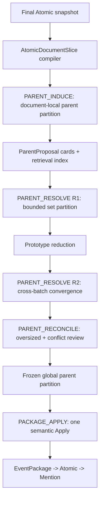

# CDECR Parent Occurrence Package V2 一次性重构方案

> 日期：2026-08-10
>
> 范围：彻底替换现有 N12 Wave A/B、Wave C、N13 Package 生成与补救路径
>
> 发布方式：Git 保留当前版本，新版本一次性切换；不做 shadow、不保留 legacy runtime、不双写
>
> 验收方式：先固定 Atomic 做 Package-only 验收，再跑真实 30 篇与 MU300；不达门槛则代码与数据整体回滚

## 0. 决策结论

本轮不再修补当前“先造 singleton、再做多轮 pair merge”的 Package 流程，而是把 Package 的生成范式改成：

```text
先识别父发生（Parent Occurrence）
    -> 再对父发生提案做集合级归一
    -> 冻结全局父发生分区
    -> 一次生成 EventPackage 与 Atomic membership
```

`EventPackage` 不再是逐个 Atomic 尝试加入、失败后生成的聚类容器，而是一个已经解析完成的父发生/持续事项的持久化投影。系统不再依赖后置 pair merge 修复前置 fragmentation。

本次实施采用以下硬决策：

1. 删除 N12 Wave A/B、Package Wave C、N13 planner/Decide/repair/Apply 的活动路径。
2. 删除 `local_package_hint -> canonical anchor -> primary anchor -> pair merge` 这条 Package 身份链。
3. 不新增任何 deterministic semantic hard conflict；确定性程序只负责召回、装箱、结构校验、幂等和 Apply。
4. 不保留旧流程开关，不做 shadow，不双写旧/新 decision。
5. 复用同一个 Parent Resolver 完成 R1、R2 和局部异常复核，不再叠加语义不同的补救节点。
6. 任一模型/Schema 技术失败不得伪装成 `CREATE_NEW singleton`。失败 task 保持 `FAILED_RETRYABLE` 并局部重跑；文档与 Atomic 不失败，Package 分区不得伪造完成。
7. 新版测试不理想时，整体回到 Git 基线；不做选择性保留或局部回滚。

需要特别说明：Git 只能回滚代码，不能自动回滚被新 Schema 或新 membership 改写的 SQLite 数据。因此“Git 保留当前版本”必须同时配套 Registry 快照。30 篇和 MU300 验收一律使用隔离数据库；生产切换前必须备份 Registry，代码回滚时同步恢复数据快照。

## 1. 当前问题与重构依据

### 1.1 当前实现的真实业务路径

当前 BULK_EPOCH Package 路径是：

```text
Atomic committed
  -> N12 Wave A：每个 Atomic 尝试加入历史 Package
  -> 未命中：立即为每个 Atomic 编译 provisional singleton
  -> N12 Wave B：在 provisional singleton 之间做候选判断和受限闭包
  -> Wave C：对结果 Package 再做 pair-level 父事件判断
  -> N13：重新做 Package pair recall、Decide、repair，必要时 Apply redirect
```

这条路径的默认状态是“拆开”，后续每一层只是在候选覆盖、模型输出、Schema 校验、pair cap 和错误降级允许的范围内偿还 fragmentation。规模增大时，任何一次漏召、非法输出、跨批边界或保守 fallback 都会永久留下 singleton。

### 1.2 已有运行证据

| 运行 | Atomic | Package | singleton Package | singleton 占比 | 最大 Package | 说明 |
| --- | ---: | ---: | ---: | ---: | ---: | --- |
| 30 篇 R5 healthy baseline | 165 | 80 | 64 | 80.00% | 56 | Package P/R/F1 为 91.07%/75.83%/82.75% |
| 最新 30 篇 R2 | 188 | 107 | 90 | 84.11% | 50 | Wave C/N13 遭 402，质量结果被保守降级污染 |
| MU300 冻结态 | 3,134 | 2,467 | 2,205 | 89.38% | 151 | 最大簇横跨 54 个 Gold Package；N13 尚未开始 |

R5 已经存在经逐项评估得到的 34.38% singleton 漏合并比例，说明 fragmentation 不是最新 402 或 MU300 并发造成的偶发现象。MU300 只是把当前结构的默认拆分、局部 fallback 和后置 pair 补救的规模退化放大出来。

最新 R2 的性能改造仍是后续基准：pre-Package 关键路径比 R5 缩短 25.92%，Field/Atomic 的 snapshot、批量读写、ledger、chunk Apply 都应保留。此次只替换 Package 语义生成路径，不回滚这些确定性效能收益。

### 1.3 本方案明确不做的事情

- 不继续调整 Package hard conflict、primary anchor、anchor conflict 或 pair boundary。
- 不用更大的 N12/N13 candidate cap 暂时掩盖漏召。
- 不把所有 Atomic 粗暴按 issuer、period、article 或 topic 合并。
- 不把 300 篇内容放进一个全局 Prompt。
- 不修改 Mention/Atomic 业务语义来换 Package Recall。
- 不宣称 Package 重构能够修复 Atomic singleton。Atomic fragmentation 是独立的 N9 问题，本轮只监测其不回归。

## 2. 新版业务模型

### 2.1 三层语义保持不变

- Mention：来源中一条具体事实表达。
- Atomic Event：跨 Mention 归一后的最小事实。
- EventPackage：包含一个或多个 Atomic 的同一父发生、父容器或持续事项。

改变的是 Package 的产生方式，而不是最终 `Package -> Atomic -> Mention` 层级。

### 2.2 Parent Occurrence 的定义

Parent Occurrence 是能够解释“为什么这些不同 Atomic 属于同一个上位发生”的真实边界。它可以是一次有界发生，也可以是一个持续事项；但不能只是：

- 公司、ticker、人物或机构；
- 宽泛主题、行业或关键词；
- 来源文章本身或文章标题；
- 当前 Atomic 的改写；
- 仅因为时间接近、同源或 embedding 相似形成的集合。

同一父发生中的不同指标、指引、评论、子动作可以属于同一 Package。市场反应、分析师反应、后续影响或独立报告通常形成自己的父发生，并通过 external relation 指向被反应的 Package，而不是被塞进原 Package。

### 2.3 singleton 的新语义

新版不再把“没有候选”“模型失败”“输出非法”解释成 singleton。一个最终 singleton Package 只能来自两种情况：

1. 文档内划分后该父发生只含一个 Atomic；
2. 经 R1/R2 全局归并后，它仍被明确判断为独立父发生。

因此，最终 singleton 是业务结论，不再是编排 fallback。

## 3. 目标架构



架构只保留两个模型任务契约：

1. `Parent Induction`：在单文档范围内，把该文档涉及的 Atomic 切片划分为父发生提案。
2. `Parent Resolution`：把多个提案与已有 canonical parent prototype 做集合级归一。R1、R2 与局部复核复用同一 Prompt、Schema 和执行器。

R1/R2/reconcile 是同一个 reducer 的不同输入批次，不是三套新的业务规则。

## 4. 数据契约与模型输入

### 4.1 `AtomicDocumentSlice`

每个 document task 提供 `document_id/title/published_at/source/full_article_text`，完整正文只在文档层出现一次。跨文档 Atomic 再按 `(event_id, message_id)` 编译切片：

```text
AtomicDocumentSlice
  slice_id
  event_id
  document_id
  canonical_proposition
  event_family
  normalized time/period
  bounded participant/object/metric cues
  1-2 条该文档内代表 Evidence
```

同一 `event_id` 可以产生多个 document slice，但一个 slice 只进入一个 document task。最终 Resolver 会把这些支持证据归并回唯一 Atomic membership；若同一 Atomic 的多个切片指向不同父发生，则进入同一份 conflict reconciliation，而不是任选第一个结果。

### 4.2 Parent Induction 输出

```text
ParentInductionBatch
  decisions[]
    task_id
    groups[]
      local_group_id
      scope: PARENT_OCCURRENCE | CONTINUING_MATTER
      package_family
      label
      members[]
        atomic_ref
        membership_relation
    external_links[]
      source_atomic_ref
      target_local_group_id
      relation
```

结构规则：

- 每个输入 `atomic_ref` 必须恰好出现在一个 group 中；
- 单 Atomic group 是独立父发生结论，不是不确定 fallback；
- external link 不改变 Atomic 的唯一 Package membership；
- `label` 是简短父发生身份，不是 reasoning；
- 不要求模型输出 anchor ID、primary anchor、identity hash 或长理由。

### 4.3 `ParentProposalCard`

编排层从 group 与成员事实确定性编译 Proposal Card：

```text
ParentProposalCard
  proposal_id
  scope / family / label
  member Atomic refs
  issuer/entity cues
  artifact cues
  period/time cues
  identity cues
  representative propositions/evidence
  supporting document refs
  embedding ref
```

这些 cue 只用于召回、排序和给模型提供证据，不具有自动 merge/block 权力。`proposal_id` 根据 document fingerprint、排序后的 member event IDs、scope/family 生成，不能依赖模型输出顺序或 request-local ID。
卡片内联最多 4-6 条能覆盖不同 artifact、object、participant role、time 和 assertion 的代表事实，不固定取前三条。

### 4.4 Parent Resolution 输出

```text
ParentResolutionBatch
  groups[]
    resolution_group_id
    proposal_refs[]
    existing_parent_refs[]
    canonical_label
```

- 一个 resolution group 表示同一父发生；它可以包含多个新 proposal、零个或多个已有 parent prototype。
- 多个已有 prototype 被放入同一组时，由 Apply 层按稳定规则选择 canonical root，并迁移 membership；模型不决定 ID 胜负。
- 每个 proposal 必须恰好出现一次，每个 existing prototype 最多出现一次。
- 输出不再包含每对 proposal 的 `SAME/DIFFERENT`，也没有 pair-level 闭包。

### 4.5 `CanonicalParentPrototype`

已有 v2 EventPackage 以轻量 prototype 参与增量解析：

- Package ID、版本、kind/family、title；
- 有界的代表 Atomic/提案摘要；
- 从成员事实推导的 entity/artifact/period/time/identity cue；
- profile hash 与 embedding。

prototype 是派生检索缓存，不进入核心业务模型。它不再保存或依赖 `primary_anchor_id`、`anchor_conflict`。

### 4.6 Schema 字段说明

strict Schema 为每个模型输出字段附一句短 `description`：

| 字段 | description |
| --- | --- |
| `decisions` | One result for each input document task. |
| `task_id` | Copy the input task ID. |
| `groups` | Complete partition of the input refs. |
| `local_group_id` | Group ID unique within this task. |
| `scope` | Bounded parent occurrence or continuing matter. |
| `package_family` | Best supplied family for this parent. |
| `label` / `canonical_label` | Short distinguishing parent description. |
| `members` | Atomics assigned to this parent. |
| `atomic_ref` | Copy an input Atomic ref. |
| `membership_relation` | How the Atomic belongs to the parent. |
| `external_links` | Supported relations to another parent; may be empty. |
| `source_atomic_ref` | Atomic that has the external relation. |
| `target_local_group_id` | Target parent group in this task. |
| `relation` | Relation from the Atomic to the target parent. |
| `resolution_group_id` | Group ID unique within this response. |
| `proposal_refs` | Proposals that identify this parent. |
| `existing_parent_refs` | Prototypes that identify this parent. |

业务规则不重复写进 description；不添加 `title`、长示例或 reasoning 字段。

## 5. Prompt 设计

只新增两份 Prompt；R1、R2 与局部复核共用第二份。

### 5.1 `parent_occurrence_induction.md`

```text
An Atomic is one minimal fact. A parent occurrence is the bounded real-world occurrence or process that contains one or more Atomics. A continuing matter is the same identifiable matter persisting across reports. Neither is an article, entity, topic, or mere shared context.

For each document, partition all supplied Atomics by parent identity. Use the full article and Atomic evidence to identify the occurrence or matter containing each fact. The parent need not be named verbatim, but it must be supported by the article. Group different child facts when they belong to the same parent. Separate reactions, consequences, independent reports, and distinct occurrences; link them externally when supported.

Work in this order:
1. Identify candidate parents in the article.
2. Compare artifact, participants, object, time, and event context.
3. Assign every Atomic exactly once.
4. Check that each group shares one bounded parent, not only an entity or topic.

A one-Atomic group is valid only when no other supplied Atomic belongs to its parent. Missing detail is not a reason to isolate it. Output only the schema.
```

### 5.2 `parent_occurrence_resolution.md`

```text
A proposal is one document's candidate parent. A prototype is an existing or provisional parent. Two items share a parent only when they identify the same bounded occurrence or continuing matter; they may contain different child facts. A shared entity, source, family, time, or topic alone is insufficient.

Partition the supplied proposals and prototypes by parent identity.

Work in this order:
1. Check Atomic overlap and explicit artifact identity.
2. Compare participants, object, time or period, family, and representative facts.
3. Reuse or combine prototypes only when the combined evidence identifies one parent.
4. Check that every group has one parent boundary.

Assign every proposal exactly once. Each prototype may appear at most once. A one-proposal group means a distinct parent, not uncertainty or missing detail. Output only the schema.
```

局部复核模式只追加：`In review mode, repartition the supplied groups by the same parent definition; size alone neither merges nor splits them.`

### 5.3 Prompt 与 Schema 对齐检查

实施时必须从“模型只看得到 Prompt + request Schema”的视角逐项验证：

- Prompt 中的 external relation 必须在 Schema 中有对应枚举/字段；
- Schema 中每个模型生成字段必须能从 Prompt 理解用途；
- request-local IDs 的输入/输出规则只说一次；
- 不把召回 score、embedding 或确定性 cue 描述成裁决规则；
- 不增加 CoT 或长 reasoning 字段；
- strict Schema probe 对 induction、resolution 各做一次真实调用，服务端 strict 不通过时先修 Schema；只有无法兼容时才退到 JSON output。

## 6. MU300 可扩展编排

### 6.1 总体复杂度

设文档数为 `D`、Atomic document slice 数为 `A`、父发生提案数为 `P`、历史 prototype 数为 `H`，新路径目标复杂度为：

```text
Induction: O(A)
Retrieval/index: O((P + H) log H + P * K)
Model resolution: O(P / batch_size) 个有界集合任务
Apply: O(A + P)
```

其中 `K` 是固定的多通道候选上限。禁止任何 `P x P` 全量 pair scan，也禁止先深读 SQLite 再剪候选。

### 6.2 Parent Induction 装箱

正常新闻按以下三项中最先达到者截断一个 request：

- 最多 4 篇独立 document task；
- 最多 48 个 Atomic document slices；
- 普通批次估算 Input 不超过 24k Token。

每篇文档在 request 内仍是独立 task，不能跨文档直接分组。较大文档遵循：

- `<=96` slices：独占一个 request，完整正文不截断；
- `>96` slices：按来源 Evidence block 切成 shard，每个 shard 仍携带完整正文；先各自产生 proposal，再在 document scope 内合并。

因此 300 篇不会进入单个巨大 Prompt。按冻结 MU300 的文长和 slice 分布，预计约 90-100 个并发 induction request。

### 6.3 统一多通道召回

所有 proposal/prototype 共用一套召回，不按父发生类型分支：

1. Atomic overlap 和可信 artifact 用稳定 hub 连接；
2. 统一结构化相似度使用 entity、period/time、family 和 identity cues；
3. 用 `label + representative facts + identity cues` 做 semantic ANN；
4. 补充 reciprocal nearest neighbors。

结构化和语义通道各取 top-12，去重后普通邻居约 24 个；强匹配边不被普通 top-K 挤出。召回只负责装箱，不自动 merge/block。宽 entity、source、family、time 或 topic 单独不得形成强边。

验收同时记录各通道新增正确邻居、候选纯度、union coverage，以及 R1/R2 前后真实父发生候选图的组件数和连通率。

### 6.4 两轮归并与局部复核

#### R1：locality-packed proposal reduction

每个任务最多包含：

- 24 个 proposal cards；
- 12 个已有 canonical parent prototypes；
- 估算 Input 不超过 28k Token。

模型直接把集合划分为 parent groups，而不是逐 pair 回答。

#### R2：prototype reduction

R1 形成的 provisional prototypes 重新建立全局邻域并再做一次集合归一。有候选邻居的 R1 singleton 必须进入 R2；没有任何候选的 singleton 不重复发送相同信息。

#### Residual reconciliation

不复核全量 singleton。Apply 前只处理：

1. proposal 数 `>=12`、Atomic 数 `>=32` 或内部明显异质的 oversized parent；
2. 同一 Atomic 的多文档 slice 父归属冲突；
3. R2 中存在重复、漏项或互斥归属的局部 task。

复核仍使用同一 Parent Resolution contract。size 只触发复核，不自动 merge/split；不增加第三轮全量补救。

### 6.5 冻结后一次 Apply

R1/R2/reconcile 期间不得写 active Package membership。只有以下条件同时满足后才生成最终分区：

- 每个 Atomic 已获得唯一 canonical parent；
- 同一 Atomic 的多 document slices 已完成冲突归一；
- oversized review 已完成；
- partition hash 固定。

“一次 Apply”指一次语义分区 Apply。物理 SQLite 写入仍可按 32/64 条 chunk 幂等提交，但所有 chunk 必须引用同一个 frozen partition hash，写入过程中不再重新决策或形成 transitive union。恢复时只补未完成 chunk。

### 6.6 并发默认值

新增 stage limit：

```text
CDECR_PARENT_INDUCTION_ACTIVE_REQUESTS=96
CDECR_PARENT_RESOLUTION_ACTIVE_REQUESTS=128
CDECR_PARENT_RECONCILE_ACTIVE_REQUESTS=96
```

- Induction 与普通 Resolution 使用 M3 当前模型/参数；只有 oversized/conflict reconciliation 使用 M4。
- stage limit 不是 provider 总上限，也不要求三者相加等于 100；当前真正限制并发的是 stage/tier limit 与 provider hard=160，target=100 只进入 telemetry。本次重构不改变调度器语义，仍沿用 start-rate=50/s、burst=80 和现有压力退避。
- 默认不在每个请求之间人为 sleep。仅在 429/连接拥塞时由现有自适应调度降低启动速率；固定 1-2 秒延迟会在 300 篇下反向放大墙钟。
- 不修改现有 M2/M3/M4 thinking 与 strict 配置，避免把模型参数变化混入架构验收。

### 6.7 效能实现硬约束

以下约束属于 v2 的实现合同，不得在重写 `package_stage.py` 时退化：

1. **单次只读快照**：Package 边界只构建一次 `PackageStageSnapshotV2`，直接复用 engine 已在内存中的 Source 全文、Mention 与 Final Atomic，并一次载入历史 Package/prototype、Field cues 和 embedding。Induction、R1、R2、reconcile 的循环内 Registry read 必须为 0；快照查询预算不超过 8 次。
2. **内存规划**：slice/proposal 编译、候选索引、装箱、prototype reduction 与 partition reducer 全部在内存运行。语义召回复用批量向量 top-K/有界索引，禁止逐 pair 读取 SQLite、重复物化 Pydantic 对象或生成全量 pair 表。
3. **共享异步执行器**：全部新模型请求必须进入现有 `AsyncModelExecutor` 和连接池，按新 stage limit 控流；禁止节点私有同步 client、私有 HTTP 线程池和固定请求 sleep。
4. **卡片累计预算**：每个 proposal/prototype 的完整卡片在每轮只出现一次；作为跨箱邻居时使用短卡片，同一 item 每轮额外出现不超过 2 次。装箱器必须统计各阶段累计估算 Token，不得通过遗漏 proposal、减少 coverage 或跳过 R2 控制成本。
5. **Embedding 复用**：proposal/prototype embedding 按稳定 profile hash 缓存，同一内容在 R1/R2/reconcile 不重复请求；只补缺失或 hash 改变的 embedding，并继续使用批量 executor。M1 Token 与失败拆批次数单列统计。
6. **批量 ledger/audit**：每个阶段使用 `start_many/finish_many/fail_many` 与批量 audit buffer；禁止逐 proposal/group 单独开启写事务。中间 checkpoint 可分批持久化，但后续阶段继续消费内存对象，不从 SQLite 逐项回读。
7. **单写与分块 Apply**：所有持久化操作进入同一个 `BulkWriter`。最终投影使用批量 Registry API，在同一 chunk 事务内写 Package version、membership、assignment、audit 与 checkpoint；维持 32/64 条 chunk、局部二分降级和未完成 chunk 恢复。

必须输出 `snapshot_query_count`、`pair_registry_read_count`、各阶段 task/audit 事务数、writer queue、Apply chunk/retry/degraded、card appearance、embedding cache hit、provider max-active/429 与各阶段 Token/墙钟。30 篇与 MU300 验收时，任一业务循环出现逐项 DB read、逐项写事务或未受限卡片重复，均判为效能实现不通过。

## 7. 增量实时场景

实时路径使用同一服务，不复制另一套 N12：

```text
new document Atomics
  -> document Parent Induction
  -> proposals 对 frozen v2 canonical parents + 同批 proposals 做 Parent Resolution
  -> residual/conflict review（仅有残余时）
  -> one partition Apply
```

已有 v2 EventPackage 仅作为 canonical parent prototype。若一个 resolution group 同时包含两个已有 parent IDs，说明新证据使其被集合级认定为同一父发生：Apply 选择稳定 canonical root，移动 membership，并为被替代 ID 保留普通 ID redirect。redirect 只是外部引用连续性，不再驱动任何 LLM pair merge。

为防实时小批量天然缺少上下文，可按时间窗口运行轻量 micro-batch reconciliation；它仍调用同一个 Parent Resolver，只输入自上次 checkpoint 后存在候选邻居的新 prototype，不新增另一套 Prompt、规则或闭包算法。

## 8. 失败、恢复、幂等与审计

### 8.1 非阻塞失败语义

| 异常 | 处理 | 明确禁止 |
| --- | --- | --- |
| batch 请求失败 | 仅重跑该 batch | 整个 epoch 从头跑 |
| 单 task Schema 非法 | 从 batch 中摘出该 task，单独 repair/retry | repair 全 batch/全文 |
| group 引用了未知 ID | 只重跑该 group 所属 task | 自动删除 ID 后 Apply |
| task 漏/重 Atomic | 只对缺失/重复 task 做 coverage recovery | 把缺失 Atomic 造 singleton |
| provider 持续失败 | ledger 标 `FAILED_RETRYABLE`，epoch 标 `PARTIAL_PARENT_RESOLUTION` | 宣称 FINALIZED |
| 某 Atomic 多 slice 父归属冲突 | 进入 conflict reconciliation | 选第一个或按来源时间覆盖 |

这里唯一会阻止 Package `FINALIZED` 的条件，是仍有 Atomic 没有可用父归属。它不是“为了严谨而阻塞”的语义 hard validator，而是最终 `Package -> Atomic -> Mention` 交付物不完整时不可伪造成功的技术完整性边界。单文档、Mention、Atomic 均保持成功和可查询，恢复只继续失败的 Parent task。

### 8.2 稳定 ID 与 checkpoint

- `slice_id`：由 event ID + document fingerprint 生成；
- `proposal_id`：由 document fingerprint + 排序后的 member event IDs + scope/family 生成；
- `prototype profile hash`：由排序后的 proposal IDs、已有 parent IDs 和成员版本生成；
- 新 Package ID：由 frozen resolution group 的稳定 identity seed 生成；
- 每个 induction/resolution task 保存 `input_hash + snapshot_hash + output_hash`；
- partition artifact 保存所有 proposal-to-parent、event-to-parent、external-link 映射及版本；
- 幂等重跑在相同 snapshot/partition hash 下新增模型调用、Package、membership 均为 0。

### 8.3 留痕范围

不新增模型 reasoning。编排层保存：

- `PARENT_INDUCTION_PLAN/PARTITION`；
- `PARENT_RESOLUTION_R1/R2`；
- `PARENT_RESIDUAL_RECONCILIATION`；
- `PACKAGE_PARTITION_V2`；
- request-local ID dictionary、模型调用 ID、输入/输出 hash；
- 每个最终 Package 的 supporting proposal IDs、document IDs、Atomic IDs。

这些内容足以回放形成路径，同时不会扩大模型输入/输出合同。

## 9. 代码删除与修改边界

### 9.1 新增/重写的核心模块

| 文件 | 操作 | 职责 |
| --- | --- | --- |
| `src/cdecr/parent_occurrence_contracts.py` | 新增 | 两个 wire contract、内部 card/prototype DTO |
| `src/cdecr/parent_occurrence.py` | 新增 | slice/proposal compiler、候选装箱、统一 Resolver、partition reducer |
| `src/cdecr/package_projection.py` | 新增并替代旧 engine | 从 frozen parent partition 构建 EventPackage、membership、prototype cache |
| `src/cdecr/bulk_epoch/package_stage.py` | 整体重写 | `INDUCE -> RESOLVE R1/R2 -> RECONCILE -> APPLY` |
| `src/cdecr/bulk_epoch/engine.py` | 修改 | 用四个新 artifact/stage 替换 N12/Wave C/N13 stage graph |
| `src/cdecr/cross_document.py` | 大幅删减 | 增量路径调用共享 ParentOccurrenceService；删除旧 Package methods |

核心业务实现最多保持上述三个 Package 模块：contracts、resolver、projection。R1/R2/reconcile 不允许复制实现。

### 9.2 直接删除的活动代码

- 删除 `src/cdecr/n13_planner.py` 及 `tests/cdecr/test_n13_planner.py`；
- 从 `src/cdecr/bulk_epoch/late_stage.py` 删除 `run_package_wave_c`，文件只保留 Atomic late 后改名为 `atomic_late_stage.py`；
- 从 `src/cdecr/cross_document.py` 删除 `_assign_packages_v13`、旧 `_assign_packages`、`_correct_packages_v13`、旧 `_correct_packages`、pair signal/boundary/repair/apply methods；
- 删除 `PackagePair*`、`PackageLate*`、旧 `PackageCandidate/PackageDecisionBatch/PackageMergePlan` 等只服务 N12/N13 的 contracts；
- 删除旧 Prompt：`package_assignment.md`、`package_merge.md`、`field_policies/package_anchor.md`；
- 删除 N12/N13/Wave C 的 runtime flag、planner version、pair cap、late admission 与 telemetry 分支；
- 删除 `N12_INVALID_*_CREATE_NEW`、`N12_WAVE_B_SINGLETON`、`PACKAGE_N13_PAIR_FAILED` 等 fallback 语义。

### 9.3 移除 anchor 业务链

以下内容停止生成和消费：

- `LocalPackageHint` 与 `EventMention.local_package_hint`；
- PACKAGE_ANCHOR Field namespace 的 active resolution；
- `package_anchor_ids`、`primary_anchor_id`、`anchor_conflict`；
- package anchor hash、hint inheritance、primary anchor selection；
- anchor-based M0 merge。

涉及文件：

- `src/cdecr/single_document_contracts.py`；
- `src/cdecr/single_document.py`；
- `src/cdecr/contracts.py`；
- `src/cdecr/canonical_field_resolution.py`；
- `src/cdecr/field_coreference.py`；
- `src/cdecr/identity_compiler.py`；
- `src/cdecr/package_engine.py`（由新 projection 替代）；
- 相关 tests 与 prompt resources。

ParentProposal 的 `label` 不是 anchor 的改名：它不进入 Field KB、不被单独 canonicalize、不拥有 primary/secondary 层级，也不能独立触发 merge。父身份由 proposal 的完整成员证据在集合 Resolver 中解析。

### 9.4 持久化模型与 Registry

保留核心业务表：Source、Mention、Atomic、EventPackage、active PackageMembership、external relation、model call、decision audit、bulk artifact/task ledger。

重构内容：

- `EventPackage` 删除 anchor 相关字段；entity/artifact/period/time/identity cue 从成员事实派生到 prototype cache；
- `PackageAssignmentRecord` 精简为 event、resulting package、membership relation、supporting proposal IDs、partition hash；
- 删除 `package_merge_decisions`、`package_pair_evaluations`、旧 assignment candidate/ranking 语义；
- `package_recall*` 重建为派生 prototype index，不再保存 local/primary anchor；
- `package_redirects` 只保留 ID 连续性用途，不参与候选召回或决策；
- Schema version bump，旧 Package 派生状态不在运行时兼容。

生产迁移不逐条把旧 Package“转换”为新 Package。正确做法是：

1. 完整备份 Registry；
2. 保留 Source/Mention/Atomic；
3. 清空旧 Package heads/versions、memberships、assignments、merge decisions、recall index、Package embeddings；
4. 对当前全部 Atomic 运行一次 `PACKAGE_REPARTITION_V2`；
5. 可确定映射的旧 Package ID 生成一次性 redirect/migration manifest；
6. 验收通过后再允许增量流量。

这避免旧 fragmentation 被当作 canonical history 带进 v2，也避免为了读旧数据在运行时保留 legacy 分支。

### 9.5 配置、CLI 与导出

- `src/cdecr/config.py` 删除 N12/N13/Wave C 配置，新增三个 Parent stage 并发和四个有界装箱参数；
- `src/cdecr/cli.py` 更新 scheduler lane、stage 名称、schema boundary 检查、诊断汇总；
- `CrossDocumentResult` 继续输出 `packages` 和精简后的 `package_assignments`，保持最终业务层级可导出；
- `result_export.py` 仍按 `Package -> Atomic -> Mention` 输出，不暴露 proposal/prototype 内部层；
- 删除旧 N12/N13 指标，新增 proposal count、resolution rounds、singleton confirmed/recovered、oversized confirmed/split、candidate coverage/connectivity、partition apply telemetry。

### 9.6 测试替换

删除以旧实现细节为断言目标的 N12/Wave C/N13 tests，新增：

- `test_parent_occurrence_contracts.py`；
- `test_parent_occurrence_induction.py`；
- `test_parent_occurrence_resolution.py`；
- `test_package_partition_v2.py`；
- `test_parent_occurrence_bulk_epoch.py`；
- `test_parent_occurrence_incremental.py`；
- 更新 Registry、CLI、export、idempotency、failure isolation tests。

实施完成后按 AGENTS 约定把代码变更摘要追加到 `changelog`。

## 10. 一次性实施顺序与 Git/Data 回滚

虽然设计评审可按 P0/P1/P2 理解风险，但执行和发布只有一个 v2，不允许中间态成为可运行产品。

### 10.1 基线封存

1. 检查 `src/cdecr`、`tests/cdecr`、`scripts/cdecr*`、`dev_plan/CDECR` 是否存在未提交修改；只处理 CDECR 范围，不夹带当前工作区其他改动。
2. 若 CDECR 路径干净，直接在当前 HEAD 创建 annotated tag；若不干净，先只提交 CDECR 基线。
3. 建议 tag：`cdecr-package-v1-baseline-20260810`。
4. 创建工作分支：`codex/cdecr-parent-occurrence-package-v2`。
5. 复制基准 Registry；禁止在 R5、R2、MU300 原库或生产库上开发测试。

### 10.2 内部工作包

这些工作包可以分 commit 便于定位，但只有全部完成后才运行新 workflow：

1. **A — Contract/Prompt replacement**：新 DTO、两个 Prompt、版本号、strict probe 工具；
2. **B — Parent resolver**：slice/proposal/prototype、multi-channel pack、R1/R2/reconcile reducer；
3. **C — Projection/Registry**：新 EventPackage projection、membership Apply、Schema migration、idempotency；
4. **D — Orchestration cutover**：bulk + incremental 接入，删除 N12/Wave C/N13 路径；
5. **E — Deletion/tests/telemetry**：删除旧 contracts/config/prompts/tests，完整回归与 changelog；
6. **F — Real acceptance**：固定 Atomic Package-only、真实 30、真实 MU300。

不引入 `CDECR_PACKAGE_V2` 开关。分 commit 只服务 Git 定位，不代表运行时共存。

### 10.3 整体回滚

若任一正式门槛失败：

- 停止新版流量；
- Git revert v2 commit range 或切回 baseline tag 构建；禁止对脏工作区 `reset --hard`；
- 恢复切换前 Registry 快照；
- 校验数据库完整性、Package/Atomic 数量、旧版幂等；
- 不单独保留“看似有收益”的 v2 子模块，后续在新分支重新设计。

## 11. 验证顺序

### 11.1 静态与单元验证

- strict JSON Schema 生成与 provider probe；
- request-local ID coverage/uniqueness；
- invalid item 只 repair 本 item；
- provider failure 不生成 singleton；
- 多 document slices 的同 Atomic 归属冲突进入 reconciliation；
- proposal/prototype 稳定 hash 与乱序等价；
- R1 分箱不同、R2 最终 partition 相同；
- oversized review 能确认或拆分，但 size 不自动裁决；
- existing parent 多 ID 同组后 canonical root/redirect 正确；
- frozen partition 的 chunk Apply 与 resume 幂等；
- 源码扫描确认不再存在 N12/Wave C/N13 运行入口。

### 11.2 固定 Atomic 的 Package-only 验收

先使用 R5 30 篇和 MU300 冻结 Atomic/Mention/Source snapshot，只重跑 v2 Package 路径。这样隔离 Mention/N9 模型波动，直接判断新架构是否解决 fragmentation。

必须输出：

- 每个 ParentProposal 与最终 Package 的映射；
- singleton recovered/confirmed，以及有/无候选邻居的 singleton 分布；
- oversized confirmed/split；
- Package pair P/R/F1；
- fragmented Gold groups、excess components、missed links；
- Package stage calls、Input/Output Token、累计 latency、墙钟；
- 各通道 candidate coverage/purity 与 R1/R2 候选图连通率；
- 人类可读 `Package -> Atomic -> Mention` 结果。

### 11.3 真实 30 篇全流程

- 使用原固定 30 篇、同 provider/model/thinking；
- 质量主基准用健康 R5；
- pre-Package 性能基准用最新 R2；
- R2 Package 质量受 402 污染，只作失败语义对照，不作正常质量基线；
- 报告 Mention/Field/Atomic 不回归，同时把 Package 指标与 Package-only replay 分开。

### 11.4 真实 MU300

- 使用同一 300 篇 manifest/fingerprint；
- 必须完整跑到 FINALIZED 和幂等复跑，不能再以 pre-N13 冻结态替代；
- 不重新引入全量 pair scan；
- 失败时只从 task ledger 的失败 batch 恢复；
- 单列 induction、R1、R2、reconcile、Apply 五段的墙钟与 Token。

### 11.5 独立人工/Agent 评估

对 30 与 MU300 分别评估：

1. 全部 singleton Atomic/Package 的数量和占比；
2. 全部 singleton 中应合并项的数量、目标父发生及漏合并率；
3. 所有 size `>=8` 或 top 1% 的 Atomic/Package，其 size、数量和错误成员比例。

Package Gold 有争议时，以父发生定义重新复核争议组；不能用不完整 Gold 把真实开放世界事实直接算 FP。Atomic 指标作为控制项单列，不用 Package 改善掩盖 N9 问题。

## 12. 正式验收门槛

### 12.1 业务质量

| 指标 | 30 篇门槛 | MU300 门槛/口径 |
| --- | ---: | --- |
| 单文档/跨文档成功 | 30/30 | 300/300，epoch `FINALIZED` |
| Package Pair Precision | >=90% | 在复核后的 judgeable Gold 上 >=90% |
| Package Pair Recall | >=82% | 在复核后的 judgeable Gold 上不得低于 30 篇门槛；不使用原始争议 Gold 强行定论 |
| Package Pair F1 | >=85% | >=85%（judgeable subset） |
| parent candidate coverage | >=98% | >=98%，同时报告 R2 后候选图连通率 |
| singleton 中应合并比例 | **34.38% -> <=5%** | <=5%，全量逐条评估并报告分子、分母和目标父发生 |
| failure-created singleton | 0 | 0 |
| oversized Package 错误成员比例 | <=5% | <=5% |
| 已知市场综述型错误大簇 | 0 | 0 |
| 151-Atomic/54-parent 类 supercluster | 不适用 | 不得形成 |

原始 singleton 占比必须报告，但不单独作为唯一成败门槛。原因是：当多个 singleton 被吸收到少数已有 Package 后，singleton 数量和 Package 总数会同时下降，比例可能不像绝对数量那样线性下降。正式判断同时使用：

- singleton 绝对数量；
- singleton 占比；
- mergeable singleton 比例；
- singleton 被正确吸收的 Atomic 数；
- missed pair links。

在相同冻结 Atomic 输入上，30 篇和 MU300 的 singleton Package 绝对数量均应比旧路径至少下降 25%；若 mergeable singleton 已降至 <=5% 但绝对下降不足，应由人工结果证明剩余确为真实 singleton，不能为了满足数值继续合并。

### 12.2 过度合并反向门槛

- size `>=8` 与 top 1% Package 必须 100% 纳入评估；
- 每个大 Package 输出其 proposal 构成、Gold/人工 parent 数、错误 Atomic 数；
- 不设置“Package 最大只能有 N 个 Atomic”的自动硬上限；
- 任一 Package 横跨 3 个以上明确不同父发生，直接判 v2 质量门失败；
- 大簇 Precision 提升不能以制造更多 singleton 换取，两个指标共同判定。

### 12.3 上游不回归

Package-only replay 中 Mention、Field、Atomic 必须逐条完全不变。真实全流程存在模型波动时，沿用现有门槛并与 R5/R2 同集比较；若发现代码路径使 pre-Package 输出发生确定性变化，视为越界修改并回滚。

Atomic singleton、Atomic mergeable-singleton、Atomic oversized wrong-member 三项照常评估，但不把它们列为本次 Package v2 的改善归因。若 34.38% 实际来自 singleton Atomic 而不是 singleton Package，则本方案不能声称解决该指标，必须另开 N9 架构任务。

### 12.4 性能与成本

| 指标 | 30 篇门槛 | MU300 门槛 |
| --- | ---: | ---: |
| pre-Package 墙钟 | 相对最新 R2 不回归 >5% | 保留现有效能实现，不出现新串行依赖 |
| Package M3/M4 Total Token | <=健康 R5 结构化 Package 节点合计的 1.25 倍，约 326k | 单列报告 |
| Package M1 embedding Token | <=30k | 单列报告并计入下行总额 |
| Package stage Total Token | <=356k | <=3.5m（含 M1） |
| Package stage 墙钟 | <=20 分钟 | <=45 分钟 |
| 本地无模型 planning | <=2 分钟 | <=5 分钟 |
| Package LLM calls | 报告实际值 | <=300，且无 O(P²) 增长 |
| resolution waves | 最多 3 | 最多 3 |
| 幂等重跑新增 model call/Package/membership | 0/0/0 | 0/0/0 |

健康 R5 的结构化 Package 节点为约 261k Token，连同约 23.5k M1 embedding 后为约 284.6k；因此 1.25 倍的完整 Package 口径约为 356k，而不是 326k。MU300 的旧 N12 已消耗约 2.52m Token，且 N13 尚未调用；3.5m 是允许新架构增加完整父发生证据、同时删除 N13 pair 成本后的上限，不是预期必须耗尽的预算。若质量达标但 Token 超限，不得靠遗漏 item 或降低 candidate coverage 裁剪发布，应整体不通过并重新设计 card packing。

## 13. 主要风险与处理

### 13.1 document-local induction 被文章叙事结构误导

风险：综述文章包含多个父发生，模型可能把“同一文章”当成一个容器。

处理：Prompt 明确 article 不是 parent；输出必须 partition 而非只生成一个摘要；R2 依据跨文档 proposal evidence 归一；oversized review 检查多父混合。

### 13.2 bounded batch 造成跨箱 fragmentation

风险：同一父发生的 proposal 在 R1 不同箱中。

处理：R2 对 provisional prototypes 全局重新召回，统一使用强边、结构化相似度、ANN 和 reciprocal neighbors；有候选邻居的 R1 singleton 必须进入 R2。不进行全量 singleton 复核，也不使用全局 Prompt 或 pair scan。

### 13.3 激进合并产生 topic supercluster

风险：集合级 Resolver 可能把同公司、同季度、同主题误当父发生。

处理：父发生定义直接进入两份 Prompt；prototype 携带成员/来源/时间证据；大簇只由模型语义复核确认或拆分，不用 deterministic hard conflict，也不以 size 自动否决。

### 13.4 Atomic 本身错误污染 Parent Resolution

风险：错误 Atomic merge 会让 Package 看起来应该合并，Atomic 过拆也会增加 proposal 数。

处理：同时报告 conditional-on-Atomic 与 end-to-end Package 指标；proposal 以 document slice 保留来源差异；本轮不跨层修改 Atomic。若 Package-only 达标而全流程失败，应先判定是否为 N9 输入回归，不能在 Package 层继续堆规则。

### 13.5 一次性切换的恢复风险

风险：Git 回滚后数据库已经是 v2，旧代码无法读取或 membership 已改变。

处理：所有真实验收使用隔离 Registry；生产切换前强制数据库快照和 restore drill；migration manifest 保存 checksum/count；整体回滚必须同时恢复代码与数据。

## 14. 完成定义

只有以下事项全部完成，才能称为方案完整落地：

- [ ] 已创建并验证 Git baseline tag 与隔离工作分支；
- [ ] 已备份测试/生产 Registry，完成 restore drill；
- [ ] 两个新 Prompt/Schema strict probe 通过；
- [ ] bulk 与 incremental 均只调用 ParentOccurrenceService；
- [ ] N12/Wave C/N13 active path、Prompt、config、contracts、tests 已删除；
- [ ] `local_package_hint` 与 Package anchor 业务链已删除；
- [ ] R1/R2/reconcile 复用同一 Resolver；
- [ ] 技术失败不会产生 singleton；
- [ ] frozen partition 后才执行 membership Apply；
- [ ] 完整 `tests/cdecr`、Ruff、Mypy、`git diff --check` 通过；
- [ ] changelog 已追加；
- [ ] 固定 Atomic Package-only 30/MU300 验收通过；
- [ ] 真实 30 篇验收通过；
- [ ] 真实 MU300 完成到 FINALIZED 与幂等复跑；
- [ ] singleton 漏合并、超大簇错误成员、Package Pair P/R/F1、Token、墙钟全部达到门槛；
- [ ] 人类可读输出仍为 `Package -> Atomic -> Mention`。

## 15. 最终判断

本方案不是把 anchor 换个名字，也不是把 N12 的 candidate 调大。它删除了“未命中即 singleton、后续 pair 补救”的默认范式，把父发生识别前移为 Package 的生成前提，再用有界、集合级、可跨批归一的 Parent Resolver 完成 30 篇与 300 篇场景。

它能够直接针对当前 34.38% 漏合并率的结构根因，但不能在实施前承诺必然降到 0。可落地的判断标准是：在不制造 topic supercluster、不过度合并、且 MU300 不退化成 O(N²) 的前提下，把 mergeable singleton 压到 <=5%。若做不到，就按本方案约定整体回滚，而不是继续在新架构上叠加 hard conflict、anchor 层级或 pair repair。
