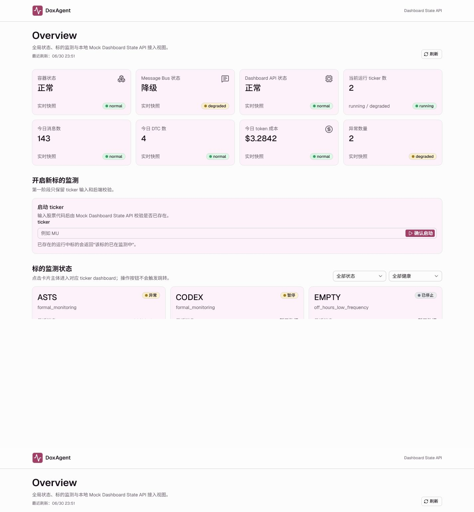
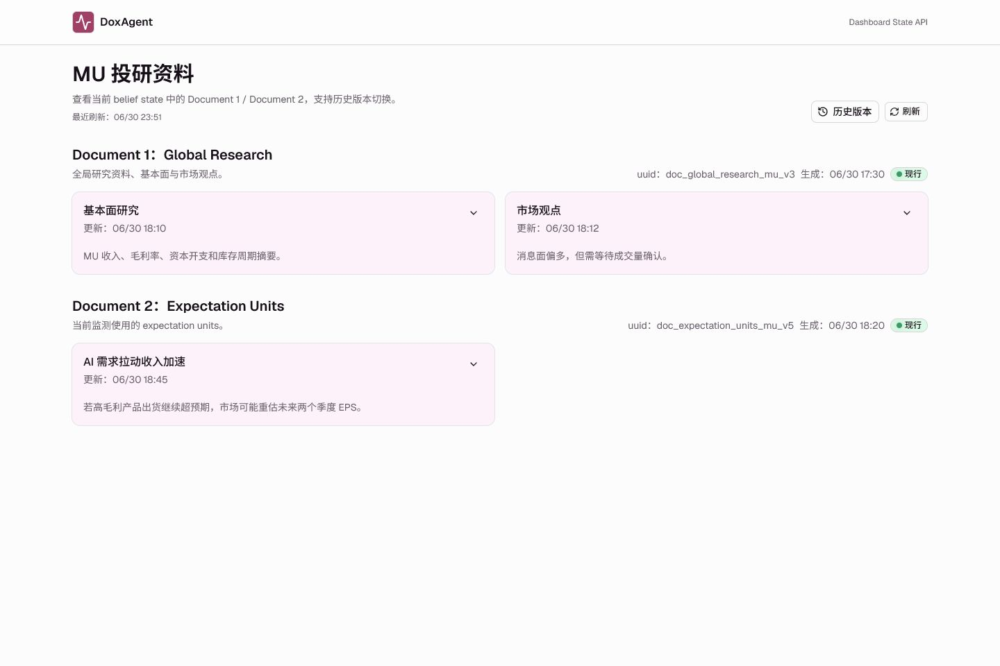
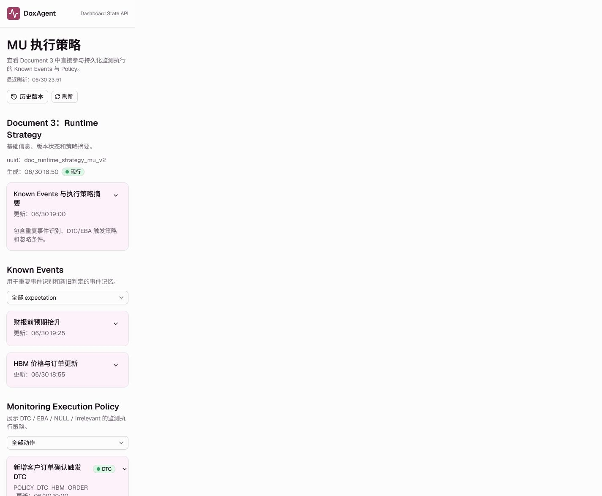
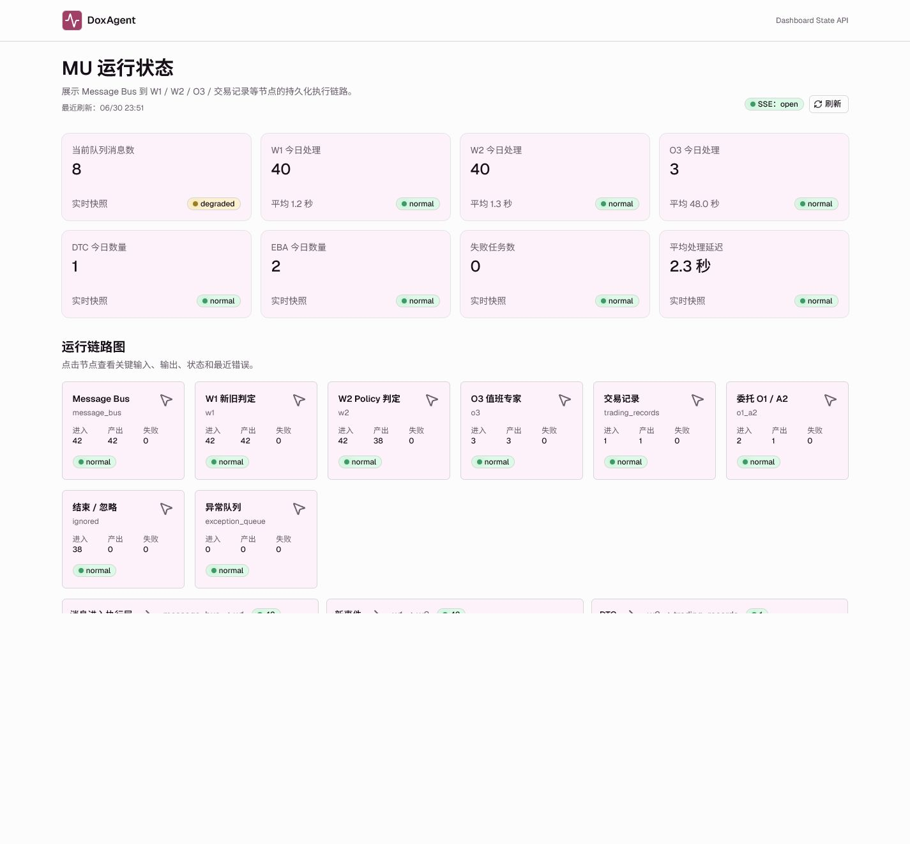
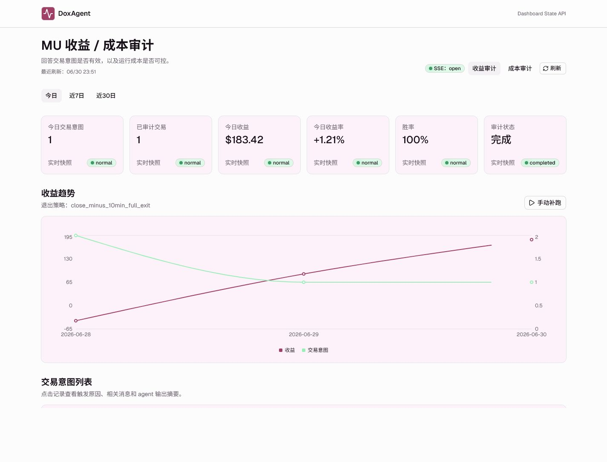

# DoxAgent Dashboard 第一阶段前端验收报告与重做方案

日期：2026-06-30  
对象：`frontend/dashboard` 当前实现  
结论：验收不通过，需要进入重做，而不是小修小补。

## 0. 审查方法

本次审查按以下证据来源执行：

- 浏览器实测截图：`dev_plan/dashboard_frontend_acceptance_assets/`
- PRD：`dev_plan/FRONTEND_PRD.md`
- API 契约：`Dashboard State API 契约.md`
- 视觉规范：`dev_plan/doxatlas_design.md`
- 现有 Message Bus Control Plane：`src/doxagent/monitoring/viewer.py`
- 当前前端代码：`frontend/dashboard/src`
- 用户补充反馈与运行链路参考图

Design read：这是一个个人长期盯盘使用的高密度 observability/control dashboard，不是 landing page。`design-taste-frontend` 技能本身声明不适用于 dashboards / dense product UI，因此本报告只借用它的审查纪律：先审计、拒绝模板化卡片、检查导航、色彩一致性、信息密度、布局重复和交互完整性。最终判断以 PRD 和 DoxAtlas design 为准。

## 1. 截图证据

### 1.1 桌面宽度截图

Overview：



投研资料：



执行策略：



消息总线：


运行状态：



收益 / 成本审计：



### 1.2 浏览器 DOM 摘要

桌面宽度 `1440x960` 下，六个核心页面的链接均只有：

```json
[{ "href": "/overview", "text": "DoxAgent" }]
```

也就是说具体 ticker 页面没有可用的全局导航。截图审计记录已保存：

- `dev_plan/dashboard_frontend_acceptance_assets/screenshot-audit.json`
- `dev_plan/dashboard_frontend_acceptance_assets/desktop/desktop-audit.json`

## 2. 总体验收结论

当前实现只能算“接上 mock API 的功能原型”，不能算“完整可用的第一阶段 Dashboard”。主要问题不是单个组件 bug，而是产品信息架构、页面布局方法和视觉系统都没有达到 PRD 的要求。

最严重的 P0 缺陷：

1. 具体 ticker 页面缺少顶栏全局导航，页面间无法自然切换。
2. Runtime 页面没有实现运行链路图，只是节点卡片和边列表分开堆叠。
3. Message Bus 页面没有继承 Monitoring Viewer 的核心控制台布局，信息层级比旧 viewer 更弱。
4. 投研资料和执行策略页把高信息量内容做成宽屏双列卡片，不适合阅读和展开。
5. 视觉系统虽然用了部分色值，但没有体现 DoxAtlas 的“生化极简主义 / 临床白 / 板岩结构线 / 情感殷红 / 仿生粉线框”的设计语言，整体变成同质化淡粉卡片。
6. PRD 中的 Supabase dev 鉴权、agent.doxatlas.com 访问、生产部署边界没有实现。本阶段如果只允许本地 mock，应明确标为未满足项，不能算完成。

## 3. 关键根因

### 3.1 顶栏导航代码存在，但运行时不会出现

`frontend/dashboard/src/components/dashboard/layout.tsx` 中确实写了 ticker nav，但 `DashboardLayout` 被包在 `<Routes>` 外：

```tsx
<BrowserRouter>
  <DashboardLayout>
    <Routes>
      <Route path="/ticker/:ticker/research" element={<ResearchPage />} />
    </Routes>
  </DashboardLayout>
</BrowserRouter>
```

因此 `DashboardLayout` 内部的 `useParams()` 拿不到 `:ticker`，`isTickerPage` 为 false，ticker 页导航不会渲染。浏览器截图和 DOM 摘要都验证了这一点。

### 3.2 页面布局以通用 Card grid 为中心，而不是以任务工作流为中心

当前所有页面基本共享同一种模式：

```text
PageHeader
KPI cards
Section
Card list
Sheet
Table
```

这让 Overview、投研资料、消息总线、运行状态、审计页看起来像同一个模板换标题。PRD 要的是长期盯盘前端，页面必须有不同工作流形态：消息流、链路图、文档阅读、审计分析、ticker 入口，而不是卡片堆叠。

### 3.3 视觉 token 被表面使用，设计语言没有落地

`index.css` 使用了 `#FCFCFC`、`#A14066`、`#F191CE` 等色值，但实际结果几乎所有面板都是同一种淡粉底卡片。缺失：

- 板岩灰 `#868686` 的高精度结构线和网格骨架。
- 情感殷红作为主模块标题、关键按钮、全局视觉锚点的层级。
- 仿生粉只应作为 focus/选中/危险节点轮廓或低透明氛围，不应把每张数据卡片都染成粉色。
- Satoshi 字体要求未满足，当前使用 Geist。
- 毛玻璃观测层没有和层级、背景纹理、结构线配合，变成普通淡色卡。

## 4. PRD 逐段核查

### 4.1 产品定位

PRD 第 1 节要求“个人使用、功能完整、低维护、可长期盯盘”，核心原则包括完整链路、简单交互、中文界面、DoxAtlas 风格、可读性和可维护性。

当前状态：部分满足 API 接入和中文展示，不满足长期盯盘可读性。页面缺乏全局导航、缺乏高密度仪表盘布局、缺乏运行链路图，不能作为长期观测控制台使用。

结论：不通过。

### 4.2 部署与鉴权

PRD 第 2 节要求 `agent.doxatlas.com`、反向代理、Docker 服务、Supabase dev 鉴权。

当前状态：只实现本地 Vite app 和 mock token 登录。没有 Supabase dev 鉴权，没有 agent 子域名部署，没有后端 dev 权限校验接入。

合理说明：因为这次实现被限定为“本阶段只做前端接入全量 mock API”，生产部署和真实鉴权可以作为受限事项，但不能在验收里标为完成。

结论：不通过，需列为后续独立交付项。

### 4.3 数据刷新与状态同步

PRD 第 3 节要求状态快照 + SSE + 轮询，不做整页刷新，只更新对应区域。

当前状态：有统一 query hook、轮询和 SSE 连接封装。问题是 SSE 当前多数是触发 refetch，不是真正“新消息追加”的视觉体验；页面只显示一个 `SSE: open` badge，缺乏事件进入、更新、断线恢复、回放游标等用户可感知状态。

结论：技术封装部分通过，产品体验不通过。

### 4.4 页面结构与顶栏规则

PRD 第 4.2 节要求具体 ticker 页面顶栏居中显示：

```text
投研资料 / 执行策略 / 消息总线 / 运行状态 / 收益成本审计
```

当前状态：具体 ticker 页面没有显示该导航。浏览器 DOM 证据显示每页只有 `/overview` 一个链接。

结论：P0 不通过。

### 4.5 Overview

PRD 第 5 节要求 KPI、启动 ticker、ticker 状态卡片、暂停/删除/重启、点击进入 ticker dashboard。

当前状态：功能原型基本具备，但存在明显问题：

- 视觉上是 8 个同质化淡粉卡片，缺少临床仪表盘的结构骨架。
- KPI 的状态颜色没有建立清晰的优先级，`normal/degraded` 英文直接暴露。
- ticker 卡片首屏被截断，信息密度和扫描效率低。
- Overview 作为全局入口没有表现出“系统控制台”的聚合层级。

结论：功能部分通过，设计与可用性不通过。

### 4.6 投研资料

PRD 第 6 节要求展示 Document 1 / Document 2、身份信息、卡片展开收起、长文本、中文 label、空字段、历史记录侧边栏。

当前状态：接口和展开/历史版本大体存在，但页面信息排布不合格：

- 桌面端使用 `lg:grid-cols-2` 双列文档卡。投研资料属于高信息量长文本，不应横向双列阅读。
- 页面没有文档阅读器感，缺少左侧目录/文档索引、右侧元信息、单列正文节奏。
- 历史记录按钮不在“左上角”语义位置，且不是页面级导航结构的一部分。
- 卡片摘要太短，实际字段展开后会变成长文本盒子堆叠，缺少分组、锚点、引用、证据层级。

结论：不通过，需要重做信息架构。

### 4.7 执行策略

PRD 第 7 节要求 Document 3 基础信息、历史侧边栏、Known Events 纵向小卡片、Policy 卡片列表、筛选、展开。

当前状态：功能原型存在，但截图显示首屏只有窄窄一列内容，大面积空白，完全没有利用桌面空间。Known Events 与 Policy 缺少策略决策工作台感，动作类型、触发条件、相关 expectation units 没有形成可扫描的结构。

结论：不通过。

### 4.8 消息总线

PRD 第 8 节要求参考 Message Bus Control Plane，保留现有组件和功能但更漂亮，不使用左侧切换栏。

现有 Monitoring Viewer 的核心布局包括：

- 左侧品牌和视图导航。
- 顶部 scope、refresh、remote 状态。
- KPI grid。
- `stream-grid`: 左侧 Live Message Stream，右侧 Source Health 与 Recent Failures。
- Config view: Configure Monitoring 表单 + Monitoring Tasks 列表。
- source health progress ring、poll latency、failure、ticker task、source binding 删除。

当前新 Dashboard 的 Message Bus：

- 首屏只看到纵向 KPI 卡和大片空白。
- Live Message Stream 没有形成主列，Source Health、Recent Failures、Monitoring Tasks 等监控视图缺席或被简化成 Config 卡片。
- 右上角配置按钮只是切换 view，缺少明显的控制台状态结构。
- 没有旧 viewer 的 per-source 健康、延迟、失败、poll progress ring、task grouping。
- 消息卡片只是普通 Card，没有时间轴、source lane、事件流密度或实时感。

结论：P0 不通过。它比现有半成品 viewer 更弱。

### 4.9 运行状态

PRD 第 9 节要求运行链路图，参考用户提供的人审链路图，节点之间连线展示流向和流量数字。

当前 Runtime 页面：

- 节点是普通 card grid。
- 边是下面单独的卡片列表。
- 节点与边在视觉上没有连接关系。
- 没有阶段分栏、曲线连线、流量宽度、边权标签、右侧结果汇总。
- 不能体现 Message Bus -> W1 -> W2 -> O3 / Trading / Ignore / Exception 的流动。

用户参考图要求的关键特征：

- 横向阶段分栏。
- 每个阶段内节点卡片。
- 节点之间多条曲线连线。
- 连线旁有流量数字。
- 右侧有审出结果汇总。
- 图本身可以横向滚动或画布化。

结论：P0 不通过。当前实现不是链路图。

### 4.10 收益 / 成本审计

PRD 第 10 节要求收益审计和成本审计切换、趋势图、交易意图列表、成本趋势、成本占比、成本明细筛选。

当前状态：基础 KPI、收益图、交易意图列表、成本 tab 原型存在。但问题是：

- 视觉仍是同质化卡片 + 图表，缺少审计工作台层级。
- 成本审计需要把“按节点 / 按模型”的占比作为核心视图，而不是普通 chart 容器。
- 交易意图列表应该支持清晰 drill-down，触发消息、policy、agent 输出摘要应成为一行可扫描证据链。
- `today/7d/30d` 切换视觉权重弱。

结论：功能原型部分通过，验收体验不通过。

### 4.11 Dashboard State API 原则

API 契约第 43-44 行要求前端只访问 Dashboard State API，并由 API 负责中文 label、分页、筛选、排序、状态枚举、错误响应和 SSE。

当前状态：前端没有绕过 mock API，统一 API client 是正确方向。问题主要在前端表达层，而不是数据来源。

结论：这部分基本通过。

### 4.12 UI 与交互规范

PRD 第 12 节要求中文和 DoxAtlas 视觉风格。

当前状态：

- 中文展示部分基本满足，但很多 status 和 source 字段仍直接露出英文枚举。
- DoxAtlas 视觉风格不满足。当前是 shadcn 默认结构 + 淡粉卡片主题，不是“生化极简主义”的临床控制台。
- 卡片、按钮、输入框、表格的层级没有形成统一精度系统。

结论：不通过。

### 4.13 第一阶段交付边界

PRD 第 13 节列出必须完成项。当前未满足或不足的关键项：

- 可登录：只实现 mock token，不是 Supabase dev。
- 可进入 agent.doxatlas.com：未实现。
- 可进入具体 ticker 页面：可直接 URL 或 Overview 卡片进入，但缺全局导航。
- 可查看 Message Bus 配置状态：有简化视图，但缺 Monitoring Tasks 完整布局。
- 可查看 Runtime 链路图：未实现。
- SSE 实时更新关键事件：技术连接有，但视觉追加和事件感不足。

结论：不通过。

### 4.14 验收标准

PRD 第 15 节逐项判断：

| 验收项 | 当前判断 |
| --- | --- |
| agent.doxatlas.com 访问 | 不通过 |
| 非 dev 用户无法访问 | 不通过 |
| dev 用户正常进入 | 不通过 |
| 页面语言中文 | 部分通过 |
| UI 风格与 DoxAtlas 保持一致 | 不通过 |
| Overview KPI / ticker 操作 | 部分通过 |
| 投研与策略历史版本 / 展开收起 | 部分通过 |
| Message Bus 实时消息流 / 筛选 / 配置 | 部分通过，但布局不通过 |
| Runtime 链路图 / 节点详情 | 节点详情部分通过，链路图不通过 |
| 收益 / 成本审计 | 部分通过 |

最终结论：不通过。

## 5. 前端设计缺陷清单

### P0：信息架构与导航

- 具体 ticker 页缺少 PRD 要求的顶栏导航。
- 页面间无法自然切换，只能依赖直接 URL 或回 Overview。
- 当前 layout 的 `useParams()` 放错层级，是直接代码根因。

### P0：Runtime 图形表达错误

- 没有链路图。
- 没有节点间视觉连接。
- 没有边权、流量宽度、阶段列、结果汇总。
- 不符合用户参考图。

### P0：Message Bus 布局退化

- 没有继承现有 Monitoring Viewer 的 stream + health + failures + task config 信息结构。
- Config 只是 source 卡片，不是配置控制台。
- 消息流不是实时事件流工作台。

### P1：文档页排布错误

- 投研资料不应双列展示。
- 执行策略在桌面大屏形成窄列和大片空白。
- 缺少适合长文本的阅读器结构：目录、单列正文、sticky 元信息、历史版本侧栏。

### P1：视觉风格不达标

- 所有卡片过度同质化。
- 仿生粉使用过量，缺少板岩灰结构骨架。
- 情感殷红没有成为全局交互锚点。
- 字体不符合 Satoshi 要求。
- 背景网格和卡片没有形成“临床观测层”，只是普通浅色仪表盘。

### P1：信息密度与空间使用差

- Message Bus 和 Strategy 在桌面首屏大量空白。
- Dashboard 应该是高密度、可扫描、重复使用的工具，不应像文档 demo 页面。
- 数字、状态、时间、source、node 没有 tabular/monospace 规则，扫描效率低。

### P2：状态与交互表现弱

- SSE 只是 badge，不像实时事件进入。
- loading/empty/error 虽有组件，但没有匹配每页最终布局的骨架形态。
- 过滤态缺少明确的“已应用条件”表达。
- 部分枚举仍是英文原样，不符合中文界面标准。

## 6. 重做方案

### Phase 0：设计基准重校准

目标：不要继续在当前卡片模板上修补。

行动：

1. 读取 DoxAtlas 真实前端实现，优先本地 `C:\Users\WEIXUANXIE\Desktop\DoxAtlas`，必要时再看远端 `/root/doxatlas`。
2. 提取真实 layout、topbar、字体、颜色 token、按钮、表格、panel、tooltip、dashboard 页面样式。
3. 把 `doxatlas_design.md` 转成前端 token 和组件规范：
   - background: `#FCFCFC`
   - structural: `#868686`
   - primary: `#A14066`
   - atmosphere/focus: `#F191CE`
   - chart bullish: `#9BEDB9`
   - chart bearish: `#FF7070`
   - radius: 4-8px
   - font: Satoshi 或项目可用的等价实现

### Phase 1：全局 Shell 与导航重做

目标：先修正 IA，不做页面细节。

要求：

- 将 layout 移入 route context，或者在 layout 中解析 `location.pathname` 获取 ticker。
- 具体 ticker 页顶栏居中显示：
  `投研资料 / 执行策略 / 消息总线 / 运行状态 / 收益成本审计`
- 当前 ticker 作为清晰上下文展示，建议加 ticker switcher 或返回 Overview。
- Overview 按 PRD 不显示其他导航按钮。
- 移动端用横向 scroll nav 或 Sheet menu，但桌面必须一行内完成。

验收：

- 浏览器 DOM 中具体 ticker 页至少有 5 个业务导航链接。
- 点击每个导航不丢 ticker，不整页空白。

### Phase 2：视觉系统重做

目标：从“淡粉卡片模板”变成“临床观测控制台”。

要求：

- 减少通用 card 数量。数据密集区优先使用结构线、表格、分组、分栏、sticky panel。
- 仿生粉只用于 focus、active、危险/关键节点轮廓、轻量 atmosphere。
- 使用板岩灰建立 1px 网格骨架、列分隔、timeline、graph column。
- 情感殷红用于 Logo、主交互、当前路由、关键标题、图表主线。
- 数字使用 tabular-nums。
- 状态色按 PRD 统一：绿/蓝/黄/红/灰，状态 label 中文化。

验收：

- 每个页面不能再只是相同卡片网格换标题。
- 页面截图能看出不同工作流：文档阅读、消息流、运行链路、审计分析。

### Phase 3：Runtime 链路图重做

目标：做真正的链路图，而不是 card grid。

推荐实现：

- 使用 SVG 自绘或 React Flow。第一阶段可不引入复杂图库，但必须画出 node-edge graph。
- 横向阶段列：
  1. Message Bus
  2. W1 新旧判定
  3. W2 Policy 判定
  4. O3 / 交易记录 / 委托 O1-A2 / 结束忽略 / 异常队列
- 节点卡显示名称、状态、进入、产出、失败。
- 连线用贝塞尔曲线，粗细或 opacity 表示流量。
- 连线中部显示 count。
- 右侧固定 summary panel，展示 DTC、EBA、Ignored、Exception 汇总。
- 点击节点后右侧详情 panel，不要只用临时 Sheet 覆盖主图。

验收：

- 截图中能直接看到节点之间的连线和流量数字。
- 节点详情不破坏链路图上下文。

### Phase 4：Message Bus 重做

目标：继承 Monitoring Viewer 的信息架构，但换成 DoxAtlas 风格。

布局建议：

```text
顶部：KPI compact strip + SSE 状态 + 刷新 + 配置按钮
主体：左侧 Live Message Stream，右侧 Source Health / Recent Failures
Config：左侧配置表单，右侧 Monitoring Tasks / Source bindings
```

必须补回：

- source health row
- poll progress / latency
- recent failures
- ticker task grouping
- source binding 参数展示
- 删除 binding 二次确认
- source filter、status filter、keyword search、load more
- SSE 新事件进入的明显提示

验收：

- 比旧 `src/doxagent/monitoring/viewer.py` 信息更清晰，而不是更少。
- 首屏不应出现大片空白。

### Phase 5：投研资料与执行策略重做

目标：从卡片网格改为长文本文档阅读器。

投研资料建议：

```text
左：Document 1 / Document 2 目录与历史入口
中：单列正文内容，按 card/field 纵向展开
右：document uuid、生成时间、状态、版本摘要
```

执行策略建议：

```text
顶部：Document 3 元信息
主体上半：Known Events 列表，支持 expectation unit filter
主体下半：Policy 列表，按 action type 分组或筛选
右侧：当前筛选和历史版本
```

原则：

- 不使用宽屏双列承载长文本。
- 展开内容需要有清晰 field label、引用、空值、长文本换行。
- 历史版本切换必须有明确当前版本提示。

验收：

- 文档页在 1440px 下是可阅读的单列主内容，而不是两列摘要卡。

### Phase 6：收益 / 成本审计重做

目标：把审计页做成“证据链 + 成本结构”。

收益审计：

- KPI strip。
- 趋势图作为中部主图。
- 交易意图列表要显示触发消息、policy、买卖价、滑点、收益、状态。
- 点击记录展示触发原因、相关消息、agent 输出摘要。

成本审计：

- KPI strip。
- 趋势图 + 按节点/按模型占比并列。
- 成本明细表高密度展示，支持 ticker/node/model/status 筛选。
- retry/failed 记录用红/黄状态清晰突出。

验收：

- 收益和成本两个 tab 的布局不能只是换一组卡片。
- 成本占比必须一眼可读。

### Phase 7：状态、测试和视觉验收

必须补充：

- Playwright 或浏览器自动化路由截图验收。
- 顶栏导航测试。
- Runtime graph 节点/边渲染测试。
- Message Bus config/stream 切换测试。
- SSE mock event 到页面提示的测试。
- loading/empty/error/filter/pagination 的视觉截图。

建议每轮重做后保存：

```text
dev_plan/dashboard_frontend_acceptance_assets/after/
```

并与本报告截图对比。

## 7. 下一步建议

不要在当前页面上直接堆补丁。正确顺序是：

1. 修全局 shell 和导航。
2. 重建 design tokens 和基础布局组件。
3. 重做 Runtime 和 Message Bus 两个最失败的核心页面。
4. 重做 Document 页面信息架构。
5. 最后打磨 Overview 和 Audit。

如果下一步任务是“重做该前端”，建议以本报告作为验收 checklist，所有 P0 必须先过，再谈完整可用。
