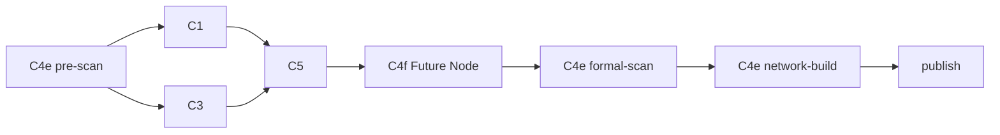

# C4 独立任务编排实施与验收记录

日期：2026-10-09。范围：当前 D1 Global Research（`codex_global_research_v1`）的本地实现。

## 1. 最终流程



四个 C4 阶段都映射到既有 `CodexAgentRole.C4`，读取同一 run 的 C4 ThreadRecord。
pre-scan 首次创建 thread，后续阶段及其重试继续传入该 thread ID。每轮分别物化当前
prompt、skill、schema 和 context，不从历史轮次继承完成状态或输出合同。

| 节点标识 | Agent prompt | Skill（相对于 `document1/skills/c4/`） | 当前轮主产物 |
| --- | --- | --- | --- |
| `c4_pre_scan` | `agents/c4e.md` | `c4e_pre_scan.md` | 初步 Entity Relations |
| `c4f_future_nodes` | `agents/c4f.md` | `c4f_future_node.md` | Future Nodes 完整快照 |
| `c4e_formal_scan` | `agents/c4e.md` | `c4e_formal-scan.md` | 最终 Entity Relations 完整快照 |
| `c4e_network_build` | `agents/c4e.md` | `c4e_network-build.md` | 独立 Markdown Network Research Report |

用户已编写的 C4e prompt 和三个阶段 skill 未改写。补齐了缺少的 `c4f.md` 与
`c4f_future_node.md`，并从当前 Global Research manifest 中移除了 `c4_enrichment`。

## 2. 输入与研究职责

pre-scan 仍在 C1/C3 之前；ticker、company_name、research_brief、base_context 的主要输入
不变，只将任务改为初步关系发现，schema 不允许 Future Nodes。C1/C3 继续收到关系输入，
两者并行执行，C5 接在完整研究之后。

三个后置阶段共享明确注入的研究材料：

- pre-scan 的完整关系快照与来源 lineage。
- C1/C3/C5 的完整 NodeOutput：全文报告、观察候选、warnings 等，不以 summary 代替正文。
- 完整 horizontal collection bundle、规范化 observations、请求中的 base_context。
- 已接纳上游 attempt 的 artifact 索引，包括 context、report、completion 的路径、ID 和 SHA。
- 同一 C4 thread 已积累的研究上下文。

formal-scan 返回新的完整关系快照，直接写入最终 `entity_relations`。不与 pre-scan 自动
求并集，也不在 formal-scan 为空或失败时回填 pre-scan。

network-build 额外收到 formal-scan 的完整快照；任务明确要求继续深度网络研究，允许
web search、新对象、新关系及前序理解修正。它不是关系表摘要器，输出不会反向覆盖
formal-scan 的五字段快照。C4f 的任务与 schema 均禁止生成或修改 Entity Map。

## 3. 输出合同和独立产物

| 最终 bundle 字段 | 来源 | 合同 |
| --- | --- | --- |
| `future_nodes` | 仅 `c4f_future_nodes` | 时间、未来事项、与目标公司的关系、来源、来源发布日期 |
| `entity_relations` | 仅 `c4e_formal_scan` | 关系主体、关系对象、关系类型、关系说明、关联业务或产品 |
| `entity_network_report` | 仅 `c4e_network_build` | 非空 Markdown 正文字符串 |

关系表与 Future Nodes 分别使用阶段专用的严格 JSON schema；行字段仍为原有五个字符串。
两类阶段的 `report_markdown` 必须为空，不共用另一类产物字段。

network-build 的 schema 与用户附件**逐字节一致**：

```json
{"type":"string","pattern":"\\S","description":"C4e network-build 的完整 Markdown 网络研究正文。"}
```

SHA-256：`879f7515bfc71728fccb147b537ef49353ff2f017fd53ab165b7fdc08a596c24`。

Worker 实际收到这个字符串 schema。task.json 的 `markdown_output_path` 指向
`attempts/<attempt_id>/output/entity_network_report.md`，最终 structured response 返回 JSON
字符串。适配层也接受 SDK 传回的直接 Markdown 文本。旧的 NodeOutput 对象不能充当
network-build 的 wire output。内部持久化仍生成 canonical NodeOutput completion receipt，
以复用现有 artifact、引用提升和 checkpoint 恢复机制；它是运行时接纳结果，不是 Agent 的主输出合同。

三个阶段各有独立 attempt、completion、artifact 与 citation manifest；网络报告引用不混入
只属于 C1/C3/C5 的聚合 manifest。正式主研究文档仍由 C1/C3/C5 组装，网络正文作为独立
report artifact 发布，可通过 `bundle.reports["c4e_network_build"]` 定位。

## 4. 串行、空值、失败与恢复

每个后置阶段都等待前一阶段结束。C1/C3/C5 必需研究未接纳时，不启动后置 C4 链。
C4f 或 formal-scan 失败并耗尽重试时，后续依赖阶段记录 `node.skipped`，checkpoint 标记
未产出，最终对应状态为 `failed`；不会以缺失的必需输入冒充完成下一阶段。

`GlobalResearchBundle.c4_product_status` 分别记录三项：

| 状态 | 含义 |
| --- | --- |
| `available` | 本产物对应阶段已接纳，内容非空 |
| `empty` | 本产物对应阶段已接纳，但关系或 Future Node 列表为空 |
| `failed` | 本阶段未接纳，或因前置 C4 阶段失败而未执行 |

合法空列表代表本阶段完成，可以进入下一阶段，同时仍明确显示 `empty`。网络 schema 要求
非空，所以空网络正文会验证失败。恢复仅从当前阶段、当前 attempt 对应输出文件进行；
不跨产品补值。保留既有 optional C4 发布策略：核心研究可以发布，但同时保存三项状态、
failed_nodes 和 `workflow.partial` 事件；`published` 不等于三个 C4 产品全部可用。

发布前中断后，可以按 input hash/SHA 恢复三个已接纳阶段，不重复发起模型研究。
历史已 published 的 run 仍是原快照，不会自动重算或伪造新版产物；验证新流程应创建新 run。

## 5. 同 thread 与 attempt 工具隔离

持久化 thread 和承载它的 SDK/MCP 进程是两个不同生命周期。为避免旧 MCP subprocess
继续使用前一 attempt 的 capability 或 observation 目录，Global C4 的 capsule 每轮结束后
释放。下一轮启动新的底层进程，以**同一个 thread ID**执行 `thread_resume`，重新注入本轮
工具配置。该规则也覆盖 `max_subagents=0`，不依赖默认 subagent 数导致的偶然进程释放。

其他角色及 legacy lane 保留原有进程/重试策略。这里的连续上下文是持久化 Codex thread；
不会新建 C4e/C4f 两个 Agent conversation。API 的 resume 语义参见
[官方 App Server 文档](https://learn.chatgpt.com/docs/app-server)。本轮验证使用本地 Worker/进程替身，
尚未以真实模型验收新的完整研究链。

## 6. 存储、兼容与部署边界

- SQLite 通用记录自然保存新增 `entity_network_report` 和 `c4_product_status`。
- PostgreSQL 的 bundle save/get 已同步新增两列，SQL upsert 与读取均保留完整正文和独立状态。
- 迁移：`supabase/migrations/202610090001_c4_independent_products.sql`。上线新版后端之前须应用。
  历史正文默认为空、状态字典默认为 `{}`，表示历史未记录，不能解释成三个阶段执行成功。
- legacy `codex_d1_v2` 保留历史混合流程；已将原 C4 资源固定在 compatibility 目录，避免
  用户删除/移动当前根目录旧提示词后，历史入口仍指向不存在的文件。
- Pilot case 构造器识别三个新节点；network-build 支持人工注入 `c4e_formal_scan.json`、
  C1/C3/C5 全文，以及独立 Markdown 输出路径。未扩展 D2/O2 的业务输入合同。
- 本轮未部署、未应用远端 migration、未触发真实模型 Pilot，也未修改远端 INTC/BE 数据。

## 7. 验证记录

最终定向组合 **87 passed / 1 deselected / 1 既有依赖 warning**，耗时 68.21 秒。主要覆盖：
精确 DAG、同 thread 重试、按阶段
注入 prompt/skill/schema、完整供材、空值/失败/跨合同输出、失败链停止、独立文件恢复、
发布中断恢复、citation 跨 attempt 重绑定及独立 manifest、SQLite/PG round-trip、Pilot 输入、
Data MCP 角色权限、C4 capsule 释放与其他角色进程复用。

```powershell
.venv/Scripts/python.exe -m pytest `
  tests/test_codex_document1_workflow.py tests/test_codex_research_lanes.py `
  tests/test_codex_d1_attempt_protocol.py tests/test_c4_split_workflow.py `
  tests/test_data_mcp_runtime.py tests/test_codex_d1_pilot.py `
  tests/test_worker_resource_budget.py::test_capsule_thread_affinity_and_idle_reclaim_without_sdk `
  -q --disable-warnings -k 'not test_failed_worker_turn_persists_bounded_turn_summary' --maxfail=3
```

扩展执行 `tests/test_codex_d1_pilot.py` 时，
`test_failed_worker_turn_persists_bounded_turn_summary` 失败并单独复现：C1 synthetic start failure
结束后没有 `attempts/c1-1/audit/turn_summary.json`。该用例涉及通用 Worker 起动失败审计，
不经过本次 C4 DAG；本轮未修改 `jobs.py` 或扩大修复。后续定向组合显式排除此项，并保留
本条失败记录，不能将该组合描述为完整 Worker suite 全绿。

Ruff、相关 diff whitespace 检查及附件 schema 字节一致性已通过。

## 8. 前置勘察与远端产物

前置现状排查与远端既有产物保留在
[D1 Entity Map 现状勘察](d1_entity_map_recon_20261009/README.md)。
其中包含 INTC 23 条、BE 30 条已发布关系的原始 bundle、completion、citation manifest、
冻结输入、可读 Entity Map 和 SHA 留证；这些是改造前远端快照，不是本轮新链路产出。

整包：`dev_plan/workflow_v2.1/d1_entity_map_recon_20261009.zip`。
