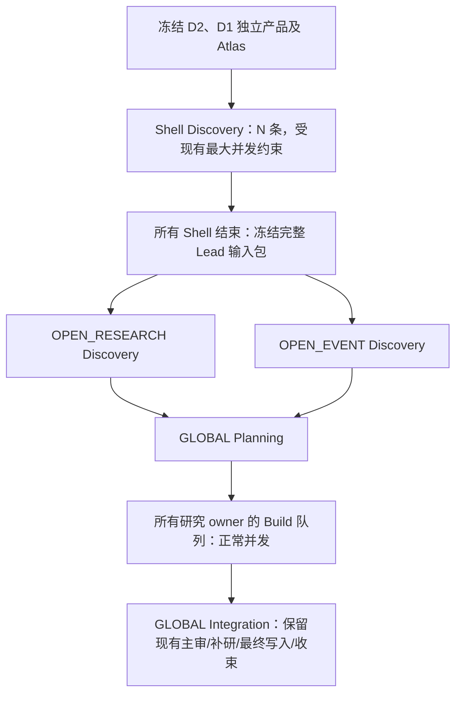

# Document3 双 OPEN 与独立 D1 产品上下文修改方案

日期：2026-10-09。状态：已完成本地实施与离线回归，见[实施验收记录](./d3_dual_open_d1_products_implementation_acceptance_20261010.md)；未部署、未切正式默认、未启动实模 Pilot。

本方案以当前工作区的 D3 v2.1 实现、2026-10-09 拆分后的 D1 Global Research 实现，以及现有两份 Open Event Atlas 为依据。目标是把单 OPEN 改成两个具有不同核心材料责任的 OPEN，并让它们在 Shell Discovery 完成之后补充发现；同时补齐新 D1 产品到 D2 全部节点的公共上下文。用户本次要求优先于旧冻结方案中 N+2、单 OPEN、Discovery 全并行的规定。

## 1. 固定设计与边界

### 1.1 初始化采用 N+3 条逻辑线程

| owner ID | 核心责任材料 | Discovery 输入起点 | 后续角色 |
| --- | --- | --- | --- |
| `S0001`…`S00NN` | 对应 D2 Shell 及完整 Unit | 自己的 Shell，按需读取共享 D1/D2 | 本线程的主/补研 Build |
| `OPEN_RESEARCH` | C1、C3、C5、Future Nodes | 核心材料全文、全部 Shell Discovery Lead | 本线程的主/补研 Build |
| `OPEN_EVENT` | Entity Map 的 formal-scan、network-build，General + L1-01 Atlas | 核心材料全文、全部 Shell Discovery Lead | 本线程的主/补研 Build |
| `GLOBAL` | 全局协调材料 | 所有发现交付及全局拓扑 | 仅 Planning、Integration |

两个 OPEN 都是 O3，使用同一 agent、通用 Discovery skill 和 OPEN Discovery skill。区别来自任务明确指定的核心材料责任，不新增两套 prompt、不新增研究职业、评分体系或子 Agent。两个 OPEN 的业务范围仍是公司整体；`OPEN_EVENT` 也不能机械地逐条 Atlas 产 Lead，`OPEN_RESEARCH` 也可以发现外部事件。

核心责任不等于读取权限：C1/C3/C5、Future Nodes、正式 Entity Map、网络报告、D2 等是共享研究资产，其他 owner 可以按需读取。Atlas 是静态辅助资产，默认只注入 `OPEN_EVENT` 的 Discovery/Build，不能作为某个事件已经发生的事实证据。两个 OPEN 没有固定 Lead/Topic/Policy 数量配额；有意义的新问题被 Shell 的 Topic 吸收时，也不要求保留独立 OPEN Topic。

Shell 数来自冻结 D2 的可用 Shell，沿用当前槽位规则。没有可用 Shell 时仍固定运行两个 OPEN，Shell Discovery 阶段为空，直接越过屏障；不凭空创建 Shell。用户所说的“每次工作流”在本方案中指执行 Discovery/Planning/Build/Integration 的初始化工作流；日常 MAINTAIN 继续单节点、单 owner，不改成 N+3，不为维护额外发起 Discovery。

### 1.2 目标调度



两个 OPEN 互不等待对方的 Discovery，也不把另一 OPEN 当轮输出作为自己的输入；这样保持两个补充视角独立。只有 GLOBAL 汇总两路。Build 不设置 Shell 优先、OPEN 专属并发或额外屏障，同 owner wave 串行、不同 owner 队列共享现有 ticker 并发额度。

### 1.3 本轮不扩展的地方

- 不改 D1 的节点 DAG、产物合同或持久化字段；消费已经实现的独立产品。
- 不改 D2 的节点 DAG、Shell/Unit 业务合同或 O1 单 thread 语义；只补齐公共研究输入与 lineage。
- 不改 Lead、Topic、Result、Review、PolicySetV3 的业务字段，不升级 `document3.v3`。
- 不处理 prompt/skill 层，不改现有 prompt/skill/Atlas 正文，不删除或覆盖 legacy prompt/skill。仅调整既有资产的注入范围，并在编排 task 中提供真实 owner、核心材料清单和阶段上下文。
- 不增加行业分类器、ticker→L1 路由数据库、Atlas 检索服务或动态学习；所有 ticker 先固定 General + L1-01。
- 不自动切换正式 D3 的默认 v2/v2.1 版本，不部署、不启动真实模型测试。本方案要求的实模验收列在验收步骤中，执行开发时可另按用户授权开展。

## 2. 已确认现状与关键缺口

| 位置 | 当前行为 | 本次需要改变 |
| --- | --- | --- |
| `codex_document3/inputs_v21.py` | topology 固定单 `OPEN`；Global 产物批量转为编号 `.txt`，另外写 `structure.json`（future_nodes/entity_relations） | 双 OPEN、显式产品角色及稳定可读路径、任务核心材料清单 |
| `orchestrator_v21.py::initialize` | `asyncio.gather` 一次启动所有 research_owners 的 Discovery | Shell 全完成后冻结 Lead 包，再启动两个 OPEN |
| `initialize` 的 scan 收集 | Planning 只接收 `{owner}.jsonl`，同次 Discovery 的 `.late.jsonl` 留到 Integration | Discovery 屏障前真实交付的主/late Lead 都进入下一步，保留原 ref |
| `runner_v21.py` | 仅 `owner == OPEN` 才注入 OPEN skill；workspace 按 owner.lower() 分开 | 按 owner kind 判断，两个 OPEN 均双 skill，独立 workspace/thread |
| `validation_v21.py::normalize_agenda`、`_build` | 非法或歧义路由回落到硬编码 `OPEN` | 双 OPEN 下稳定兼容路由，最终只能调度真实 owner |
| D1 Global bundle | 已有 `future_nodes`、`entity_relations`、`entity_network_report`、`c4_product_status`，三阶段独立 report/completion/citation | D2/D3 应消费这些独立权威字段与发布引用，不回读旧混合 C4 代替新产品 |
| D2 `GlobalResearchInput`/loader | reports 只载 C1/C3/C5；载入两个结构化列表；没有网络正文及产品状态 | 载入三项独立产品及 provenance，公共上下文覆盖全部 D2 节点 |
| D2 `_common_context` | 默认只有 future_nodes；entity_relations 在 O0 v2.1 分支另加，O1 通过 global_research 获得 | 一处构造公共产品视图，O0/O1 各节点都明确可读 |
| D2 Pilot case builder | 独立拼装 common/global_research，并只 bootstrap 三份主报告 | 同步正式 loader 的产品投影，防止正式有而 Pilot 没有 |
| Atlas | 已有 `Open_Event_Atlas_General.md`、`Open_Event_Atlas_L1-01.md` | 作为独立静态资产冻结与注入，记录文件 SHA |

特别注意：D1 新 `c4f_future_nodes`/`c4e_formal_scan` 的主要内容是结构化列表，对应 report artifact 的 Markdown 可以为空；不能因为 `.md` 为空就说 Future Nodes/Entity Map 缺失。`c4e_network_build` 则相反，正式主要内容为非空 Markdown，内部 canonical completion 是 NodeOutput JSON 封装。用户提到的 `c4e_network_build.json` 应作为下游的可读 JSON 视图/原始 completion 定位，不能把网络正文按 EntityRelation schema 解析。

## 3. D1 产品的消费合同与稳定文件

### 3.1 只增加一个很薄的共享产品投影器

建议新增 `src/doxagent/codex_runtime/research_products.py`，提供纯投影函数 `project_d1_products(bundle)`：返回三项产品的完整内容、可用状态、producer role 和源 artifact 元数据。不负责拉取 provider、不建新 repository、不发研究调用。D2/D3 loader 与 Pilot bootstrap 复用它，文件读取与 SHA 校验继续使用各自现有 workspace/published-storage 通道。

三项正文的权威来源固定为：

| 产品 key | 权威字段 | producer role | JSON 只读视图 |
| --- | --- | --- | --- |
| `future_nodes` | `bundle.future_nodes` | `c4f_future_nodes` | `{"future_nodes": [...]}` |
| `entity_relations` | `bundle.entity_relations` | `c4e_formal_scan` | `{"entity_relations": [...]}` |
| `entity_network_report` | `bundle.entity_network_report` | `c4e_network_build` | `{"report_markdown": "完整 Markdown 正文"}` |

JSON 视图是宿主对已发布 D1 的无损只读投影，明确标记 `source_kind=published_d1_product_projection`，不是新 Agent 产物。列表使用当前 D1 模型的 `by_alias=True` 序列化，不能自行重命名行字段。网络正文保留全文，同时提供 `.md` 阅读入口；两份视图源于同一正文，不作为两个研究来源计数。

投影器读取 `bundle.reports[producer_role]` 记录原始 artifact ID/path/SHA/attempt；loader 在现有 artifact 列表中按这个已接纳 attempt 定位 `STRUCTURED_COMPLETION`，有则保留原始 JSON 的只读引用/全文及 SHA。不得通过“最新 C4 attempt”或扫描到的第一个 completion 跨阶段取值。网络 report 使用对应已发布 Markdown 的引用。结构化列表的来源权威仍是最终 bundle，而非空 report.md。

完整源 artifact 可读时校验 SHA；不可读时遵循当前缺件策略，记录 provenance 缺失，不能用其他 attempt 或旧 pre-scan 补值。已发布 bundle 中完整的 typed 数据仍可作为明确标记的 bundle 投影供读，不因为旧制品清理一律阻塞整个 D2/D3。

### 3.2 状态与历史兼容

- 新 D1：沿用 `c4_product_status` 的 `available / empty / failed`；failed 的字段不当作成功产品注入，保留状态与缺件说明。
- `empty` 的结构化列表正常注入空列表，表示该节点已接纳且无条目；不等同 failed，也不需要强制重跑 D1。
- 历史 bundle 没有新状态/producer role 时，有历史数组就原样作为 `legacy_published_snapshot`；空数组只表示历史未提供条目，状态记 `unrecorded`，不能反推新节点执行成功。网络正文缺失记 `unavailable`。
- 状态只记录已有事实，不新增产品完整率门槛或整条 workflow 阻断；D1 本身允许核心报告发布但 optional C4 部分失败，消费者须如实显示。
- 不在同一次 run 内发现缺件后改取另一个“最新 D1”；D2/D3 同一 run 使用固定 `source_global_run_id`。

### 3.3 D3 的规范文件与索引

在 `context/document3/v21/shared/d1/` 物化：

```text
c1.md
c3.md
c5.md
c4f_future_nodes.json
c4e_formal_scan.json
c4e_network_build.json
c4e_network_build.md
products_manifest.json
```

C1/C3/C5 对应已有正文，使用其明确 role 定位，不按编号推测。可以保留现有编号 Global 原件和 `structure.json` 作为兼容读取入口，但新 task 的核心材料只指向上述稳定文件，不列出数份相同内容要求重读。共享结构中增加 `entity_network_report` 与三项状态，防止仍使用 structure 的节点漏正文。

`products_manifest.json` 每项至少含 `product_key / producer_role / state / local_path / source_run_id / original_ref / source_artifact_id / source_sha256 / projection_sha256 / source_kind`；没有的源引用用 null 并给 availability 原因，不伪造 SHA。原件 SHA 与投影 SHA 分开。所有实际物化文件继续进入已有 input manifest、read_mapping、分页读取索引；long Markdown 不截短、列表不只交数量/标题。

引用：D3 保留原文本与原 citation；D2 延续现有 D1 citation qualifier，并把网络正文纳入同一规范化流程。网络报告有独立 citation manifest，不能只靠 C1/C3/C5 的聚合 manifest 当作已包含网络来源；提供 producer artifact ID 与独立 manifest 的路径/ID（可读时冻结），不创建新的来源编号体系。

## 4. 双 OPEN 的 topology、任务与路由

### 4.1 直接扩展现有 topology，不增加调度框架

在 `InputPreparerV21.prepare` 的 topology 中增加：

```json
{
  "shell_owners": ["S0001"],
  "open_owners": ["OPEN_RESEARCH", "OPEN_EVENT"],
  "research_owners": {
    "S0001": "实际 Shell 名称",
    "OPEN_RESEARCH": "OPEN_RESEARCH",
    "OPEN_EVENT": "OPEN_EVENT"
  },
  "owner_profiles": {
    "S0001": {"kind": "shell", "primary_materials": ["对应 Shell 路径"]},
    "OPEN_RESEARCH": {"kind": "open", "primary_materials": ["C1/C3/C5/Future Nodes 的真实路径"]},
    "OPEN_EVENT": {"kind": "open", "primary_materials": ["formal-scan/network-build/General/L1-01 的真实路径"]},
    "GLOBAL": {"kind": "coordinator", "primary_materials": []}
  }
}
```

`owners` 是 research_owners 加 GLOBAL。owner_profiles 的 primary_materials 应同时携带状态/角色或链接 products_manifest；缺件不能从列表静默消失。Atlas 路径来自冻结资产配置，不在 InputPreparer 内另读一遍活动磁盘文件。允许先使用稳定逻辑 ref，由 `_freeze` 在资产快照已生成后完成路径绑定。

Workspace 继续由 `run_id + '-' + owner.lower()` 得到 `...-open_research` 和 `...-open_event`。现有 `(run_id, owner)` 锁及 ThreadRecord 自然保证不同 thread；Discovery 到本 owner Build/补研仍沿用自己的 thread。不能共用旧 `...-open` workspace/thread，不额外新增 CodexAgentRole 或数据库表。

### 4.2 每个节点的任务必须明确给出责任

`_turn` 通用 task 增加 `owner_profile`，包含：kind、核心材料可读映射、共享研究目录、当前工作责任。OPEN Discovery 额外给：

```text
discovery_stage = open_after_shells
prior_shell_discovery = 本轮完整冻结包的索引路径
objective = 以指定核心材料为起点，对照已完成 Shell Lead，寻找有实质差异的遗漏入口
```

这些是编排生成的任务元数据；仅把文件复制到 workspace 不算完成责任绑定。Shell Lead 的来源阶段标记为 discovery，Atlas 标记为 static_reference，缺件保留 availability，避免材料类别和任务责任在上下文中丢失。本方案不规定 Agent 如何进行语义去重、如何判断证据或如何编写 Lead。

Build task 继续给 topics、round、ordinal、result_delivery；给本 owner profile 与需要复用的核心材料入口，不要求重新跑 Discovery 或逐项重新扫 Atlas。GLOBAL task 给全体 owner profile 和 allowed_research_owners，用于按背景复用分配工作。原始发现属于谁与 Topic 最终给谁继续分离，两个 OPEN 的 Topic 可以分给 Shell，反之也成立。

### 4.3 清除单 OPEN 硬编码并保持轻量兼容

- `RunnerV21.turn` 用 `owner_profile.kind == open` 判断双 skill 注入，两者 Discovery 都得到真实文件名 `initialize_discovery.md` 和 `initialize_discovery_open.md`。
- `normalize_agenda` 增加显式 `fallback_owner=OPEN_RESEARCH` 参数；现有调用点均传当前 topology 的默认开放 owner。
- 旧 `owner=OPEN` 作为兼容别名解析到 `OPEN_RESEARCH` 并报告规范化提醒。它不是第三个 thread，不放入 research_owners，不作为新 Planning 的推荐路由。
- Shell 名称/限定 alias 延续当前规则；规范化后的 Topic owner 统一输出真实稳定 ID，避免两个 OPEN 因显示名相同被歧义匹配。
- 未知、GLOBAL 或歧义 owner 仍按现有非阻断原则回落到 OPEN_RESEARCH，保留提醒。该回落只是调度补救，宿主不根据 brief/关键词做语义分类、不再调用 LLM 分发。
- `_build` 不再保留第二套硬编码 `else OPEN`：消费已规范化的真实 ID，异常时使用同一 fallback 函数。所有主/补研 Agenda 一致应用。
- 主/补研究波次大小、同 owner 顺序、Policy 身份与 Result 接纳全部保持现有规则。

## 5. Discovery 两阶段与完整 Lead 屏障

### 5.1 执行顺序

将 initialize 的单次 gather 拆为以下明确步骤，均复用 `_turn`：

1. 对 `shell_owners` 创建 Discovery task，按现有 `TickerConcurrency` 执行；每个 Shell 只生成自己的主/late 文件。
2. 等所有 Shell 调用及其现有重试结束，按稳定 owner 顺序读取接纳快照，冻结 Shell Discovery 输入包。
3. 把同一输入包映射到两个 OPEN workspace，之后同时发起两者 Discovery；并发上限为 1 时自然串行，无额外并发额度。
4. 等两个 OPEN 结束，汇总所有研究 owner 的 Discovery 交付，构造最终 scan/scan_inputs，进入 GLOBAL Planning。

`_pilot_boundary('discovery')` 保留在步骤 4 后，代表完整 Discovery 节点结束；Pilot 不增加用户必须手动驱动的第五节点。内部阶段可在状态视图中显示 `SHELL_DISCOVERY / OPEN_DISCOVERY`。

### 5.2 交给 OPEN 的 Shell Lead 包

冻结目录建议：`context/document3/v21/discovery_inputs/shells/`，含 index.json 和各 Shell 主/late 原文的只读映射。不要只给聚合摘要或标题；每条保留完整 `name / lead / ref`、producer_owner、原始文件 ref、行号及源快照 SHA。index 同时列 Shell 名称、scope/boundary、交付状态和无效行诊断。主 JSONL 与 late JSONL 的业务 ref 仍是 `output/work/v21/discovery/Sxxxx*.jsonl#Lx`，OPEN 通过 read_mapping 找真实文件，不猜别的 workspace。

这批派生上下文冻结在宿主 run 中；Runner 会像其他非 prepared 引用一样生成稳定 reference_path。task 中给逻辑 ref，read_mapping 指向真实路径，避免新写死的跨 workspace 读取。它与 Atlas 都是显式任务材料，但 source_kind 不同：前者为已接纳本轮 Agent 交付，后者为静态方法辅助。

采用一个 `collect_discovery_materials(owner_ids)` helper，同时返回原文映射、解析成功 Lead 和诊断，供 Shell 屏障及最终 Planning 汇总复用。不要为两处分别写 parser。

### 5.3 明确同次 late 的调度语义

本次用户要求 Shell 完成后“全部产生的 lead”交给 OPEN。将 **Discovery 当轮已接纳的主与 late 文件**一并交给 OPEN，也一并进入 Planning；OPEN 两路 Discovery 当轮的主/late 同样都进入最终 scan。保留原路径与行号，不回写初始扫描文件，不强制逐行去重或同名合并；经济去重归 Planning。

Build/Integration 才新增的 late Lead 继续沿用 Integration 的唯一补研流程，不重新打开 Discovery/Planning。`_late_materials` 可以继续返回全部 late 作为参考，但最终 coverage 应从 Agenda 的原 ref 判断是否被承接，不能因同一条已进入主议程就重复列为未补研。此次改动只修正发现期已知材料的准入，不扩展研究轮次。

### 5.4 错误、恢复与冻结边界

- Shell 尚有在跑/待重试任务时不得启动 OPEN；不能按谁先结束把不完整 Lead 包先交过去。
- 沿用现有 PARTIAL 策略：某 Shell 重试耗尽后可结束该阶段，将可接纳条目和失败说明交 OPEN/GLOBAL，并记录 run missing；不永久等待失败 Shell，不把缺件伪装成空发现。不可变快照校验失败仍按现有 integrity error 停止。
- Lead 包只由宿主已接纳 task 快照构造，不读 Agent workspace 的活动草稿。记录 producer task、snapshot SHA 和内容哈希；一经 OPEN 消费不再改变。
- 恢复时重用已接纳 Shell task 和已冻结屏障包，不重新研究已完成 Shell。两个 OPEN 分别恢复/重试；一条完成不导致另一条重跑。
- 不新增数据库 schema；用现有 run payload 保存 `shell_discovery_input` 的 refs/hash、阶段及诊断，task 快照继续沿用现有表。
- D3 `orchestration_revision` 从 2 升为 3，活动旧初始化 run 使用现有机制要求新 run，不把旧单 OPEN 执行中途迁移成双 OPEN。已 commit 的历史交付保持可读/幂等；不重写历史产物。
- MAINTAIN 不创建两个 OPEN，不依赖 Atlas。其上下文可复用新增共享 D1 产品视图，但维持既有权限/NOOP/基线规则。

## 6. Atlas 的冻结与注入

在 `assets_v21.py` 增加两个明确静态路径：

```text
prompts/codex_v2/open_event_atlas/Open_Event_Atlas_General.md
prompts/codex_v2/open_event_atlas/Open_Event_Atlas_L1-01.md
```

建议资产 key 为 `open_atlas_general`、`open_atlas_l1_01`；可以在 default_node_assets 接收独立 atlas_root（默认固定仓库位置），便于测试/外部调用提供文件。`RunnerV21.frozen_assets('initialize')` 读取两文件 UTF-8 原字节并记录 SHA，与其他初始化资产一次冻结；缺少文件在发 Agent 前明确报资产配置错误。`maintain` 的 required 列表不加入 Atlas。

只对 `OPEN_EVENT` 的 Discovery/Build 物化到 `context/document3/v21/assets/open_event_atlas/`，保持原始文件名，task 的 `atlas_profile` 明确 `general + L1-01` 及 SHA。同一 run 重试读取冻结内容，不因本地文件更新改变上下文。Atlas 不放入 D1 report 字段、不写入 Event Library、不应用 research as_of 可用性过滤，也不增加自动行业选择。静态资产更新时间与研究事实截止是不同概念。

Runner 保持既有 agent/skill 内容，两个 OPEN 的 Discovery 均按第 4 节注入通用与 OPEN skill。新 owner ID、材料责任与 Shell 前置结果由 task.json 提供；本方案不处理现有文字的认知、行为或方法指导。

## 7. D2 全节点公共上下文补齐

### 7.1 Loader 与输入模型

`codex_document2/inputs.py::GlobalResearchInput` 保留已有 future_nodes/entity_relations，新增 `entity_network_report`、`d1_product_status`、`d1_product_sources`，使用默认值保持历史 JSON 可解析。产品来源复用第 3 节投影器；读网络报告与原引用校验的规则等同现有报告，不将 C4e JSON 当 C1/C3/C5 Markdown。

`Document2InputLoader.load` 在固定 Global bundle 上加载独立产品，扩充 `manifest.global_research` 的 artifact_ids、workspace_paths 和 metadata.products，记录每项状态/源 SHA/独立 citation manifest。缺产品给具体 warning，不把 Global 整体可用变成三个 C4 全部可用，也不隐式重跑 D1。

### 7.2 一处公共构造，覆盖 O0/O1 所有节点

扩充 `_common_context(prepared)` 返回三项完整产品与 metadata；把 O0 分支单独加 entity_relations 的重复逻辑归并到此处。O1 两套构造路径（legacy 与 v2.1）也接入同一产品上下文 builder，避免只在 `global_research` 中有字段但 task 无明确导航。

全节点清单：O0 C1/C3/C5/Narrative candidate、Synthesis、C1/C3/C5 domain review、Finalization；O1 Open Discovery、State、Realization、Gaps、Finalization。保持各自 primary_source/本域报告/单 Shell 的主责任；新增产品是公共可读背景，不自动新增候选渠道或 O0-C4 节点。

建议新增的公共字段为：`entity_network_report / d1_product_status / d1_product_sources`，沿用顶层 future_nodes/entity_relations。O1 的 `global_research` 同步保有相同权威字段；物化索引应将重复逻辑内容指向一个阅读入口或明确说明两者相同，不能要求 Agent 两份都读。现有 context.json 保持完整，没有必要为本次引入全局远程文件服务。

`context_index.py` 对 `entity_network_report` 明确加入 reports 分类，即使正文短于当前 1200 字符阈值也可用报告入口读取；future_nodes/entity_relations 保有可分页字段/记录入口。`research_asset_sources` 必须按真实字段 key 绑定独立 C4 producer，而非统一冠以 c4 或 C1/C3/C5；已有 pointer/source metadata 机制足够，不扩展新读取工具。

### 7.3 正式与 Pilot 同步

`pilot/document2_case_builder.py::_bootstrap_reports` 继续保持主报告校验，同时 bootstrap 网络报告和独立产品来源；common/global_research 构造复用共享产品投影，避免再写第三套状态推断。在线 bootstrap、从已保存 context 重建、SDK coordinator 三条路径都验证：旧冻结 attempt 原样恢复，新创建 attempt 带完整产品。

`pilot/document3_driver.py::seed_database/import_global_files` 的源 Global 导入应保留新 bundle 字段、三 producer 的 report/completion/citation 元数据和原始文件；不能只复制 C1/C3/C5 就宣称新 OPEN_EVENT 已获完整资产。Driver 的四节点边界保持原样，`document3_sdk.py` 的交付报告按真实 owner 展示两个 OPEN，不添加只识别 OPEN 的报告分支。

D2 正在执行的旧 attempt 不因本次升级改写 context/hash；要验证全节点新上下文需新 run/case。完整导入失败时照实列缺件，不静默换别的 D1 snapshot。无需新数据库迁移、D2 schema version 或数据合同升级。

## 8. 文件级实施清单与顺序

| 次序 | 文件/位置 | 具体改动 |
| --- | --- | --- |
| 1 | `codex_runtime/research_products.py`（新） | 三独立产品纯投影、状态/来源兼容；无 provider 调度 |
| 2 | D2 `inputs.py` | GlobalResearchInput 新字段；loader 加载网络正文与产品 provenance；manifest 补齐 |
| 3 | D3 `inputs_v21.py` | 稳定 D1 文件、产品 manifest、双 OPEN topology 和 owner_profiles |
| 4 | D3 `assets_v21.py`、`runner_v21.py` | Atlas 配置/冻结；双 OPEN skill 注入路由；任务元数据绑定；Atlas 只对指定 owner/phase 物化 |
| 5 | D3 `orchestrator_v21.py` | 两阶段 Discovery；完整 Lead 屏障包；同次 late 进入 scan；owner_profile 与只读材料注入；revision 3 |
| 6 | D3 `validation_v21.py` | 单一 owner 规范化/fallback；旧 OPEN alias；主/补研统一真实 ID |
| 7 | D2 `orchestrator.py`、context_index | 全节点公共产品上下文、短网络报告导航与真实 source metadata |
| 8 | D2/D3 Pilot builder/SDK/driver | 新源产品完整导入、bootstrap 同构、双 OPEN 展示及重试 |
| 9 | `document3_v2.1_contracts.schema.json` | 仅更新 owner 描述/示例与调度说明，业务字段和 published schema 不变 |
| 10 | 测试、`changelog` | 覆盖下面的真实边界；记录配置、调度及输入变化，明确未部署/未切正式默认 |

相关旧文件复用：`materials_v21.py` 的 reference_path、完整材料索引；`state_v21.py` 的 task 快照/输入冻结/owner_workspaces；`TickerConcurrency` 的 ticker 限额；现有 Build 队列、Review 五目录分批、一次补研与集合交易。只在确实需要的新合同处加代码，不重构整个上下文系统或状态机。

## 9. 测试与验收

### 9.1 D3 调度和隔离

1. N=3、并发上限 2：用可控制释放的替身任务确认同时最多两个 Shell；第三 Shell 未结束前两个 OPEN 都未启动；两者拿到相同完整包。用同步事件验顺序，不以 sleep 猜完成。
2. 两个 OPEN 同时启动且 workspace/thread 不同，后续各自 Build 延续本线程；并发上限 1 时自然串行。GLOBAL 无 Discovery/Build，S0001 无 OPEN skill/Atlas。
3. OPEN_RESEARCH 的核心清单含完整 C1/C3/C5/Future；OPEN_EVENT 含 formal/network 两种正文及两份 Atlas；两者都含通用+OPEN skill。核心缺件可见，不影响固定启用。
4. Shell 主/late Lead 含不同来源引用，逐字节/逐行送入两个 OPEN；全部 Discovery 当轮 late 进入 Planning，ref 不重编号。后续 Build late 不重开 Planning。
5. 某 Shell 耗尽重试、空 Lead、无效行、N=0 分别验证屏障行为和诊断；不把 failed 混作“发现零条”。
6. Shell 阶段、OPEN 一条完成后、Planning 之前分别模拟中断恢复，完成 task 不重复调用，屏障 SHA 不变，两个 OPEN 输入一致。
7. Agenda 包含两个 OPEN、Shell 名称/slot/alias、旧 OPEN、未知 owner、GLOBAL、重名 Shell；全部归入真实 owner，同 owner wave 约束保持；不会创建第三条 OPEN 队列。
8. Atlas 源文件在冻结后改动，当前 run 恢复内容/SHA 不变；新 run 使用新字节；maintain 不要求 Atlas 文件，也不启动 OPEN。

### 9.2 D1→D2/D3 产品与上下文

使用新 D1 fixture，三产品设置互不相同的哨兵内容及独立 producer/citation。校验新数组不是旧 pre-scan，网络正文不是 C1/C3/C5 总报告，空 Markdown 不抹掉结构化产品。

- D2 所有上述 O0/O1 节点的实际 Worker context、索引和 source metadata 中都可读三项完整产品，不只测 `_common_context` 返回值。
- D3 三产品规范路径、JSON/Markdown 视图、SHA 与原来源一致；跨 owner 共享读取可用。
- available、合法 empty、failed、legacy unrecorded、报告源不可读分别验证；无跨阶段 fallback 或跨 run 拼接。
- 网络 citation 保留并可定位独立 manifest；D2 qualifier 不误改外部 URL，也不误绑定为 C1/C3/C5 来源。
- D2/D3 formal 与 Pilot 同输入投影一致；长网络正文完整，短正文仍可从 reports 目录读到。

### 9.3 回归与实际验收

运行直接受影响的 D3 orchestration/repair/maintenance、D2 workflow/v21/context index、D2/D3 Pilot suites；D1 独立产品合同只读回归。可从以下测试文件起步并按失败扩展，不要求无关全仓套件：

```text
tests/test_codex_document3_v21_orchestration.py
tests/test_d3_v21_repair.py
tests/test_codex_document3_v21_maintenance.py
tests/test_document3_sdk_pilot.py
tests/test_codex_document2_workflow.py
tests/test_codex_document2_v21_orchestration.py
tests/test_document2_pilot_coordinator.py
tests/test_context_index.py
tests/test_c4_split_workflow.py
```

离线通过只证明合同和调度，不证明双 OPEN 有增量发现价值。后续实模验收至少做一个具备三项新 D1 产品的 MU case：固定同一来源与 D2 snapshot，四节点 serial driver，记录两个 OPEN 读过哪些核心材料、引用了哪些 Shell Lead、输出中哪些是实质新增/深化、哪些被合理合并。不以 OPEN 最终 Topic 数量或 Policy 数量增加判成功；优先看遗漏入口是否进入议程、主 Build 是否少了重复、Integration 是否减少补救正常发现工作。Atlas 效果尚待验证，不能在方案阶段宣称有效。

实施完成标准：上述调度、实际注入、稳定路由、冻结恢复、D2 全节点公共读取和 Pilot 同构均有测试证据；现有维护/发布合同不退化，prompt/skill/Atlas 原文无改写。本方案只交付编排实现及对应验证边界，不包含 prompt/skill 层的修改方案。

## 10. 勘察依据

- [D1 独立产品实施记录](C:/Users/WEIXUANXIE/Desktop/DoxAgent/dev_plan/workflow_v2.1/c4_split_orchestration_implementation_20261009.md)：新 D1 DAG、产品状态与发布/历史边界。
- [D1 Global orchestrator](C:/Users/WEIXUANXIE/Desktop/DoxAgent/src/doxagent/workflows/codex_global_research/orchestrator.py)：三个 producer 的 accepted 引用、bundle 字段及独立 report。
- [D3 输入准备](C:/Users/WEIXUANXIE/Desktop/DoxAgent/src/doxagent/workflows/codex_document3/inputs_v21.py)：Global 输入、structure 与当前单 OPEN topology。
- [D3 orchestrator](C:/Users/WEIXUANXIE/Desktop/DoxAgent/src/doxagent/workflows/codex_document3/orchestrator_v21.py)：Discovery gather、scan 汇总、Build 队列及 late coverage。
- [D3 Runner](C:/Users/WEIXUANXIE/Desktop/DoxAgent/src/doxagent/workflows/codex_document3/runner_v21.py)：资产冻结、owner workspace/thread、context 映射与并发。
- [D2 输入模型与 loader](C:/Users/WEIXUANXIE/Desktop/DoxAgent/src/doxagent/workflows/codex_document2/inputs.py)、[D2 orchestrator](C:/Users/WEIXUANXIE/Desktop/DoxAgent/src/doxagent/workflows/codex_document2/orchestrator.py)：现有公共产品输入及 O0/O1 实际 context 构造。
- [D2 Pilot bootstrap](C:/Users/WEIXUANXIE/Desktop/DoxAgent/src/doxagent/pilot/document2_case_builder.py)、[D3 Pilot driver](C:/Users/WEIXUANXIE/Desktop/DoxAgent/src/doxagent/pilot/document3_driver.py)：独立输入构造与源快照导入。
