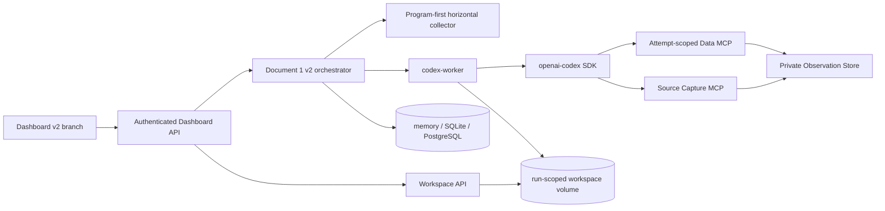

# Codex SDK migration Phase 1-8 implementation handoff

Date: 2026-08-09  
Workflow version: `codex_d1_v2`  
Scope: Document 1 v2; Document 2 interface freeze only; Data MCP follow-up integrated.

## Delivered topology



The legacy Run Type remains the default. Enabling v2 requires both
`DOXAGENT_CODEX_D1_V2_ENABLED=true` and a separately configured worker. No old
workflow table, route, prompt contract, or execution branch is replaced.

## Phase status

| Phase | Delivered implementation |
|---|---|
| 1 | Versioned D1 contracts, thread/attempt/checkpoint/artifact/source/citation/event models, capability tokens, memory/SQLite/PostgreSQL repository parity, feature/config isolation, frozen `document1-handoff-v1`. |
| 2 | Independent FastAPI `codex-worker`, official `openai-codex==0.144.4`, start/resume/turn/cancel adapter, job event stream, restart snapshot recovery, contained Workspace CRUD/inventory/export/publish/delete, atomic writes, checksums, immutable context/published paths, bearer plus run/operation capability authorization. |
| 3 | MCP 2.0 Source Capture and attempt-scoped Data MCP stdio servers; signed role/node capabilities, semantic tool contracts and guide, bounded Observation delivery, shared attempt-local `O#`, Pack readback, and cited-only promotion. |
| 4 | Production-ready PROGRAM target execution, explicit per-target terminal status, provider-attempt audit, guarded Observation normalization, StateValue promotion after identity/unit/time/provenance checks, role-scoped context artifact, corrected VIX route. Unsupported forward/derived targets remain non-executable. |
| 5 | Immutable attempt context compiler, isolated v2 prompt bundle, structured node completion, artifact envelopes, thread identity `(workflow_version, ticker, run_id, agent_role)`. |
| 6 | Exact D1 DAG: Program Collection -> C4 pre-scan -> parallel C1/C2/C3/O4-B -> Agent normalization -> C4 enrichment/finalization -> O4-A -> deterministic assembly/citation/publish. C4 uses one three-turn thread; O4-B/O4-A use one two-turn thread. |
| 7 | Additive Supabase migration with private `doxagent` schema tables, indexes, RLS/forced RLS and explicit service-role grants; authenticated run/start/retry/cancel/events/artifact APIs; API-driven frontend v2 branch with loading/empty/error states and exact C4 public fields. |
| 8 | Focused Python unit/integration/regression tests, mypy/ruff, frontend production build, Compose profile validation, local account/model capability probe, runbook and rollback notes. |

## Workspace and remote deployment contract

The independent worker is viable remotely because the dashboard/orchestrator
does not need host filesystem access. All cross-service file operations use the
Workspace API and accept only normalized paths relative to a validated `run_id`.
The worker owns the workspace volume and exposes:

- read/write with SHA-256 metadata and optimistic conflict checking;
- complete inventory and ZIP export;
- checksum-addressed, idempotent immutable publication;
- deletion limited to a validated attempt identifier;
- short-lived HMAC capabilities bound to one run and operation.

The Codex SDK process itself runs with its run directory as `cwd`,
`workspace-write` or `read-only` sandbox, and `deny_all` approval mode. The
container drops Linux capabilities, enables `no-new-privileges`, runs as a
non-root user, and keeps Codex credentials and run workspaces in separate named
volumes.

## Authentication and provider selection

The local SDK account probe confirmed that the existing ChatGPT login is usable
and that `gpt-5.6-luna` supports `max`. Therefore the default remains OpenAI and
the DeepSeek fallback is not activated.

Desktop credentials are not copied into a container automatically. Authenticate
the same membership account once into the worker's persistent `CODEX_HOME`:

```powershell
docker compose --profile codex-v2 run --rm codex-worker python -m doxagent.codex_worker.login
```

The named `codex-worker-home` volume makes this work identically on a remote
Docker host. After login, verify `/v1/readiness` using the internal bearer token;
the endpoint returns authentication state and available model IDs without email
or credentials.

## Local activation

1. Generate independent random values of at least 24 and 32 characters for
   `DOXAGENT_CODEX_WORKER_BEARER_TOKEN` and
   `DOXAGENT_CODEX_CAPABILITY_SECRET`. Local development currently persists them
   in the Windows user environment; provision separate secrets on another host.
2. Keep Codex runtime metadata on SQLite for local/node testing. The attempts,
   checkpoints, events, sources, citation manifests and bundles are high-churn or
   potentially large JSON payloads, so do not apply the Supabase migration by
   default. PostgreSQL additionally requires
   `DOXAGENT_CODEX_REMOTE_RUNTIME_STORAGE_ENABLED=true` after an explicit egress
   review and migration window.
3. Authenticate the worker `CODEX_HOME` as above.
4. Start `docker compose --profile codex-v2 up -d --build codex-worker`.
5. Confirm worker health, authenticated readiness, Workspace API authorization,
   and a synthetic SDK turn.
6. Set backend `DOXAGENT_CODEX_D1_V2_ENABLED=true` and frontend
   `VITE_CODEX_D1_V2_ENABLED=true`, then rebuild/restart the dashboard.

No remote command, migration, image push, or service restart was executed in
this development round.

## Acceptance evidence and open verification items

Passed locally:

- 32 focused v2 and adjacent regression tests covering contracts, repository,
  Workspace security/idempotence, Source Capture soft-failure, citation,
  horizontal collection/compiler, worker auth/restart recovery, authenticated
  Dashboard routes, and the full fake D1 DAG;
- legacy horizontal, Evidence/Observation annotation, and Dashboard mock API
  regression tests;
- targeted Ruff and mypy checks;
- Dashboard lint, 5 Vitest tests, TypeScript, and Vite production build;
- `docker compose --profile codex-v2 config --quiet`;
- Codex SDK account/model listing, including `gpt-5.6-luna` with `max`.
- `doxagent-codex-worker:latest` image build, non-root healthy container,
  persistent ChatGPT device login, authenticated readiness, bearer rejection,
  and capability-scoped Workspace API reads;
- real `gpt-5.6-luna` max-effort structured turns through both the SDK adapter
  and worker HTTP job path: Data MCP guide discovery, SEC provider execution,
  O1/O2 creation, exact citations, and cited-only promotion all passed.
- final-image low-effort functional smoke completed every D1 v2 checkpoint,
  exercised a persisted failed-then-succeeded retry, C4/O4 thread hand-offs,
  attempt-local citation promotion, publication, and final artifact inventory;
  this was explicitly not a research-quality acceptance run.

Deferred or blocked honestly:

- Remote container, volume, database migration, restart recovery, and network
  policy acceptance are deferred by the explicit no-remote-sync constraint.
- Multi-agent tools are enabled only for C1/C3/O4-A and request/prompt-capped at
  two. The pinned `openai-codex==0.144.4` rejects the current manual's scalar
  `[agents]` limit keys, so hard native concurrency enforcement remains a separate
  acceptance item until the pinned SDK/app-server exposes a compatible key.
- Research quality and performance evaluation are intentionally separate from
  development acceptance. Establish the quality ceiling only after the first
  complete real workflow succeeds.

## Rollback

Set both v2 feature flags to `false` and stop the `codex-worker` profile. This
immediately restores the legacy-only runtime because no old route or table was
replaced. Retain the v2 tables and named volumes for audit/replay; dropping them
is unnecessary for rollback and should be a separate approved destructive
operation.
