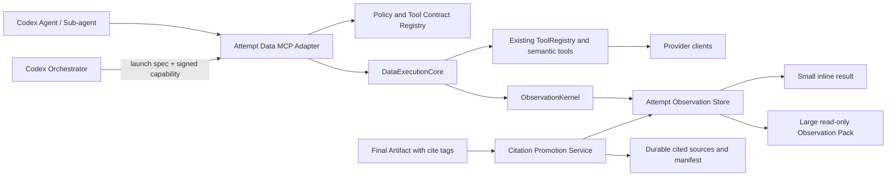

# DoxAgent Data MCP 开发方案

> 状态：已完成需求澄清，可进入实现  
> 日期：2026-08-09  
> 适用版本：`workflow_version=codex_d1_v2`  
> 上位方案：[`codex_sdk_migration.md`](./codex_sdk_migration.md)  
> 本文件只定义 Data MCP、共享 Observation 能力及其对接契约；不在本轮实施代码、配置、数据库或远端部署变更。

---

# 一、结论与冻结决策

Data MCP 采用“**每个 node attempt 一个轻量 stdio Adapter + 共享执行核心 + attempt 级 Observation Store**”的结构。它不是第二套数据工具系统，也不接管旧 Agent Runtime；现有 provider clients、semantic tools、`ToolRegistry.call()` 和旧 Workflow 继续可直接调用。

已经确认并冻结：

1. `O#` 命名空间属于 `node_attempt_id`。同一 attempt 内主 Agent 与 Sub-agent 共用一个命名空间；retry 创建新 attempt 和新命名空间。
2. 小结果在 MCP response 中直接返回完整的已清洗 Observation；大结果只内联高价值块，并物化只读 Observation Pack，供 Codex 使用原生文件读取和搜索能力按需访问。
3. attempt 期间保存全部已清洗 Observation；Artifact 发布时只长期提升实际被 `【cite:O#】` 引用的块、来源坐标、校验和与 Citation Manifest。未引用内容按 attempt/workspace/provider retention 到期。
4. 权限为三层交集：`Data MCP 静态策略 ∩ Orchestrator attempt capability ∩ Codex enabled_tools`。`enabled_tools` 负责减少暴露和上下文，不作为唯一安全边界。
5. MCP 除执行 Adapter 外，还必须承担工具发现和调用指引职责；但不得用一个可任意选择内部工具的通用 `data.call` 绕过逐工具授权。
6. Data MCP、Source Capture MCP 与 Legacy ReAct 最终复用同一个 `ObservationKernel`。本方案实施 Kernel 与 Data MCP；只冻结 Source Capture 的接入接口，不在本批次实现网页/文件捕获。

实现依据采用 Codex 当前正式支持的 stdio/Streamable HTTP MCP、server instructions 和 per-server `enabled_tools` 配置；本方案首版选择 attempt-local stdio，不把 HTTP 多租户服务加入首批复杂度。参考：[Codex MCP 文档](https://learn.chatgpt.com/docs/extend/mcp.md)。

---

# 二、现状审计与必须先解决的冲突

## 1. 可直接复用的实现

- `src/doxagent/tools/providers/`：provider clients、鉴权、fallback、normalization 和已有结果投影；
- `src/doxagent/tools/factory.py`：semantic tool 注册和现有 Agent allowlist；
- `src/doxagent/tools/registry.py`：权限感知的稳定直调入口；
- `src/doxagent/agents/runtime/memory/observations.py`：确定性分段、索引、选块、回查 locator 与 raw/clean block 分离；
- `src/doxagent/agents/runtime/memory/aliases.py`：task-local `O#` 映射语义；
- `src/doxagent/annotations/processor.py`：结果校验后、非阻塞的 `【cite:O#】` 与时间标记解析；
- 现有 Observation/Citation 数据表：作为 Legacy 路径兼容基线，而不是直接复用其 task-local 生命周期。

当前证据机制已经不是旧 `EvidenceRef`。真实链路是：

```text
ToolResult.output
→ Observation 分段
→ task-local O# alias
→ Agent 在正文写 【cite:O#】
→ TextAnnotationProcessor 解析并持久化 annotation
```

Data MCP 必须兼容这条业务语义，但不能把 ReAct 的 `TaskMemoryRuntime`、Plan/Action 循环或合成 `read_observation` 工具整体搬入 Codex。

## 2. 当前冲突及处理口径

| 冲突 | 当前事实 | 本方案处理 |
|---|---|---|
| MCP 输入 Schema 不完整 | `ToolDescriptor` 只有 `input_fields`，不能表达类型、必填、枚举、范围和互斥关系 | 新增版本化 `DataToolContract.input_schema`；旧 Descriptor 字段保留，MCP 只暴露契约完整且通过校验的工具 |
| 工具选择指引不足 | 当前 description/purpose 不足以在 40+ 工具中稳定路由 | 增加 server instructions、逐工具 use/avoid/fallback 指引和确定性的 `data_tool_guide` |
| stdio 身份与 attempt 授权冲突 | 一个长期共享 stdio 进程无法可靠推断不同 attempt 的身份 | 每个 node attempt 启动轻量 Adapter，读取只读且已签名的 attempt capability |
| `O#` 只在进程内 | 当前 alias registry 不持久化，也不能安全协调多个进程 | 新增 attempt-scoped alias store，原子分配并允许主/Sub-agent 共同解析 |
| 大结果回读依赖 ReAct | `read_observation` 依赖下一轮 Fresh Context，Codex 使用它较粗糙 | 大结果写入只读 Observation Pack；兼容回读工具只作为兜底，不作为主路径 |
| `UNAVAILABLE` 语义不一致 | `ToolResult.status` 只有 succeeded/partial/failed/empty/not_applicable；Horizontal Collection 另有 UNAVAILABLE | MCP envelope 分离 `execution_status` 与 `availability`；不把编排/订阅可用性硬塞进旧 `ResultStatus` |
| Citation 只做 annotation | 当前 alias 生命周期和 Citation 持久化仍以 Legacy task 为中心 | 在 Artifact 发布后增加 cited-only promotion，保留非阻塞解析语义 |

`UNAVAILABLE` 不等于一次调用 `FAILED`。例如无订阅权限应返回 `execution_status=failed`、`availability=unavailable` 和稳定的 `error.code=entitlement_required`；Horizontal Collection 再将其映射到 target-level `UNAVAILABLE/BLOCKED`。

---

# 三、目标架构



## 1. `DataExecutionCore`

共享执行核心负责：

1. 接收规范化 `ToolRequest + DataExecutionContext`；
2. 复核 tool allowlist、ticker/run/attempt 范围和只读属性；
3. 通过现有 `ToolRegistry` 调用 semantic tool；
4. 将 provider 返回映射为稳定的执行状态、availability、provenance 和 output contract；
5. 调用 `ObservationKernel`，不自行拼接 prompt；
6. 产生审计事件和 MCP result envelope。

第一版 `DataExecutionCore` 是共享 Python library，不新增长期在线数据微服务。每个 stdio Adapter 在进程内调用它；provider cache 继续使用现有共享 cache backend。Legacy 入口仍可直接使用 `ToolRegistry.call()`，随后再通过兼容 Adapter 渐进接入同一 Core。

## 2. `AttemptDataMcpAdapter`

Adapter 负责 MCP 协议、attempt 身份、工具展示和 bounded delivery：

- 启动时加载 `DataMcpLaunchSpec` 与签名 capability；
- 只向 `tools/list` 暴露交集后的工具；
- 将安全 MCP 名称映射到现有 canonical tool id，例如 `sec_filing_sections → sec.filing_sections`；
- 生成只包含当前 Agent 可用能力的 server instructions；
- 校验 MCP input schema 后才进入执行核心；
- 返回小结果或 Observation Pack locator；
- 不持有 provider key，不把 capability 内容返回给 Agent。

## 3. `ObservationKernel`

Kernel 从现有 ReAct Observation 实现中抽取纯业务能力：

- 只解析 `ToolResult.output`，raw provider payload 不直接进入 Agent 上下文；
- 使用 tool-specific output profile 做字段白名单、排序、去重、表格/时间序列裁剪；
- 生成稳定 block id、source coordinates、content hash 和 attempt-local `O#`；
- 为小/大结果选择不同 delivery plan；
- 支持通过 alias、block id 或 source locator 精确解析；
- 支持 cited-only promotion；
- 不依赖 ReAct step、scratchpad、compaction 或 next-loop context。

旧路径保留兼容 façade，使 `TaskMemoryRuntime` 仍可按原 API ingest/read；在 parity tests 通过前不得删除旧 import path。

## 4. `AttemptObservationStore`

Store 是 attempt 级控制面存储，至少持有：

- raw `ToolResult` 审计副本，Agent 不可见；
- 全部 cleaned Observation Blocks；
- alias ↔ block id 映射；
- call index、catalog、checksum 和 source coordinates；
- cited/promotion 状态。

alias 分配必须使用文件锁或 SQLite transaction 原子化。要求是“attempt 内一经分配保持稳定”，不要求不同 retry 产生相同的 O# 数字。

## 5. `CitationPromotionService`

在结构化结果校验完成、Artifact publish 前后执行：

1. 递归扫描可注释文本中的 `【cite:O#】`；
2. 在当前 `node_attempt_id` 中解析 alias；
3. 生成最小 Citation Manifest；
4. 将被引用的 cleaned block、source coordinates、provider/method version、content hash 提升到 durable source store；
5. 未引用块留在 attempt store，按 retention 到期；
6. 无效 alias、存储失败或单个 source 缺失只产生 warning，不阻断业务 Artifact。

“只长期提升已引用内容”不意味着删除原始调用审计。raw result 仍按安全审计策略短期保留，但不进入 published Artifact、Agent 上下文或长期引用仓库。

---

# 四、MCP 的工具发现与调用指引

工具指引必须由 MCP 自身承担，并采用四层逐步披露，避免一次把几十个 endpoint 的长说明塞入上下文。

## 1. Server instructions

Adapter 根据当前 allowlist 动态生成短说明，至少告知 Agent：

- 先按业务问题选择 semantic tool，而不是按 provider 品牌猜 endpoint；
- 哪些类别可用：公司披露、财务、市场预期、宏观、行业、监管、合同/订单等；
- `as_of/cutoff`、ticker、时间区间和 point-in-time 约束；
- `succeeded/partial/empty/failed` 与 availability 的区别；
- 小结果可直接引用，大结果应先读 `selected.md/catalog.json`，再只打开相关 `blocks/O#.md|json`；
- 引用格式固定为 `【cite:O#】`，不得编造 alias。

核心路由不能依赖 MCP resource 是否会被模型主动读取；server instructions、tool description 和普通工具调用构成正式路径。

## 2. 逐工具描述

每个 `DataToolContract` 必须提供：

```yaml
canonical_tool_id: sec.filing_sections
mcp_name: sec_filing_sections
source_name: SEC EDGAR
business_categories: [company_filing, contract_order, management_guidance]
description: 检索并返回指定 SEC filing 的相关章节及来源坐标。
use_when:
  - 需要 10-K/10-Q/8-K 原文中的合同、订单、产品、风险或管理层披露
avoid_when:
  - 只需要标准化财务数值
required_context: [ticker]
input_schema:
  type: object
  properties:
    form:
      type: string
      enum: [10-K, 10-Q, 8-K]
    accession:
      type: string
    sections:
      type: array
      items: {type: string}
  additionalProperties: false
output_profile: sec_filing_sections_v1
fallback_tool_ids: [sec.recent_filings]
freshness: provider_realtime
point_in_time_safe: true
read_only: true
contract_version: "1.0"
```

其中 `input_schema` 必须是完整 JSON Schema；实际实现应按真实 semantic tool 参数补齐约束，不能照抄示例或以空对象通过 exposure gate。`ToolRequest.ticker`、`agent_name`、run/node/attempt、cutoff 和审计 metadata 由 Adapter 从已验证 launch context 注入，不作为可由 Agent 伪造的普通 input；确需跨标的查询的工具必须显式声明 `symbols` 并接受 capability 范围校验。

MCP 只暴露满足以下条件的工具：schema 完整、read-only、契约版本受支持、位于三层权限交集、provider capability 未被静态禁用。已知无 entitlement 的工具不应继续暴露后再让 Agent 反复失败；如果业务需要展示缺口，则由 guide 返回“unavailable + 原因”。

## 3. `data_tool_guide`

所有 Data MCP profile 都暴露一个只读、无 provider 调用的 `data_tool_guide`：

```json
{
  "task": "查找 MU 最近 8-K 中的长期供货协议和管理层产能表述",
  "business_category": "contract_order",
  "as_of": "2026-08-09"
}
```

它只在已授权契约中做确定性元数据匹配，返回最多 5 个候选工具、选择原因、必填输入、fallback、point-in-time 风险和已知 availability；不得发起 LLM 请求、provider 请求或任意内部 tool call。

## 4. 生成式目录文件

Adapter 启动时可在只读 context projection 中生成 compact `data_tool_catalog.md`，供 Codex 使用文件搜索。它是 server instructions 的展开版，只包含本 attempt 的允许工具，不是新的授权来源。目录由 Tool Contracts 自动生成，禁止维护第二份手写 endpoint 清单。

---

# 五、权限、进程与安全边界

## 1. Launch contract

Codex Orchestrator 负责构造：

```yaml
schema_version: data_mcp_launch/1.0
workflow_version: codex_d1_v2
run_id: string
node_id: string
node_attempt_id: string
agent_role: string
ticker: string
cutoff_at: datetime
enabled_tool_ids: []
capability_file: worker-control-plane path
observation_projection_root: read-only Codex path
```

capability 文件位于 Agent 不可写的 worker control-plane 路径，包含相同 scope、过期时间、nonce、只读标志和签名。Adapter 启动时验证签名、audience、expiry、attempt/ticker/workspace 一致性；任一失配硬失败，不启动降权后的“部分服务”。

## 2. 权限交集

```text
effective_tools =
  static_policy(workflow_version, node_id, agent_role)
  ∩ signed_capability.enabled_tool_ids
  ∩ Codex profile enabled_tools
```

- static policy 是服务端最大权限；
- capability 是单 attempt 的进一步收窄；
- Codex enabled-tools 用于模型可见性和上下文控制；
- 每次 tool call 都重新校验 effective set；
- 不提供通用 `data.call(tool_name, arbitrary_input)`；
- `data_tool_guide` 也只能看到 effective set 和明确登记的 unavailable 缺口。

## 3. Secret 与文件安全

- provider key 只由现有 settings/provider client 读取，不进入 launch spec、tool schema、result、pack、trace 或错误详情；
- MCP result 与 Observation Pack 写入前执行 secret-pattern redaction；
- Pack 先写临时目录，校验后 atomic rename，finalize 后只读；
- 生产 worker 将 pack 从 worker-owned store 只读投影到 Codex Workspace；
- 所有路径做 containment 校验，拒绝绝对路径输入、`..`、symlink escape 和跨 attempt locator；
- Codex 读取 Pack 后若内容被修改，Citation promotion 通过 checksum 拒绝提升该块并记录 warning。

---

# 六、结果、分段与 Observation Pack 契约

## 1. 统一 MCP envelope

```json
{
  "schema_version": "data_mcp_result/1.0",
  "canonical_tool_id": "sec.filing_sections",
  "tool_call_id": "call_...",
  "node_attempt_id": "attempt_...",
  "execution_status": "succeeded",
  "availability": "available",
  "summary": "...",
  "delivery": {},
  "provenance": {
    "provider": "sec",
    "retrieved_at": "...",
    "published_at": null,
    "as_of": "...",
    "method_version": "..."
  },
  "warnings": [],
  "error": null
}
```

`execution_status` 直接沿用 `ToolResult.status`；`availability` 使用 `available | degraded | unavailable`。provider entitlement、配置缺失、静态停用等通过稳定 error code 表达。MCP Adapter 不把 `failed` 猜成 `unavailable`。

## 2. 小结果

默认在 cleaned content 不超过 16,000 字符、12 个 blocks 且无单块超限时直接返回：

```json
{
  "mode": "inline",
  "observations": [
    {
      "alias": "O1",
      "title": "...",
      "content": "...",
      "source_locator": "...",
      "content_hash": "..."
    }
  ]
}
```

即使内容 inline，也必须先登记为 Observation 并分配 O#，否则最终 Artifact 无法稳定引用。

## 3. 大结果

超过 inline budget 时，response 仅返回不超过 12,000 字符的高价值 selected blocks、简短 catalog 和 Pack locator：

```text
context/mcp_data/<tool_call_id>/
├── manifest.json
├── selected.md
├── catalog.json
└── blocks/
    ├── O12.md
    ├── O13.json
    └── ...
```

- `manifest.json`：call、tool、status、版本、时间、block 索引和 checksum；
- `selected.md`：默认最值得阅读的完整块，不放截断句；
- `catalog.json`：alias、标题、类型、时间范围、行数/字符数、locator 和关键词；
- `blocks/O#.md|json`：单个完整 cleaned block。

Agent 优先用 `rg`/文件读取定位目标块。兼容 `data_read_observation(alias)` 仅用于无文件读取能力的 client 或诊断，不应在 Codex 主路径中频繁调用。

## 4. 清洗原则

“显著剔除冗余”必须由 tool-specific `output_profile` 确定，不能用通用启发式任意删除业务字段：

- JSON：声明保留路径、记录 identity、排序键、时间字段和最大条数；
- table/time series：保留表头、单位、季调/频率/period，按业务时间倒序裁剪；
- filing/text：保留完整相关段落、章节、页/段落 locator，不截断句子；
- search results：去重 URL/文档 ID，保留标题、日期、来源、摘要和 locator；
- provider wrapper、debug echo、重复 metadata、空字段和未使用分页结构不进入 Agent-facing content；
- raw payload 只进入受控审计存储。

沿用当前 1,200 字符级 block 基线，但允许 output profile 对表格行和法定披露段落做有界覆盖。所有覆盖必须有 snapshot 和 exact-reconstruction 测试。

---

# 七、与 Legacy、Codex SDK 和 Source Capture 的接口边界

## 1. Legacy 直调兼容

- `ToolRegistry.call(request, permissions)` 的公开签名和返回类型保持不变；
- 现有 Agent allowlist 保持可用；
- `DataToolContract` 是 Descriptor 的向后兼容扩展，不要求旧调用方提供 MCP 字段；
- MCP 只调用同一 semantic client，不复制 provider endpoint 代码；
- 同一 fixture 经 direct path 与 MCP path 后，其业务 output、status 和 source locator 必须等价；MCP 只额外增加 Observation/delivery envelope。

## 2. Codex SDK 开发线的交付边界

Codex SDK 开发线负责：

- node attempt 生命周期和 `DataMcpLaunchSpec`；
- stdio process 启停、interrupt、timeout 和日志关联；
- `CODEX_HOME` MCP 配置与 enabled-tools；
- worker control-plane capability 签发；
- Observation Pack 的只读 workspace projection；
- 最终 Artifact publish 时调用 Citation promotion 接口。

Data MCP 开发线负责：

- Tool Contract/指引目录；
- capability 验证与 effective tool 计算；
- stdio MCP server 和逐 semantic tool Adapter；
- `DataExecutionCore`；
- `ObservationKernel`、attempt alias/store、Pack 与兼容回读；
- Citation resolve/promotion 实现；
- direct/MCP parity、真实 tool 和安全测试。

双方以本文的 `data_mcp_launch/1.0`、`data_mcp_result/1.0` 和 Observation Pack v1 为并行开发契约。任一方需要改字段必须先升 minor/major version，不能静默修改。

## 3. Source Capture 接口

Source Capture MCP 后续只需将抓取结果转成统一入口：

```text
ObservationKernel.ingest_external_source(
  node_attempt_id,
  source_metadata,
  cleaned_content,
  source_coordinates,
)
```

它与 Data MCP 共用 alias store、Pack、Citation promotion 和 retention；不共用 provider tool registry，也不能获得 Data MCP capability 中未授予的 endpoint 权限。

---

# 八、建议模块与实施顺序

## 1. 模块落点

```text
src/doxagent/
├── data_runtime/
│   ├── contracts.py
│   ├── execution.py
│   ├── guidance.py
│   └── policy.py
├── observations/
│   ├── kernel.py
│   ├── aliases.py
│   ├── profiles.py
│   ├── store.py
│   ├── pack.py
│   └── promotion.py
└── mcp/
    └── data_server.py

tests/
├── data_runtime/
├── observations/
└── mcp/
```

现有 `agents/runtime/memory/*` 在迁移期保留 façade/re-export，避免一次性改动 Legacy Runtime。

## 2. 实际开发顺序

### Step 1：冻结版本化契约

- 建立 `DataToolContract`、launch/result/pack schema；
- 为现有 ToolDescriptor 增加带默认值的兼容字段；
- 定义 execution status、availability 和稳定 error codes；
- 建立 contract validation 与版本测试。

退出条件：不改任何 provider 调用，旧 registry/tests 无回归；缺少 input schema 的工具不能进入 MCP exposure。

### Step 2：抽取 `ObservationKernel`

- 从 ReAct memory 中抽取 parser、block、profile、locator 和 checksum；
- 建 compatibility façade；
- 增加 direct fixture 的 block/alias/fresh-view parity 测试；
- 新增 attempt alias store 与并发分配测试。

退出条件：Legacy ReAct Observation 行为和现有 citation tests 不变，Kernel 不依赖 ReAct runtime。

### Step 3：建立 Tool Contract 与指引

- 按当前 43 个非派生 semantic tools 补齐 JSON Schema、use/avoid、category、fallback、availability 与 output profile；
- 生成 per-role/node compact catalog；
- 实现确定性 `data_tool_guide`；
- 已移除或 entitlement blocked 的工具不得重新进入 allowlist。

退出条件：每个 exposed tool 均可说明“什么时候用、需要什么、返回什么、失败后怎么办”，无重复手写目录。

### Step 4：实现 Data MCP Adapter

- stdio server、server instructions、tools/list、逐工具 call；
- capability 校验和三层权限交集；
- safe MCP name ↔ canonical id 映射；
- `DataExecutionCore` 与审计事件；
- 保持 `ToolRegistry.call()` 直调回归。

退出条件：未授权工具既不可见也不可调用；授权 semantic tool 可经 MCP 获得与 direct path 等价的业务结果。

### Step 5：实现 bounded delivery 与 Pack

- small inline/large pack planner；
- worker-owned store、atomic finalize、只读 projection 与 checksum；
- catalog/selected/block 文件；
- `data_read_observation` 兼容兜底；
- retention 清理。

退出条件：大结果不再把完整正文高频暴露给模型；Agent 能使用原生文件工具定位并读取任意 cleaned block。

### Step 6：实现 cited-only promotion

- 对接最终 Artifact annotation；
- resolve attempt alias；
- 只提升 cited blocks 和 manifest；
- 补齐 invalid alias、过期、checksum mismatch 和 persistence failure 的非阻塞告警。

退出条件：`【cite:O#】` 可从 MCP result 追溯到 durable source；未引用块不会进入长期发布仓库。

### Step 7：真实验收与 Codex SDK 联调

- 使用无 LLM harness 对每个 exposed tool 做 MCP `tools/list/call`；
- 每类 provider 至少一次真实调用，记录返回内容、裁剪比例、locator 和可用性；
- Codex SDK 线再做 Agent 工具选择、Pack 原生读取、Sub-agent 共用 alias 和 Artifact citation 的端到端验收；
- entitlement blocked、IBKR 未接通等现状按真实状态保留，不以 mock 宣称 production-ready。

---

# 九、验收门槛

Data MCP 只有同时满足以下条件才可供 `codex_d1_v2` 使用：

1. **兼容性**：Legacy direct call、ReAct Observation 和 annotation 回归全部通过。
2. **工具契约**：100% exposed tools 有有效 input schema、工具选择指引、output profile 和 capability 状态。
3. **授权**：tools/list 与 tools/call 都执行三层交集；越权、过期、跨 attempt、跨 ticker 全部拒绝。
4. **结果质量**：真实 ToolResult 提供预期业务信息；冗余裁剪可解释且 raw 审计可回查。
5. **上下文控制**：小结果有上限；大结果只内联 selected blocks，完整 cleaned content 通过 Pack 按需读取。
6. **引用**：inline/pack 均分配 O#；主/Sub-agent 同 attempt 可解析；只长期提升实际引用块。
7. **安全**：provider key、capability、绝对控制面路径和 raw payload 不出现在 Agent-facing result/pack/log。
8. **可靠性**：EMPTY、PARTIAL、entitlement、timeout、rate-limit 和 provider error 均有稳定机器语义；Citation 失败只降级。
9. **可观测性**：每次 call 可按 run/node/attempt/tool/provider 关联 latency、status、payload bytes、inline/pack bytes、block count 和 citation promotion count。
10. **真实联调**：至少一个 Codex D1 node 在真实 Data MCP 下完成工具选择、读取、引用和 Artifact publish；不得用旧 ReAct harness 代替该门槛。

---

# 十、明确不做

- 不在 Data MCP 内实现 Agent loop、planning、memory compaction、Submit Tool 或 Artifact 业务校验；
- 不复制 provider client 或为 MCP 再维护一套 endpoint SDK；
- 不用 Prompt 文本替代服务端 capability；
- 不暴露任意 provider URL、任意 SQL、任意内部 tool name 的通用调用器；
- 不把所有 raw provider payload 写进 Codex Workspace；
- 不依赖模型主动读取 MCP resource 才能知道基本工具选择规则；
- 不在本批次实现 Source Capture 抓取器、Document 2 workflow 或派生指标计算；
- 不因迁移而把 DOCUMENTED/BLOCKED 工具升级为 production-ready。
