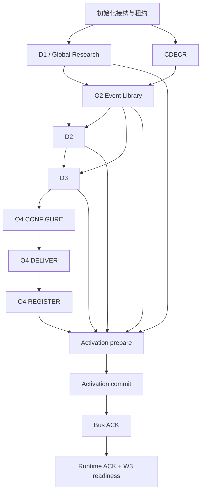

# DoxAgent V2 ticker 初始化：阻塞逻辑审计与修复建议

审计日期：2026-09-10（Asia/Shanghai）
对象：本地当前工作树；HEAD `dffbf64c11298fc3e2d346685ecba5ceac3d9db8`，**包含未提交修改，不等于该 commit 的纯净内容**。
范围：正式 ticker initialization 入口、跨节点适配、实际子工作流、产物校验、恢复、O4 注册、激活与 Bus/Runtime 接纳。
交付性质：审计及建议方案；未修改业务代码，未部署、未操作服务器、未恢复 MU 初始化。

## 1. 核心结论

目前频繁中断的根因不只是模型输出不稳定，而是**Agent 输出、执行回执、持久化记录、业务交接物被混在同一个成功判定里**。可用报告因旁路文件差异被否决；可用事件集合因某条 ledger/关系错误被整包否决；成功节点恢复时重新经过当前严格 schema；这些异常再被外层有限预算放大成全 ticker 失败。

这与 `ticker_initialization_orchestration_plan_20260905.md` §5.2 已冻结的最小可用交接物原则不一致。方案本身已要求局部问题不阻断，但各子工作流执行边界没有统一落实。

最值得提前修复的路径，按执行顺序排列：

1. **D1**：progress/双份报告/候选列表一致性、任一引用未解析、任一子节点失败都会阻断发布。
2. **O2**：阶段结果与文件校验在容错 importer 之前执行；覆盖计数不一致、重复文件不同、局部日期/Reference ledger 错误仍能全局失败。
3. **D2**：有 PARTIAL 能力，但候选/评审只接受特定异常类型降级；原 D1 thread 不存在、部分恢复异常会逃逸。Synthesis/Finalization 仍是单点。
4. **D3 → O4**：D3 已支持合法空策略和逐记录恢复，O4 却禁止无 policy 的计划，并要求所有 policy 都被覆盖，形成跨节点契约冲突。
5. **O4**：checkpoint、候选耗尽证明、全部 Source Need 结算的一条局部错误可能否决所有已完成交付。
6. **恢复与启动**：成功 receipt 解码失败不能自动迁移/认领；启动 ACK 等待能超时失败，但消费端只记录笼统 warning，根因难以定位。

推荐方向不是给现有严格校验再加更多模型重试，而是：**宽容接收 Agent 草稿 → 确定性归一化 → 隔离最小受影响对象 → 生成严格、可消费的 canonical handoff → 父节点仅判断该 handoff 是否可用**。

边界说明：Codex SDK 是 coding agent，这支持放宽模型输入输出格式要求；但后续 importer、消息总线和 Runtime 是确定性程序，不能直接消费任意坏结构。应把严格性放在程序生成的 canonical 产物和实际副作用上，不能简单全局关闭 Pydantic 或把所有异常吞掉。

## 2. 证据与审计方法

### 2.1 基线

- 阅读 `real_test_issue.md` 全文，包括 line 61 附近的 durable receipt/事件超长故障，以及后续追加的跨 attempt 引用记录。
- 阅读初始化整体方案与实际 `ticker_initialization` 代码；沿真实 dispatch 追踪，不把旧初始化工作流或 Pilot 专用 gate 当作生产必经路径。
- D1 的生产入口实际是 `ResearchInitializationAdapter._d1 → CodexGlobalResearchOrchestrator`，后者继承 `CodexDocument1Orchestrator` 的执行、恢复、发布工具。报告引用 Global Research 的真正发布 gate。
- 检查 D2、D3、O2、O4 runner/orchestrator/schema，以及 Event Library validator、CDECR 接入、durable 子节点、激活消费者。
- 无远端实时核验；历史 MU 事实来自问题记录，后续风险来自本地代码。没有把静态可达风险声称为远端已经发生。

### 2.2 必要的本地探针

使用现有 `.venv/Scripts/python.exe` 运行内存级探针，不调用模型、不访问业务数据库、不创建初始化：

| 输入 | 当前实际结果 |
|---|---|
| C3：progress 已 completed，章节正确，唯一差异为 draft 末尾多 ` |` | `StructuredOutputInvalid: report_draft.md does not match report_markdown` |
| D1：可用 report，metadata 多一个 `note` | `extra_forbidden` |
| O4：完整计划元信息，`source_needs=[]` | `configuration plan must cover at least one policy` |

这些探针验证三个具体拒绝条件，不等于全链路测试。其余结论为调用链审计；本轮没有运行宽泛回归或真实 MU 重测。

### 2.3 已记录故障的当前分类

| 故障 | 当前本地状态 | 审计判断 |
|---|---|---|
| C3 Markdown 尾部差异 | `attempt_bundle.py` 仍做严格文本一致性；探针复现 | **仍需修复**，不应消耗研究重试 |
| EntityRelation/FutureNode alias 与内部字段名不兼容 | 当前 `codex_runtime/schema.py` 已有兼容补丁 | 此模型已修，通用 receipt 演进问题仍在 |
| 16 KiB WorkflowEvent 掩盖原错误 | D1 `_execute_or_partial` 已使用有界错误文本 | 此入口已修，未形成全局安全事件写入边界 |
| 重试复用旧 thread，Observation Store 留在旧 attempt | D1 runner 已对历史 attempt 使用新 thread；citation promotion 扫描完整 NodeOutput；rebinder 递归处理字段 | 已有局部修复；不能宣称所有工作流的 thread/MCP scope 均已解决 |
| 建立 thread 时 403 / turn timeout | worker 与 D1 仍主要传播为节点失败；D1 将无成功响应包装为 StructuredOutputInvalid | 与格式故障混类，应按执行阶段分类 |

问题记录末尾仅表明新 C3 attempt 在执行，不代表 O2/D2/D3/O4/Activation 已验收。

## 3. 实际依赖与失败传播

代码：`ticker_initialization/catalog.py:19`，`service.py:90`。

父 worker 只把 `SUCCEEDED` 视为依赖满足；`quality_annotations` 不驱动分支，这是正确设计。问题是子层在生成 `NodeResult` 前已经抛错，父层永远看不到“有成果但局部降级”。

`service.py:100-127` 在顶层节点耗尽且无待恢复节点时结束初始化；同批兄弟节点通过 gather 保留独立完成机会。`substeps.py:220-258` 管理内部首次+一次重试；`service.py:153-168` 对仍有预算的失败 child 重入容器。因此不能简单声称“父重试必然重跑所有成功子节点”，也不能把重试层数机械相乘。

真正的问题是失败类型没有表达影响范围，确定性解析错误和真实研究失败都能进入相同预算；成功回执解码还发生在 child 执行 try 之前，反复重入也不会修复旧 payload。

## 4. 判定原则：最小阻塞范围

| 类别 | 建议动作 | 例子 |
|---|---|---|
| 可机械恢复的表示问题 | 本 attempt 内修复并记差异，不新开研究 turn | BOM、换行、alias、空值表示、非业务多余字段、程序可重算计数 |
| 可用主体的附件/质量缺口 | 生成严格交接物，标注诊断，继续下游 | progress 未更新、缺少 review、部分引用不可解析 |
| 单条记录有语义冲突 | 隔离该对象及必要依赖，健康记录继续 | 日期不确定的 Fact、坏 Policy、一个失效 Source Need |
| SDK/网络短暂不可用 | 有界重连/等待，检查已有成果，恢复原执行事实 | thread 建立暂时失败、ACK 暂时未到 |
| 全局身份/不可变输入被破坏 | 硬阻断相关执行或提交 | ticker 错、输入 hash 真正改变、陈旧 base 的冲突写入 |
| 没有任何可消费成果或必要能力不可用 | 硬阻断相应阶段，保留全部历史 | 所有核心研究主体缺失、依赖不可读、Bus/Runtime 无法启动 |

“局部降级”不能意味着编造事实、猜测引用、虚构来源已交付、把未知触发条件当作可执行 Policy。可以保留研究文字并标注证据未解析，但不能把该别名冒充已解析证据。

原方案仍规定每节点首次+一次自动失败重试，本报告不建议直接改为无限重试。确定性修复不计模型失败重试；传输级恢复必须有时间上限；真实重新执行仍遵循预算。需要调整预算政策时应单独修改原契约。

## 5. 发现清单与具体修复建议

优先级：P0＝建议在继续扩大真实初始化测试前修复；P1＝应纳入本次系统性治理；P2＝诊断/工程完善。这里是审计排序，不代表已造成线上事故。

### A. 父编排、回执与执行基础层

**A01 · P0 · 成功 receipt 的 schema 演进仍是永久恢复障碍。**
证据：`ticker_initialization/substeps.py:167-178,220-230`，`invocation.py:59`。SUCCEEDED 的 `artifacts.return` 被当前 codec 整体重新解析；alias 修复只覆盖 EntityRelation/FutureNode。后续增加枚举、字段约束、嵌套输出版本，同类错误仍可能发生。该解析在执行 try/budget 分支之前，父级重复运行容器不能修复它。

建议：receipt 增加 codec/schema 版本，提供有限、可审计的兼容迁移；保留原 payload/hash，写新的迁移视图。迁移失败先依据已冻结 artifact 与 manifest 对账认领；只让不可恢复的最小节点进入失败集合。不能删除旧 receipt，也不能伪造成功 NodeResult。

**A02 · P1 · 任意异常进入同一种失败预算，缺少“错误范围 + 已有成果”判定。**
证据：`service.py:132-178`、`substeps.py:231-258`。大量 ValueError/ValidationError 直接记 fail；重复调用无法改变的格式/契约错误可能立即耗尽。

建议：各适配器返回统一的交接物判定：usable、diagnostics、quarantined_refs、repair_refs；异常带 code、scope、retryability。父层只消费判定，不重做内容质量校验。必须落到各节点的恢复逻辑，不能仅新增一组异常类。

**A03 · P1 · SDK 建线程故障与产物格式故障混类，超时不先认领成果。**
证据：`codex_worker/jobs.py:108-166`；`codex_document1/node_runner.py:256-258`；D2 `errors.py:41-124`。worker 保留 CODEX_WORKER_ERROR/CODEX_TURN_TIMEOUT，但 D1 统一转换为 StructuredOutputInvalid；D2 还依靠错误字符串识别 SYSTEM。worker 的 turn 超时包裹 `handle.run()`，建线程的 `runtime.start()` 在它之前，不受该 turn timeout 覆盖（SDK 自身可能另有超时，不能从这里推断绝对无限等待）。

建议：分别记录 START_THREAD、RUN_TURN、INGEST、CANONICALIZE、PUBLISH；为启动阶段设置显式有界超时及短暂故障退避；403 不假定必为永久权限错误，也不无限重试。failed/timeout 后检查稳定工作区成果与完成证据，足够则认领，否则重试该节点。完成证据必须由程序验证，不能只看文件非空。

**A04 · P1 · 诊断大小限制仍可能成为次生错误。**
证据：`codex_runtime/schema.py:278-292,430-440`；`codex_document1/orchestrator.py:943`；D1 runner `bounded_error_message` 按字符裁剪，而若干模型按 UTF-8 bytes 限制。D1 当前 2,000 字符裁剪足以规避此处 16 KiB 事件，但不等于通用满足 4 KiB attempt 字段。部分代码用 model_copy 绕过即时校验，风险可能延后到重新读取时暴露。

建议：统一按 UTF-8 JSON 实际字节预算编码错误摘要，完整错误保存本地受控诊断文件；事件写入失败不改变已完成业务结果。控制账本/租约写入失败不能降为普通日志警告。不要为消除 16 KiB 错误无限放大消息上限。

### B. D1 / Global Research

**B01 · P0 · progress 与双份报告一致性被当作研究成功条件。**
证据：`codex_document1/attempt_bundle.py:276-321`。draft 非空、progress JSON、status、required_sections、completed_sections 顺序与全集、report 文本、candidate 文件与 structured completion 全部硬校验。Markdown 尾部问题当前仍可复现。

建议：确定一个 canonical report 来源：有效 final report 优先；缺失时恢复稳定 workspace draft。另一份只作差异审计。progress 是进度信息，不是发布凭证；章节缺口记录到报告质量。候选列表逐条归一化/隔离，内容冲突不能简单拼接。保留原两份内容，不原地改写历史；程序另写 canonical 输出与 repair receipt。两份都无可用研究主体时才失败。

**B02 · P0 · NodeOutput 严格 envelope 会丢弃整篇可用报告。**
证据：`codex_document1/schema.py:19-36`；`node_runner.py:258`。metadata 是空闭合模型，额外 note 可导致整个输出失败；一个 observation/relation/future node 坏字段也可能使整包解析失败。

建议：保留最终 canonical model 的严格性；在模型返回的接入层分解解析主体和各数组，alias/多余非业务元数据确定性处理，坏项进 quarantine。warnings/metadata 缺陷不得否决 report。无法证明含义的日期、事实、方向不猜测填补。

**B03 · P0 · 任意 unresolved citation 阻断整节点。**
证据：`node_runner.py:280-296`；Global Research `orchestrator.py:155-163` 还要求 report 对应 manifest 存在。

建议：优先做同一受控 lineage 的证据重绑定；无法重绑定则保留 unresolved 条目和正文位置，不作为已解析证据进入数值/事实晋级。manifest 缺失时从当前成果及可证明来源重建，不能猜旧 O#。局部引用问题不应阻断整篇研究。整体 provenance 身份错配仍拒绝该证据域，但允许已有健康研究内容以显式证据缺口继续交接。

现有跨 attempt 修复是正确的；不建议为了通过 gate 扫描所有历史 Observation Store 按别名碰撞取值。

**B04 · P0 · 任一 failed child 阻断 Global Research 发布。**
证据：`codex_global_research/orchestrator.py:150-153`；继承的 `_execute_or_partial` 已返回占位结果继续执行，最终却统一拒绝发布。C4 预扫描/丰富化失败也进入同一个集合；`node_runner.py:530-537` 要求 C4 enrichment 非空。

建议：C4 缺失优先复用本轮有效 pre-scan 关系，无内容允许空关系/未来事项并记缺口。最终依据 C1/C3/C5 主体是否有可读取内容判定；progress/schema/citation 小错经前述恢复后不应让核心报告消失。核心报告确实全无可用主体时保留失败。未来若允许缺失某个核心领域报告，需同步改 O2/D2 的 required-role 读取，不能只删这个 gate。

**B05 · P1 · 研究后确定性 assemble/publish 的恢复单位不足。**
证据：Global Research `orchestrator.py:150-229`；公共 `_publish_references` 在 `codex_document1/orchestrator.py:867`；默认拓扑只有顶层 d1，实际 durable 主要包裹研究 runner。

建议：为 canonicalize/assemble/publish 建立独立 durable receipt，已有研究成果先落盘再发布。发布异常仅重做对应副作用并核对既有 checksum。缺存储配置应在执行昂贵研究前预检；不可变产物 hash 错不应被宽松文本比较替代。

### C. CDECR 与 O2

**C01 · P1 · CDECR 接入层要求完整 message ID 覆盖和 FINALIZED，需区分全局损坏与局部任务缺口。**
证据：`cdecr_integration/workflow_runner.py:68-75,113-138`；`coordinator.py:191,417-421`；`ticker_initialization/research_adapter.py:214-251`。

当前允许 FINALIZED_NOOP，且 O2 可建立合法空 publication，这是已有正确能力。冻结非 FINALIZED epoch、未知输入身份不能直接放行。

建议：document processor 缺少少数 message 输出时，在原始消息可证明完整的前提下为缺项记录隔离/待处理账，不让有效消息被丢弃；由 epoch 引擎正式完成隔离结算再 FINALIZED。不能把异常返回强制改成 FINALIZED 或伪装“没有新闻”。PREBUILT_REQUIRED、cutoff/registry identity 是运行模式和输入完整性约束，不因鲁棒性改造静默绕过。

**C02 · P0 · O2 在容错 Bundle ingestion 之前设置了大量格式 gate。**
证据：`codex_event_library/remote_runner.py:523-531,673-730,884-910`。模型返回必须匹配阶段、NOT_RUN、PENDING/BUNDLE_READY、bundle_path、coverage total；survey/wave/candidate map 要逐个 D# 完全覆盖；final 阶段 work 与 bundle 的 JSONL 整体解析后要求一致。

建议：阶段、路径、base、预期 D# 总数由程序拥有；模型回显缺失可从冻结上下文补回，明确冲突需检查真实产物身份。先宽容逐行读取，再重算覆盖；遗漏 D# 记 KEEP_PENDING；未知 D# 隔离；完全相同重复项去重，冲突项隔离。采用单一 canonical Revision Bundle，work 是草稿，不能继续将双份文件同步作为全局前置 gate。

**C03 · P0 · 可发布 Bundle 仍可能因模型覆盖计数不一致被否决。**
证据：`remote_runner.py:992-1026,1102-1119`。`outcome.publishable` 已为真，仍调用 `_require_exact_bundle_coverage` 比较模型 total/resolved/pending，不等即抛 StructuredOutputInvalid。

建议：直接使用 validator 的权威统计替换展示计数，保存 `reported_coverage` 与差异。此处不需要模型修复，更不应重跑 reconstruction wave。

**C04 · P0 · Event Library 的局部关系/生命周期错误可否决整包。**
证据：`event_library/validator.py:169-197,220-374`。单事件未知关系目标、ACTIVE 同时 retired、缺 retirement、redirect 目标错误会生成 ERROR；`RELATION_CYCLE` 也是整包失败。

建议：隔离最小闭合冲突子图及引用它的本轮变更，保留既有版本对象，将对应 delta 回填 Pending；重复计算引用闭包，健康对象继续发布。不能仅把 ERROR 改 WARNING 后原样发布有环/悬空图。只有无法确定整个 bundle 的身份或无法得到一致的保留子集才全局失败。

**C05 · P0 · 日期/Reference Review 的账本细节仍能阻断 O2。**
证据：`validator.py:479-618,621-886,888-1039`；`remote_runner.py:1227` 为当前 validation context 要求 `event-library-maintenance-v3`，不是仅旧维护路径才会触发。

典型条件：重复 review、未知 event、review 与 revision flag/importance 不同、缺 date ledger、Fact 日期精度/ledger 不同、缺 Reference decision ledger、basis/reason/note/as_of 不同。这些错误最终通过 `any(ERROR)` 使 bundle 不可发布。

建议：

- 冗余 note/reason/flag/时间戳由选定 canonical decision 与冻结时钟生成，不让模型重复写相同事实。
- 日期优先级已有唯一可证明答案时程序恢复；不确定日期不猜测，把受影响 Fact/Event 与 delta 留 Pending。
- 对缺失 review/ledger 的旧事件保留既有已发布状态；新事件不能无依据标为 important/included，可以隔离或使用契约允许的未决状态。
- 只重算受影响记录的 coverage；避免“一条 fact 日期错误 → 全部事件重建”。

**C06 · P1 · 导入已发生后的状态比较可能制造假失败。**
证据：`remote_runner.py:1148-1154`：调用 `import_tolerant_and_publish` 后，若 outcome.status 与先前校验状态不同，再抛异常。

建议：发布前确认不可变输入；发布后按 publication ID/base/hash/receipt 对账。诊断从 PARTIAL 变 PASS 等状态差异应保存告警，不足以否决已经正确提交的 publication。真正内容/版本冲突仍阻断后续采用。此为静态可达风险，未复现远端事故。

### D. D2

**D01 · P1 · Candidate/Review 的降级按异常类判断，而非交接物可用性。**
证据：`codex_document2/orchestrator.py:491-501,590-600,1155-1156`；`errors.py:37-38`。仅 Document2ExecutionError 且非 SYSTEM 被允许降级；普通 ValueError、receipt 解码、恢复/存储异常会整体上抛。

建议：候选和评审只要其他输入仍可用，可记录该分支缺口继续 synthesis/finalization；把缺陷分类为“该分支不可用”和“全局执行环境不可用”。不能用 catch-all 吞掉 LeaseLost 或控制账本写入错误；也不能仅凭某条异常含 authentication 字样就否决已有全部成果。

**D02 · P0 · 原 D1 thread 是评审硬依赖，且存在继续复用旧 MCP scope 的风险。**
证据：`orchestrator.py:689-710`：找不到原 thread 直接 ValueError；review 使用 D1 workspace/thread，`fresh_on_retry=False`。输入中其实已经传了原领域报告和 provisional shells。

建议：以冻结报告+候选集合为充分业务输入；thread 不存在/不可恢复时新开 review thread。同 thread 只是优化，不是业务正确性条件。为 D1→D2 review 和 D2 自身重试验证实际 MCP attempt scope。当前 SDK `thread_resume` 不能被假定必然刷新 stdio 进程；若 scope 不一致则换新 thread 并显式携带上下文。

该风险有 MU D1 的同机制历史证据，但 D2 尚未实测；O4 另外通过可刷新 capability 文件处理权限续接（`codex_worker/sdk_runtime.py:224`），不能一概宣称所有 resume 都错误。

**D03 · P1 · O0 synthesis/finalization 失败缺少基于已有 seeds 的降级路径。**
证据：`orchestrator.py:503-535,602-646`。候选/评审能局部缺失，但这两个调用直接决定流程继续。

建议：先恢复已生成且有效的 provisional/final seeds；finalization 不可用时可将已验证 provisional seeds 交给 O1，并显式保留“未完成终审”。程序只做可证明的身份去重/结构整理，不能编造新的投资命题。完全无可用 seeds 且有证据表明研究未执行，应失败；业务上合法无 shell 要独立表达，不把异常空输出冒充合法空集合。

**D04 · P1 · O1 已有局部容错，但容错结果的诊断没有完整传到父级。**
证据：`orchestrator.py:248,317-318,817-830`；`runner.py:310` 引用晋级非阻断；初始化 `research_adapter.py:354-372` 允许 published PARTIAL 恢复，但返回 NodeResult 没有携带 D2 publication_state/warnings。

建议：保持 O1 shell 局部失败、引用非阻断、published PARTIAL 复用。把实际失败 shell、publication state、gap 计数及引用缺口写入父 quality_annotations/诊断引用，便于区分研究可用与研究完整。未知普通异常也需按范围进入 shell 隔离，而不是只支持一种异常类。

### E. D3

**E01 · 已有正确实现：不要重做或误删。**
`validator.py:38-62` 将大多数历史 blocking=True 降为 recoverable，仅显式 allowlist（STALE_BASE）可全局 fatal；`recovery.py` 逐记录读取、归一化、隔离；`runner.py:485-534` 对成功 SDK turn 的缺失/坏 structured response 使用 artifact-first fallback；`orchestrator.py:439-444` 将 REVIEW_BLOCKED 视为建议；`1345-1410` 对坏 policy 文件及 compile 配套产物做局部恢复。合法空集合不能机械认定失败。

**E02 · P1 · SDK turn 自身失败时，Compile/Review 不总能在本次执行立即使用已经写出的成果。**
证据：`runner.py:469-483,536`，`orchestrator.py:279-319,335-368,431-439`。artifact-first response fallback 位于成功 job 分支；失败 job 耗尽仍抛 O3TurnError。Stage A 有恢复既有 Worklist 的专门逻辑，但不能据此认定 Compile/Review 在所有失败路径同样闭合。

建议：job failed/timeout 后先验证冻结输入边界，再对各 stage 的工作区做同级恢复；Compile 有足够 worklist/policies 时进入 review，Review 无有效回执时以 deterministic findings 形成 advisory review。只有实际主体全不可恢复才重跑。需补失败 job + 已写成果的定向测试，不能只测 succeeded + 坏 JSON。

**E03 · 保留核心完整性 gate，局部写错路径可进一步精细处理。**
证据：`orchestrator.py:1008-1051,1547-1579`。冻结输入改变、run/ticker 错误、受保护目录修改会阻断；普通 scratch 已非阻断。建议保持身份/输入 hash 防线；若仅多写派生文件且可证明冻结输入未变、未产生外部副作用，可隔离多写文件后恢复。不能无条件接受 Agent 改写 runtime-owned publication。

### F. O4 CONFIGURE / DELIVER / REGISTER

**F01 · P0 · 合法空 PolicySet 在 O4 被拒绝。**
证据：`codex_monitoring_o4/schema.py:148-155`，本地探针已复现；`ticker_initialization/o4_adapter.py:268-277` 另要求至少一个可用 binding。

建议：空 PolicySet 生成程序拥有的空需求/NOOP 计划；保留既有或明确配置的基础 monitoring，跳过不必要 DELIVER。若基础 binding 可用，可继续启动。若完全无 monitoring 能力，研究候选可保存，但不得谎称完整 Bus/Runtime 初始化成功；是否允许另一种“仅研究完成”操作应另设契约，不改写本次完整初始化含义。

**F02 · P0 · CONFIGURE 强制 policy 全覆盖，局部缺口全局化。**
证据：`orchestrator.py:375-392` 要求 covered==expected；schema 对一条 need/candidate 的结构错误整包拒绝。

建议：known policy 的遗漏记 `NO_DEDICATED_SOURCE` 或明确 omission 诊断（所需业务内容不能凭空填）；未知 policy 引用隔离；其余 needs 继续。逐 need 接入后程序组装严格 plan，不能为补齐覆盖发明 URL、来源证据或可观测性。

**F03 · P1 · PlanFinalizer 某一来源校验失败会否决全计划。**
证据：`policy.py:196-264`：candidate admission evidence、existing source_id、binding 已应用状态等在循环内直接 raise。

建议：按 source_need 结算；有真实 registered binding 的健康项保留。缺证据项不准注册，但仅降为未交付；已应用变更从 Message Bus 事实对账恢复。TikHub 账户数量等配置限制继续作用于实际 mutation，局部超限不扩大为全部研究失效。crawler 内容断言/发布校验是可执行能力质量底线，失败只阻止该 crawler 晋级。

**F04 · P0 · DELIVER checkpoint 一条错误导致全部 checkpoint 无法提交。**
证据：`runner.py:195-213,222-244`；`policy.py:280-313,324-376`。集合不完全相同、单项 candidate/FAILED 状态不符均可抛错；即使 worker succeeded 且 final settlement 有效，commit_error 仍先使 runner 失败。

建议：从前次 checkpoint + 本次合法项 + 实际 crawler registry/release 状态合并；坏项保留前次已确认状态并记录诊断，缺项补已有状态。不能把一条新坏记录覆盖整个 checkpoint；实际 release 已成功应先认领。需要区分“未经验证的 Agent 自报 COMPLETED”与“服务端已有交付事实”。

**F05 · P0 · 全量结算/候选耗尽条件会阻止健康来源投产。**
证据：`orchestrator.py:395-440`；`policy.py:351-376`。未终态、重复、漏项、FAILED 未证明全部候选耗尽均全局拒绝；初始化 `_deliver` 捕获通用异常后标 FAILED（`orchestrator.py:304-307`）。外层 `_process_result` 仅接受 SUCCEEDED/DEGRADED。

建议：去重与补齐结算由程序负责。仍缺失且预算耗尽的 Source Need 使用已有合适终态，或新增独立的“本轮未交付/延期”语义；不能伪造 INFEASIBLE 或四次 STALLED 证明。候选探索进度决定该 need 的后续恢复，不决定其他可用 need 是否允许注册。所有项仍需被程序明确结算，不能忽略仍运行的外部任务；在没有有效进展时及时终结本轮局部工作。

**F06 · P1 · REGISTER 的可用性判定应保持最小，配置安装局部错误仍需隔离。**
证据：`o4_adapter.py:252-285` 当前仅要求一个 enabled、未 tombstone、source 存在且 enabled 的 binding，不要求全部来源健康，这是正确方向。`ticker_initialization/configuration.py:127-134` 对候选 source 缺失、共享 source 改变会拒绝安装。

建议：准备阶段逐 binding 预检并冻结可安装集合，隔离无效候选绑定；共享源并发修改不能盲目覆盖，应保留现有有效源或只拒绝冲突项。没有任何可用 binding 仍不应宣称完整监测已启动。

### G. Activation / Bus / Runtime

**G01 · P1 · readiness 短暂失败被快速升级，且消费端丢失具体错误。**
证据：`activation_adapter.py:68-70,92-132`：W3 readiness 单次 HTTP（15 秒），Bus/Runtime ACK 默认 180 秒；Bus ACK 过期会再次抛错。`consumers.py:79-85,143-148` 捕获错误仅写 activation pending，父级最后只看到 timeout。

建议：在总启动时间预算内，对 readiness 暂时错误退避重查；ACK 缺失期间记录 consumer 的错误类型、阶段、最近成功心跳、目标 revision 和下一次检查时间。真正缺模型/凭证、输入不可加载、控制面停止 admission 要明确分类。等待不应立即消耗研究节点预算；长期不能启动仍失败，保留候选及旧 active revision。

**G02 · 保留实际 consumer 接纳与不可变产物校验。**
证据：`activation_adapter.py:134-152` 校验 D1/D2 主体；`runtime_inputs.py:51-62`、`runtime_scheduler/service.py:218-251` 加载指定 revision 的 Index/Projection；`repository.py` 的 fencing/CAS、`configuration.py` 的安装与 rollback。

建议：不要为了“激进”删除这些 gate。保留 ticker/revision 对齐、hash 一致、控制面准入、必要能力存在和真实 ACK；只容忍健康子集及短暂等待。合法空 Index/Projection 与缺失对象应严格区分。W3 readiness 不需要真的触发交易 case，当前设计符合方案。

## 6. 全链路 gate 处置矩阵

| 层/节点 | 可继续的最小交接物 | 自动修复/隔离 | 应保留的硬阻断 |
|---|---|---|---|
| 接纳/租约 | 有效唯一执行身份 | 诊断裁剪、恢复既有执行 | 重复 active、失效 fence、控制账本不可写 |
| D1 C4 pre/enrichment | 本轮关系快照或带缺口空集合 | 复用 pre-scan、逐条关系隔离 | 跨 ticker/被污染输入 |
| D1 C1/C3/C5 | 各核心领域可读主体 | draft 回收、progress 忽略、引用未决、候选逐条解析 | 核心领域主体确实不可恢复且无合法替代 |
| D1 assemble/publish | canonical handoff + manifest | 程序重建附件、认领已发布事实 | 产物真实损坏、不可变内容冲突 |
| CDECR | 正式 finalized snapshot/delta 或合法 NOOP | 消息级隔离与 epoch 结算 | 输入身份错/epoch 未安全结算 |
| O2 survey/wave/reconcile | 可读取候选/修订子集 + Pending 账 | D# 计数重算、坏行隔离 | 冻结输入整体缺失/身份冲突 |
| O2 import/publish | 一致事件子图 + 可读版本 | 日期/ledger 局部隔离、权威统计 | stale-base 写冲突、无可验证发布 |
| D2 O0 candidate/review | 可用候选及原领域报告 | 缺分支告警、新 thread、review advisory | 全局环境损坏/输入不可用 |
| D2 synthesis/finalization/O1 | 合法 seeds/shell 子集 | provisional 复用、失败 shell 隔离 | 无主体且不能证明合法空 |
| D3 A/Compile/Review | canonical Worklist/PolicySet/Projection | 已有 record/file recovery，扩展 failed-job 恢复 | 输入身份/保护区实际污染、完全不可恢复主体 |
| O4 CONFIGURE | 有效 needs 子集或合法 NOOP | 空 policy、遗漏、坏 need 隔离 | 全计划身份无法确认 |
| O4 DELIVER | 程序结算全部项，保留已交付子集 | checkpoint 合并、服务端事实认领、局部延期 | 未授权发布/错误 release 身份 |
| O4 REGISTER | 至少一个本轮可采用 binding | 无效 binding 局部隔离 | 完全无监测能力 |
| Activation | 同一 revision 可读取依赖 | 预检、幂等重试、错误明细 | 身份/hash/CAS/准入错误 |
| Bus/Runtime readiness | 必要 consumer 真实接纳 | 有界等待、短暂失败退避 | 必要运行能力持续不可用 |

说明：“核心领域主体必须存在”是当前 O2/D2 消费契约；这不要求全文格式完美、每个章节完成或全部引用已解析。若要进一步允许 C1/C3/C5 中整份缺失，需要作为下一层放宽方案同时修改所有消费者，而不是在 D1 造一个空字符串骗过字段存在校验。

## 7. 建议修复顺序与实现边界

### 批次 1：解除当前 D1 瓶颈，同时防止恢复再卡死

范围：B01/B02/B03/B04、A01/A04。

1. 增加 D1 draft/response 宽容接入与 canonical 生成；关闭进度/双份文本的全局 gate。
2. 引用 unresolved 保留诊断与隔离，递归重绑定继续使用当前正确实现。
3. Global Research 发布按最小主体判断，C4 非必要缺口不全局失败。
4. receipt codec 兼容迁移与 artifact 对账；错误编码按字节预算。

验收：现有 C3 尾部差异直接恢复；metadata 多字段不重新研究；单坏候选不丢 report；旧成功 receipt 可复用；仍然拒绝跨 ticker/伪造 hash。使用同一 initialization 的正式恢复，不改 SQLite，不删除 workspace。

### 批次 2：在 MU 到达前治理 O2

范围：C02—C06。

把 O2 阶段回显、双份文件、coverage 改为程序拥有；将 validator 的局部 ERROR 转为有闭包隔离的正常 PARTIAL。保留 frozen identity/base/引用图最终一致性。此批不能只改 remote runner，因为后面的 validator 仍会重新阻断。

验收：一条坏 ledger、一条坏 JSONL、少报/重复 D#、模型计数不符、局部环，不影响健康事件发布；问题 delta 可追溯 Pending；错 ticker/stale base 仍拒绝提交。

### 批次 3：打通 D2/D3/O4 的交接契约

范围：D01—D04、E02、F01—F06。

- D2 review 不依赖旧 thread 存活，canonical seeds 可恢复。
- D3 保留现有恢复框架，补失败 SDK job 的产物认领。
- O4 接受合法空 policy；按 need 接入、结算、延期；checkpoint 不整包丢弃。
- 定义“空研究集合”和“研究未执行”的区别；保留最小真实 monitoring 能力要求。

验收：缺一个 review、坏一个 policy、失败一个 crawler、某 need 未完成，健康子集可进入 canonical handoff 与注册；不伪造 crawler 成功或策略执行条件。

### 批次 4：启动与运行恢复

范围：A02/A03、G01。

细分执行阶段错误，补有界启动等待和 consumer admission 诊断；按 publication/release/revision 事实认领。保持两次真实执行预算、lease/fencing、幂等键和 CAS。

验收：短时 worker/ACK 不可达不会重跑研究；长期必要服务不可用准确失败；旧运行 revision 保持可用；成功副作用后掉线不会重复发布。

建议按上述批次增量修改，每批独立 diff、变更日志和针对性回归，避免一次全局替换校验器。

## 8. 最小验收场景

| 场景 | 应验证的结果 |
|---|---|
| C3 draft 末尾差异、progress 未更新、candidate 一条坏字段 | canonical 主体保留，无额外研究 turn，诊断可查 |
| 单个 unresolved O# / 完全不同 attempt 的证据域 | 前者局部未决；后者拒绝错误证据绑定，不按同名 O# 猜测 |
| 成功 receipt 用旧 alias/旧 codec | 有界迁移并复用成功节点，不重写历史 |
| O2 100 个 D# 中 1 个遗漏或坏日期 | 99 个健康项继续，剩余 Pending；总数程序重算 |
| O2 一个冲突关系子图 | 隔离闭包、无悬空引用、不丢健康事件 |
| O2 已发布后回执失败 | 认领既有 publication，不重复 import |
| D2 某 review 无旧 thread | 新建 thread 或 advisory 缺口，其他阶段继续 |
| D3 SDK failed 但有效工作产物已落盘 | 输入边界通过后恢复；产物不足才重试 |
| D3 空 PolicySet + 已有基础 monitoring | O4 NOOP 可继续；无 binding 则不虚报完整初始化成功 |
| O4 三个 needs：一个成功、一个失败、一个坏 checkpoint | 成功不丢；其余有明确结算/恢复引用，不全局丢 checkpoint |
| 403/timeout/超长中文异常 | 原始错误类型可查，无二次 payload 错覆盖，无无限重试 |
| Bus/Runtime ACK 暂时迟到与永久不可用 | 前者预算内恢复，后者准确失败，保留原成果及旧运行版本 |
| 错 ticker、输入 hash 被改、过期 lease、CAS 冲突 | 仍阻断相应提交，不能因宽容模式放行 |

先用定向单元/故障注入验证这些边界，再做一次同 initialization 的 MU 正式恢复验收。不需扩大成无关全仓测试，但不能只证明某个 schema 通过就宣称整个 workflow 已解决。

## 9. 审计覆盖与限制

覆盖了生产必经编排和主要校验/失败传播：顶层 catalog/service/repository/substeps；D1 Global Research 与共享 runner；CDECR 接入/冻结；O2 阶段与 Event Library validator；D2 O0/O1；D3 stage/恢复/发布；O4 plan/checkpoint/settlement/register；activation 与实际 consumer admission。

未逐项审计全部第三方 provider、每个 crawler adapter、每个 MCP 工具的业务内部校验；本报告追踪其错误如何传播到初始化，不能保证消除所有外部失败。未重新核验远端当前 MU 状态。源码行号对应本次工作树，后续修改可能漂移；报告中的函数名/错误文本可用于定位。

最终验收标准应是：**非关键错误有可追溯去处，健康成果继续流转，真实不可用才失败；失败后能从最小受影响节点继续，而不是靠人工反复破解新 gate。**
