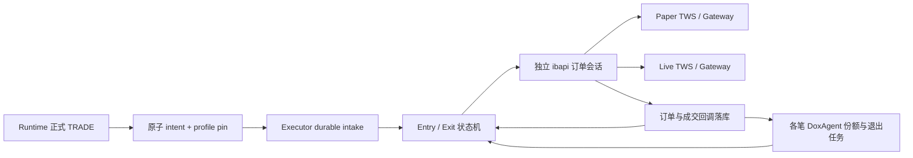

# Trade Executor：确定性 IBKR 执行模块落地方案

日期：2026-09-06。状态：实现前方案；本轮已排查代码、查阅官方资料并完成本机只读连接探测，没有提交、修改或撤销订单。

策略依据：[trade_execution.md](trade_execution.md)。继承 Persistent Runtime 的非阻塞、持久恢复、人工配置优先及语义日有效期约束。本文将策略落到订单、成交和调度接口，不增加 AI 审核、策略评分或人工逐笔批准。

本轮用户明确修订：**Exit 只关闭各笔 DoxAgent 成交份额，不关闭该账户同 ticker 的全部净持仓，也不主动清理人工持仓。** 本条优先于原策略第十八节和末尾表格中的“全部净持仓”。

## 1. 排查结论与本机证据

| 位置 | 当前实现 | 本期改动 |
|---|---|---|
| `persistent_runtime_v2/trade_output.py` | TradeRecord、Policy 消费、intent 原子落库；LocalTradeSink 只输出；IBKRPaperAdapter 未连接 | 保留 Runtime 原子输出，接入持久 Executor intake，建立真实订单与成交状态 |
| `persistent_runtime_v2/coordinator.py::_pump_delivery` | 硬编码 LocalTradeSink；逐 intent 等待 reconcile/submit | 改为可配置持久接管；接管后由独立 Executor worker 执行，避免订单等待阻塞 Runtime |
| `persistent_runtime_v2/schema.py::TradeRecord` | 方向 LONG/SHORT；来源含 POLICY、W3；没有订单数量和真实成交 | 继续作为交易意图；数量、价格、账户、fills 和持仓归属属于执行模块 |
| `tools/providers/ibkr_tws.py` | 官方 ibapi 10.49.2，EClient/EWrapper + reader thread；仅数据请求；默认 localhost:7496/client 71 | 复用握手/合约的技术方式，新增独立订单会话；不把下单能力暴露给 Data MCP |
| `settings.py::ibkr_tws_*` | 一套只读数据环境；host 限 localhost；默认允许延迟行情模式 | 保留 Data MCP 配置，执行另建 PAPER/LIVE profile，不通过修改数据端口来切交易环境 |
| `persistent_runtime_v2/calendar.py` | is_session/next_session，缺少实际 open/close | 扩充 session bounds/提前收市，另加可交易 venue 时段查询 |
| `journal.py`、`fencing.py` | SQLite WAL、任务、gap、短租约、迟到写保护 | 复用持久基础；增加订单/成交/份额索引表和 socket writer 唯一所有权 |

### 1.1 本轮真实只读探测

北京时间约 2026-09-06 19:18–19:23，使用独立临时 client IDs 181–186，完成后断开。没有复用 Data MCP 的 client ID。

| 检查 | Live 7496 | Paper 7497 |
|---|---|---|
| TCP/API 握手 | 成功，server version 225 | 成功，server version 225 |
| Python API | 10.49.2 | 10.49.2 |
| 服务器时间、MU 合约 | 成功；conId 9939，STK/USD，SMART/NASDAQ | 同左 |
| managedAccounts | 单账户，脱敏 U1***370 | 单账户，脱敏 DU***665 |
| AccountSummary、positions 完整结束 | 成功；返回 6 行持仓 | 成功；返回 0 行持仓 |
| AccountType | INDIVIDUAL | INDIVIDUAL |
| 请求实时 MU bid/ask | 10089：API 行情需额外订阅，延迟行情可用 | 2186：实时 API 行情需额外订阅，提示延迟替代 |

`INDIVIDUAL` 是账户组织类型，不能据此宣称已验证 CASH/MARGIN。Live 只读、Paper 非只读来自用户的 TWS 设置说明；本轮没有用下单来验证写权限。合约 validExchanges 包含 OVERNIGHT，只证明合约存在该目的地，不证明 Paper 夜盘撮合、实时行情或账户权限已通过。

**实际需要用户操作的主要前置条件是实时 API 行情订阅/共享。** 两套 TWS 的基础连接已可用。历史文档的“零 tick”记录不作为当前结果；本轮已有明确订阅提示。

## 2. 业务规则冻结与必要精确化

### 2.1 触发与方向

- 对 Runtime 最终正式释放的每个有效 TRADE 自动接管。Policy TRADE、W3 最终 TRADE、Weekend Selection 正式释放的 TRADE 使用同一入口，不要求再次命中 Policy。
- CLOSED Candidate 未释放时不下单；EXPIRED、DUPLICATE 等非 READY 意图不提交；既有 Policy activation 消费语义不改为“成交后才消费”，订单失败也不隐式重新激活 Policy。
- `environment=PAPER|LIVE` 与 `account_mode=PAPER|LIVE_CASH|LIVE_MARGIN` 分开：默认 Paper LONG/SHORT 开启；Live Cash LONG 开启、SHORT 关闭。后续 Margin 可配置开启 SHORT。
- SHORT 禁用只阻止新的 SHORT entry，不能阻止现存 SHORT 的 BUY cover；LONG entry 开关同理不得阻止已有 LONG 的 SELL exit。
- `DIRECTION_DISABLED` 是正常终态，不是执行失败。Broker 因借券、交易权限或资金拒单才记真实 rejection；不添加模型判断，也不通过无限重试绕过拒单。

### 2.2 参数

| 参数 | 默认值 |
|---|---|
| target_notional_usd | 20,000，可配置 |
| initial_tolerance | 0.01 |
| non_rth_retry_tolerance | 0.02 |
| order_wait_seconds | 5 |
| rth_max_retries | 1；initial LMT + 一次 MKT |
| non_rth_max_retries | 2；initial LMT + 两次 LMT |
| exit_offset_minutes | 30 |
| fractional_shares | false |

每次 attempt 都读取当前可用 bid/ask：BUY 初始 ask×1.01，retry LMT ask×1.02；SELL 初始 bid×0.99，retry LMT bid×0.98。BUY 向上、SELL 向下按有效价格梯度取整。全部金额计算采用 Decimal；与 ibapi 边界转换时才使用其要求的类型。

### 2.3 不应被代码掩盖的数学边界

1. RTH MKT 没有事先可知的实际 order price。明确采用该 attempt 的 fresh ask（BUY）/bid（SELL）作为 **quantity reference price**，计算 floor(remaining_notional/reference_price)，实际成交后按 fills 记账。记录 `sizing_price` 与 `limit_price=null`，不能声称 MKT 有价格保护。
2. 20,000 美元是目标，不是严格成交上限。MKT 跳价可能超出；SHORT 限价卖出在更高价格成交也会超过按限价计算的绝对 notional。预算包含成交本金，不包含手续费；记录 overshoot，不补一笔反向交易修正、不偷偷把 MKT 改成 LMT。
3. BUY 向上/SELL 向下 rounding 可能比原始百分比多一个有效 tick；按原策略 marketability 优先执行，保存原始 cap 与最终 price。
4. 一张 entry 订单已全部成交即结束该 entry，不因更优成交留下零头预算再发补仓单。只有未完全成交、且原订单已终态后才计算下一次剩余预算。
5. remaining_notional 不足一股：有成交则结束并保留份额；无成交记 `FAILED/BELOW_ONE_SHARE`。不能为凑金额引入碎股。

## 3. Live / Paper 配置、保险丝与热切换

### 3.1 配置模型

拟新增版本化 `ExecutionProfile`：

```json
{
  "profile_id": "paper-tws-local",
  "environment": "PAPER",
  "account_mode": "PAPER",
  "host": "127.0.0.1",
  "port": 7497,
  "client_id": 82,
  "expected_account_id": "<从该会话发现并固定的完整 Paper account ID>",
  "long_enabled": true,
  "short_enabled": true,
  "target_notional_usd": "20000",
  "quote_profile_id": "paper-tws-local"
}
```

Live profile 独立配置 7496/client 81，默认 LIVE_CASH/short_enabled=false。示例 client IDs 实施时检查占用，不抢用已连接 ID。未来 Gateway 默认 Live 4001、Paper 4002，但端口可配置，不把端口当环境认证。[IBKR API 安装配置说明](https://www.interactivebrokers.com/campus/trading-lessons/installing-configuring-tws-for-the-api/?retakeFinal=1)

### 3.2 唯一账户保险丝

下单、改单、撤单均绑定已冻结 profile：会话 managedAccounts 必须包含 exact expected_account_id；订单显式设置 account；PAPER/LIVE 的 expected IDs 不得相同。Paper 账户前缀可辅助诊断，但不能只按 DU 或端口决定环境。配置不一致时隔离该 profile 的执行并记录 `ACCOUNT_MISMATCH`，不影响 Runtime、其他环境或 ticker。

没有第二轮 AI 风控、双人审批、隐藏总仓位阈值或逐单人工确认。账户类型、方向、有效报价、撤单终态属于策略/协议条件，不是新增策略门槛。

### 3.3 热切换精确定义

1. 导入候选 profile → 校验 schema、账户映射和连接 → 原子切换 active profile revision。
2. 在 Runtime 正式生成可执行 intent 时，同一数据库事务固定 `execution_profile_revision`、account、environment、strategy_revision；避免排队期间 Paper 意图突然变成 Live。
3. 切换只影响切换提交后新释放的 TRADE。已接管 entry、retry、UNKNOWN 订单、已成交份额及 Exit 全程留在原账户。
4. 切到 Live 后，Paper 有未结束持仓则 Paper worker 继续管理；无须先清仓才能热切换，也不自动将 Paper 仓位搬到 Live。
5. 策略参数更新对新执行生效；在途 entry/exit 保留其策略版本。网络 endpoint 更新提供同 account 的连接配置迁移，保留原 execution 身份；不能借“更新端口”迁移账户。
6. 首次启用 Executor 建立明确 activation cutoff。历史 `OUTPUT_RECORDED` 不回放成真实订单；既有缺少 environment pin 的 READY 意图标记 legacy 并留在 output-only，不自动送往当前账户。启用后的新 intent 才进入 IBKR。

## 4. 执行架构与接线



- 新增 `src/doxagent/trade_execution/`，独立 worker 进程运行；复用 Runtime SQLite 文件和基础 journal，使用独立执行表。Runtime durable intake 成功即可返回 `EXECUTION_ACCEPTED`，不是等待成交。
- 保留 LocalTradeSink 的 output-only 能力。移除 coordinator 内对 LocalTradeSink 的硬编码，依配置注入 intake adapter。正常部署启动一个 Executor supervisor，同时维护需要的 Paper/Live 会话。
- `TradeExecutionAdapter.submit()` 表示持久接管，不能既表示异步接管又假装最终 FILLED；真实 entry_result/exit_result/lifecycle 分字段记录。原 deliver 的 30 秒 timeout 和有限 delivery 重试只用于接管，不能包住一整套下单/撤单/退出。
- 每个环境/account/conId 的订单变更串行；不同 ticker 并行；Exit 到期任务先于同合约的新 entry。锁等待和 5 秒订单等待均用持久 `due_at`/异步唤醒，不占用 Runtime worker。
- 同一账户 socket 由单一 writer 管理，固定 clientId、持久 orderId 分配；旧进程失去执行租约后停止 socket writes 并断连。数据库 fencing 本身不能撤回已发出的 broker 命令，因此新 owner 必须完成 broker reconciliation 后再继续。
- 不向模型/Data MCP 注册 placeOrder/cancelOrder；Data MCP 原有只读路径继续使用。可以独立指定只读 quote profile（例如 Live 数据用于 Paper 执行），但 quote profile 永远不能决定 order account。

## 5. 合约、行情、时段

### 5.1 合约与 tick

以 ticker + STK + USD + primaryExchange 解析唯一 conId，冻结到执行记录。补充当前 ResolvedContract 缺失的 `tradingHours/liquidHours/orderTypes/marketRuleIds`，保留向后兼容。

minTick 只是所有价位/交易所中的最小值，不足以表达全部梯度。按目的地在 validExchanges 中的位置选 marketRuleId，调用 reqMarketRule，并在价格落入新梯度时重新校准。缓存按 conId/venue/rule 版本管理。[IBKR Minimum Price Increment](https://www.interactivebrokers.com/docs/tws-api/doc/orders/minimum-price-increment/introduction)

### 5.2 fresh quote

使用执行会话的持续 L1 订阅，而非每单重新连接 TWS。每个 attempt 读取当前流中的 bid/ask，保存接收时间、marketDataType、venue、报价版本和 submission 时间。建议默认 quote freshness 上限 5 秒、单次等待 5 秒，均作为执行技术参数可配置；不等待一个必然发生的价格变化来证明 freshness。

所需侧报价必须有限、正值且来自实时订阅。冻结、延迟报价及历史收盘仅用于诊断，不冒充策略的 fresh quote；10089/2186 记录为权限/延迟状态。订阅期间空报价或无有效报价让该 item 有界失败/等待，不阻塞其他执行。freshness 的接收时钟不能伪称交易所逐笔时间。

本轮缺少 API 实时权限已被实际请求确认。先解决对应美股 L1 API 权限，并让 Paper 有效共享；不要为此自动购买套餐。订阅与共享按登录用户名生效，双会话/异机登录需按 IBKR 限制核验。[IBKR 行情订阅入口](https://www.interactivebrokers.com/campus/trading-lessons/trade-permissions-mkt/)、[官方行情共享说明](https://interactivebrokers.github.io/tws-api/market_data.html)

### 5.3 RTH、Extended、Overnight、Closed

- RTH：交易所实际 open ≤ now < close，不能用 semantic day 或固定工作日代替。
- Premarket/After-hours：SMART + LMT + outsideRth=true；TIF DAY，有限等待后明确撤销剩余。
- Overnight：独立识别可用 venue，优先显式 `exchange=OVERNIGHT` 的 LMT/DAY 路径，基于本机 API/TWS 支持进行 Paper 验收；记录交易时段，不同时盲设多套 overnight 路由参数。
- `outsideRth=true` 不代表夜盘自动有效；也不能把休市中的周六当成 Non-RTH 可成交时段。按合约/venue 的营业时间、节假日和 broker 支持判断。[IBKR Overnight API](https://www.interactivebrokers.com/campus/ibkr-quant-news/api-overnight-trading/)、[Overnight 交易时段与订单说明](https://www.interactivebrokers.com/campus/trading-lessons/overnight-trading-in-tws/)
- Runtime 仍可 24 小时生成有效 TRADE；没有可交易场所时 Executor 进入 `WAIT_SESSION`，在 intent 有效期内于下一有效时段恢复，过期的 entry 不进入下一语义日。不恢复 04:00 Trade Enable Gate。
- 等待开市尚未 placeOrder 不消耗策略下单次数；不得提交到 broker 后无限排队，绕过语义日过期约束。
- 每次 retry 再判定实际时段：最多总计三张订单、MKT 最多一张且仅 RTH。已有两张订单后进入 RTH 时结束，不追加第三张 RTH MKT；RTH 初始单跨收市时可按 Non-RTH 剩余预算发 LMT，绝不把既定 MKT 带到盘后。每张 attempt 保存其实际时段与次数判定。

## 6. Entry / Exit 共用订单状态机

```text
ADMITTED → CHECK_DIRECTION → WAIT_SESSION / WAIT_QUOTE
→ PREPARED → SUBMITTING → WORKING
→ FILLED
或 → RECONCILING → CANCEL_PENDING → FINAL_FILL_SYNC
→ 下一 attempt / 最终业务结果
```

### 6.1 数量与提交

- Entry：`remaining_notional=max(0,target-sum(abs(有效 entry fills qty×price)))`；LMT 分母为取整后订单价格，MKT 为 fresh side quote。初始与 retry 都 floor 为整数股。
- Exit：分母和目标金额不参与，数量为对应 DoxAgent lot 尚未平掉的实际整数股。BUY cover/SELL exit 共用同一 side primitive。
- placeOrder 前事务保存 attempt ID、orderRef、orderId、完整参数与 `SUBMITTING`；收到回调再推进，不把函数返回当作 broker 接受。
- 从实际发送时间起等待最多 5 秒；确认全部成交可提前结束。最后一张 MKT 也有有界观测与最终对账，不因“Market 应该马上成交”而无限等。

### 6.2 撤单与部分成交

严格执行原策略顺序：读取订单和 fills → 计算实际成交 → cancel 剩余 → 等待终态 → 再拉 final fills → 重算剩余 → 才可能下一张单。最终 attempt 剩余也必须撤销并对账，不能报 PARTIAL 后仍挂着可继续成交的单。

采用 execDetails 的 execId 去重，orderStatus 仅辅助；处理重复/乱序回调和成交修订。订单状态累计成交数与 fill ledger 不一致时继续对账，不从差值发下一单。[IBKR 订单回调说明](https://interactivebrokers.github.io/tws-api/order_submission.html)

取消 5 秒内无确定结论：进入 `RECONCILE_REQUIRED`，释放 worker；有界后台查询，不发新的 attempt。收到 late fill 后原子更新份额及退出任务。不能把租约超时当成撤单成功，也不能把查询无 open order 当成没有成交。

### 6.3 结果及残余

Entry 业务结果保留 `FILLED / PARTIAL_FILLED / FAILED / DIRECTION_DISABLED`；附加 reason。`UNKNOWN/RECONCILE_REQUIRED/WAIT_SESSION` 是过程状态，不能提前伪装零成交失败。

Entry 非零成交即持久创建 lot 和可恢复的 Exit obligation；entry 完结时冻结正式 scheduled_exit。若中断发生在部分成交期间，恢复也能找到退出义务。时间映射按该笔首次实际成交时刻确定，避免回调晚到/重启改变今日或次日退出归属。

Exit 全部尝试耗尽仍有残余：记录 `EXIT_PARTIAL`/`EXIT_FAILED` 和 remaining_owned_qty，保留未关闭份额并生成可见告警；不无限重开新执行来绕过 retry 上限。只继续只读对账；支持用户显式 `resume-exit` 开新轮并记录原因。其他 workflow 继续。

## 7. 各笔份额与 Exit 调度

### 7.1 用户已确认的归属

一个正式 execution 对应独立 DoxAgent lot。Entry fill 增加该 lot 的成交份额；Exit fill 只减少其 assigned lot。账户持仓用于一致性对账，不直接作为某笔 Exit 的下单数量。

同方向多次 TRADE 仍各自计算 $20,000 和独立 scheduled_exit。例如 A 买 100 股、B 买 80 股、人工原有 50 股，A 到期只卖其剩余 100，B 和人工份额不因 A 的 Exit 被清空。首单部分成交同样拥有独立退出任务。

**反向交易的净额归属：本轮用户已确认采用 FIFO。** 新反向 entry 仍执行其目标金额，实际反向成交先按 FIFO 核销旧 DoxAgent 反向 lot，只有超过旧 lot 的剩余数量建立新方向 lot；被核销份额的旧 Exit 同步缩减/完成。FIFO 按 first_fill_at、lot_id 稳定排序，并与 fill 去重、allocation、Exit 剩余量更新同事务提交。不能一边说旧仓已净额抵销，一边让旧 Exit 日后再下单。新 execution 可以有非零 entry fills 但因全部用于抵销而没有新 open lot，这时不得另建空仓退出任务。

人工仓位不纳入上述 FIFO。Broker 股份本身没有应用所有权标记，归属是本地 signed ledger；混合账户中的外部主动交易、拆股/成交更正应记录为 reconciliation adjustments，不能把未知变化自动分配到 DoxAgent lot。检测到归属缺口仅隔离该合约的受影响操作，提供对账/份额修正入口。

### 7.2 Exit session 算法

扩展 MarketCalendar 返回 RTH open/close、calendar version、人工覆盖；所有时间存 UTC，计算用 America/New_York。

对首次 fill_at：当日有 RTH 且 fill_at < close-30min，则当日退出；否则选择下一适用 RTH session 的 close-30min。盘前选当日；到/超过 cutoff 选下一场；盘后和夜盘选下一即将到来的 RTH。提前收市使用实际 close。

持久化 `first_fill_at/relevant_session/close_at/scheduled_exit/calendar_revision`。日历纠错通过显式修订重算未来到期任务并留痕；不每次重启改写历史决定。

到期后停机恢复：先恢复 fills/份额，若仍有 owed quantity 则马上按实际当前时段执行；真正闭市则等待下一可交易 venue。**Exit 不受原始消息 semantic day 过期限制**。未成交 entry 到期则停止新增敞口，撤掉在途剩余并管理已成交份额。

## 8. 数据模型、恢复与非阻塞

建议使用同一 Runtime SQLite 内的明确表，而非让所有订单都塞进无索引 JSON namespace：

| 表 | 主要内容/约束 |
|---|---|
| execution_profiles、execution_profile_head | immutable revision、expected account、active pointer |
| executions | unique runtime intent；环境/account/profile/strategy pin、方向、target、entry_result、lifecycle |
| execution_attempts | unique execution+leg+attempt；orderRef、clientId/orderId、permId、参数、时段、due_at、状态 |
| broker_events / execution_fills | 原始必要回调；account+execId 去重；修订关系、qty/price/费用 |
| execution_lots / lot_allocations | 每笔 signed entry/exit/抵销量、remaining_qty、归属证据 |
| exit_schedules | lot、session、due_at、attempt budget、残余数量 |
| broker_sync_state | reconciliation checkpoint、open/completed/executions 请求结束标记、可查询时间范围 |

### 8.1 身份与恢复规则

- intent ID 是业务幂等键；orderRef 是关联键，**不是 broker 自动去重保证**。orderId 使用握手 nextValidId 与本地/已观察序列最大值分配，固定 clientId 恢复。[IBKR Order ID](https://www.interactivebrokers.com/docs/tws-api/doc/quick-start/order-id)
- `SUBMITTING/UNKNOWN` 恢复时先查 open orders、completed orders、executions，以 account/clientId/orderId/permId/orderRef 匹配。找不到但证据不完整时保持 UNKNOWN，不能换新 orderId 盲重发。[Open Orders](https://www.interactivebrokers.com/docs/tws-api/doc/order-management/open-orders)、[Execution Details](https://www.interactivebrokers.com/docs/tws-api/doc/order-management/execution-details/request-execution-details)
- 网络失败不重置策略 attempt budget。准备但确认未发送的 attempt 可续发同一计划；未知发送状态必须先对账。lease 接管不意味着 broker 命令被撤销。
- TWS/Gateway 的历史回报不是无限审计库：本地实时保存每条 fill。跨日长停机若超出 broker 可查询范围，明确 `BROKER_HISTORY_GAP`，支持导入账户 execution statement；仅凭账户净仓不能唯一重建每笔成交。绝不声称任何长停机都能凭 TWS 自动恢复精确成本和归属。
- 已成交但 Exit schedule 未完成提交的崩溃，通过 fill/lot/schedule 同事务及幂等 repair 补齐；旧环境持仓永远留在旧环境管理。

### 8.2 非阻塞默认值

执行工作以小步骤推进：单次 quote/正常订单等待 5 秒；cancel 首次等待 5 秒；对账轮次异步退避 1/2/5 秒后记录 gap 并降频只读跟踪。允许配置 broker 请求 timeout，但无任何全局“等待某笔完成”barrier。

按 profile 保持会话，按 account/conId 序列化写操作。多个 ticker 的 due tasks 可以并行；失败仅隔离关联 execution/合约。连接全断只能暂停该 profile 的订单步骤，不能暂停 Message Bus、Case 或 O2/O3 维护。

## 9. 模块划分与分期落地

| 阶段 | 文件/改动 | 完成条件 |
|---|---|---|
| E0 合同 | `trade_execution/schema.py`, `strategy.py`, 配置与版本迁移 | 本文参数、方向、MKT sizing、lot 和 session 口径固定；不引入模型 |
| E1 会话 | `ibkr_session.py`, `quotes.py`, `contracts.py` | 两环境账户 fuse；长连接、clientId/orderId；合约梯度/行情/订单回调与重连 |
| E2 账本 | `repository.py`, `reconciliation.py` | attempt/fill/lot/exit 原子恢复；重复回调、unknown submit、cancel race 均可解释 |
| E3 状态机 | `executor.py`, `sessions.py`, `positions.py` | LMT/MKT 有界 retry、整数份额、部分成交、独立 Exit、逾期恢复 |
| E4 接线 | Runtime trade_output/coordinator/factory + `worker.py` | 正式 TRADE 自动接管、profile 原子 pin、无历史意图重放、独立进程不阻塞 Runtime |
| E5 运维 | `cli.py`、status/inspect/reconcile/profile/exit 命令 | 环境热切换、旧环境继续退出、Paper/Live 可观测、迁移备份 |
| E6 验收 | deterministic fixtures + read-only/Paper 集成测试 | 离线与周末可做项完成；开市专属项独立持久记录，不冒充通过 |

拟新增命令（**尚未实现**）：

```text
python -m doxagent.trade_execution.cli discover-accounts --profile <id>
python -m doxagent.trade_execution.cli import-profile --file <json>
python -m doxagent.trade_execution.cli activate-profile --profile <id> --reason <text>
python -m doxagent.trade_execution.cli run-worker
python -m doxagent.trade_execution.cli status
python -m doxagent.trade_execution.cli inspect --execution <id>
python -m doxagent.trade_execution.cli reconcile --execution <id>
python -m doxagent.trade_execution.cli resume-exit --lot <id> --reason <text>
python -m doxagent.trade_execution.cli validate-paper --suite <name>
```

日志展示脱敏账户；真实 account IDs 存本地配置，由发现接口读取并明确绑定，不要求用户把密码或完整账户信息发到对话里。日志指标包含 quote/limit/sizing、target/fills/残余、TTFF、成交耗时、retry、slippage、费用、account/profile pin、cancel latency、gap。

## 10. 周末与开市验收计划

### 10.1 本轮已完成

只有第 1.1 节的真实只读探测。没有开发 Executor、没有执行 Paper 下单/撤单/what-if，也没有创建后台自动下单任务。本轮产物是方案。

### 10.2 开发阶段无需开市即可完成

- 确定性金额/方向/tick/所有 retry 路径；实际日历的 DST、提前收市、休市和 cutoff；完全不调用 W1/W2/W3/O2/O3/O4 真模型。
- fake broker 注入 partial fill、cancel 时成交、重复/乱序/修订 fill、最后 attempt 未成交、资金/借券拒绝、断网、进程强杀、次日恢复、环境切换、旧环境 Exit、账户 fuse。
- 所有正式 TRADE 来源的 durable intake；Candidate 不提交；profile pin 与同时切换事务竞态；历史 output-only 不变订单。
- 同 ticker 多笔份额、不同到期时间、人工基础份额、反向成交归属；未解决成交不能重复发单。
- TWS handshake/account/positions/contract/marketRule/open/completed/execution 查询；Paper what-if 在服务器可用时仅作为参数和权限诊断。
- 若需要 Paper 下单/撤单 smoke，使用明确带测试标记的订单，必须确认终态；休市挂起的订单不能遗留到开市。市场关闭导致暂存或拒绝只验证协议路径，不算成交验收。
- 周末不以历史价/延迟价加真实 Paper 下单来冒充本策略 fresh-quote 验收。订阅问题不阻塞上述离线开发。

### 10.3 必须真实开市的项目

| 测试 | 验证内容 |
|---|---|
| RTH Paper LONG/SHORT entry→exit | fresh quotes、真实回报、完整份额退出、资金/借券许可 |
| RTH LMT→MKT | 新 quote quantity、等待、取消终态、MKT fallback；自然触发不到则该分支保留离线覆盖，不能改生产策略强行制造 |
| Extended LMT retry | fresh quote 更新、outsideRth、生效的撤单与 finite budget |
| Overnight | venue/权限/行情/限价撮合；Paper 不支持的行为单独标明环境限制 |
| Scheduled exit | 实际 close-30min、部分仓位也退出；提前收市先靠离线回放，等真实日期再补观察 |
| 运行中恢复 | 已成交/待撤销断线后回执归属、无重复订单、旧 profile Exit |

2026-09-07（周一）为 Labor Day，NYSE/Nasdaq 休市；下一常规 RTH 是 **2026-09-08 09:30 ET，即北京时间 21:30**。正常当日 Exit 时间 15:30 ET，即北京时间次日 03:30。不能安排“周一开盘验收”。[NYSE 官方交易日历](https://www.nyse.com/trade/hours-calendars)、[Nasdaq 2026 日历](https://www.nasdaqtrader.com/Trader.aspx?id=calendar)

实施时把待开市项落成可恢复 `acceptance_runs`/suite runner：固定 PAPER profile、测试语料与策略版本，保存 WAIT_MARKET/WAIT_MARKET_DATA/READY/RUNNING/PASS/PARTIAL/FAIL、due_at、证据、测试持仓退出义务。开启 suite 后只在条件满足时执行一次，重启继续，不每天重复制造新仓。Live 永远不加入自动验收 suite。当前只规划，不注册 Codex heartbeat 或无人值守下单任务。

Paper 主要验证状态机和协议，模拟成交不能替代 Live 的流动性/滑点评估；Paper 不支持的 order/venue 行为必须独立记载。[IBKR Paper 限制](https://www.interactivebrokers.com/docs/tws-api/doc/notes-limitations/limitations/paper-trading)

## 11. 远端 IB Gateway 部署兼容

执行 adapter 使用 TWS API socket，TWS/Gateway 是相同接口层；远端主要更换 host/port/profile 和进程管理，不重写策略。优先 Executor 与 Gateway 同机，容器场景使用受控私网或隧道，数据面配置与下单面配置保持分离。

Gateway 默认 4001/4002 可覆盖；安装与当前官方 API 兼容的版本，保持固定 clientId 和原持久账本。迁移时停止旧 writer、备份搬迁 SQLite/配置、启动 Gateway 登录、只读对账完成后恢复，同一账户不同时运行本机与远端两个下单 owner。

Gateway 需要登录及周期性重新认证，不能承诺安装服务后永久无人登录。设置日常 auto-restart，提供连接健康与 NEEDS_LOGIN 通知；认证通过后自动恢复对账和未完义务。登录/2FA 由用户完成，不在策略程序保存 TWS 密码。[IBKR Daily & Weekly Reauthentication](https://www.interactivebrokers.com/docs/tws-api/doc/tws-settings/daily-weekly-reauthentication)

## 12. 用户准备项与最终交付标准

现在需要：

1. **行情**：在 Client Portal 的 Market Data Subscriptions/Market Data Assistant 为 MU 及计划交易的美股选择支持 API 的实时 L1 bid/ask 权限；配置 Paper 共享并在生效后重做实时报价探测。具体套餐由账户资格和覆盖品种决定，不凭默认免费 TWS 行情推断 API 已授权。
2. **账户绑定**：开发时由 discover-accounts 读取完整 account ID，写入对应 profile 的 exact expected_account_id；当前已发现各端口只有一个账户，无需现在提供账户号码。按笔 Exit 与 FIFO 反向抵销均已确认，没有遗留的核心业务选择。
3. **Paper 交易准备**：保持 7497 非只读、股票交易权限、足够模拟资金；SHORT 能力由实际 broker 返回验证。无需为了开发关闭 Live 的只读开关。

稍后需要：Live 正式迁移时关闭 7496/对应 Gateway 的 Read-Only，明确使用 CASH 或 MARGIN 及方向配置；远端部署时准备 Gateway 登录/2FA 与进程管理环境。本轮不需要提供登录凭据。

完整开发交付应包含：源码、数据库迁移/备份、版本化双环境配置、独立 worker、确定性订单与份额状态机、Runtime 接线、运维手册、恢复测试及真实 Paper 证据。报告分开列“技术通过”“周末只读通过”“待开市”“行情前置条件”“Paper 模拟成交限制”；不将 broker 接管成功称为成交成功，也不以 Paper 通过自动开启 Live。
